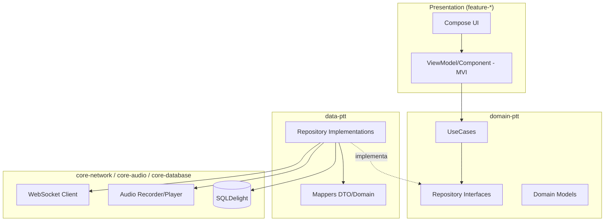
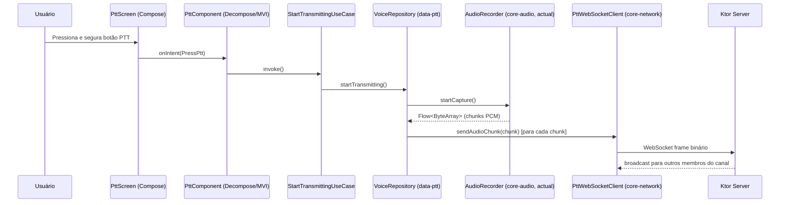
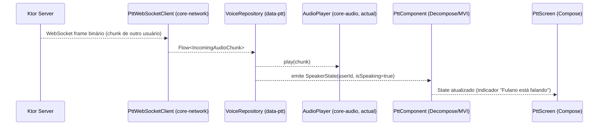
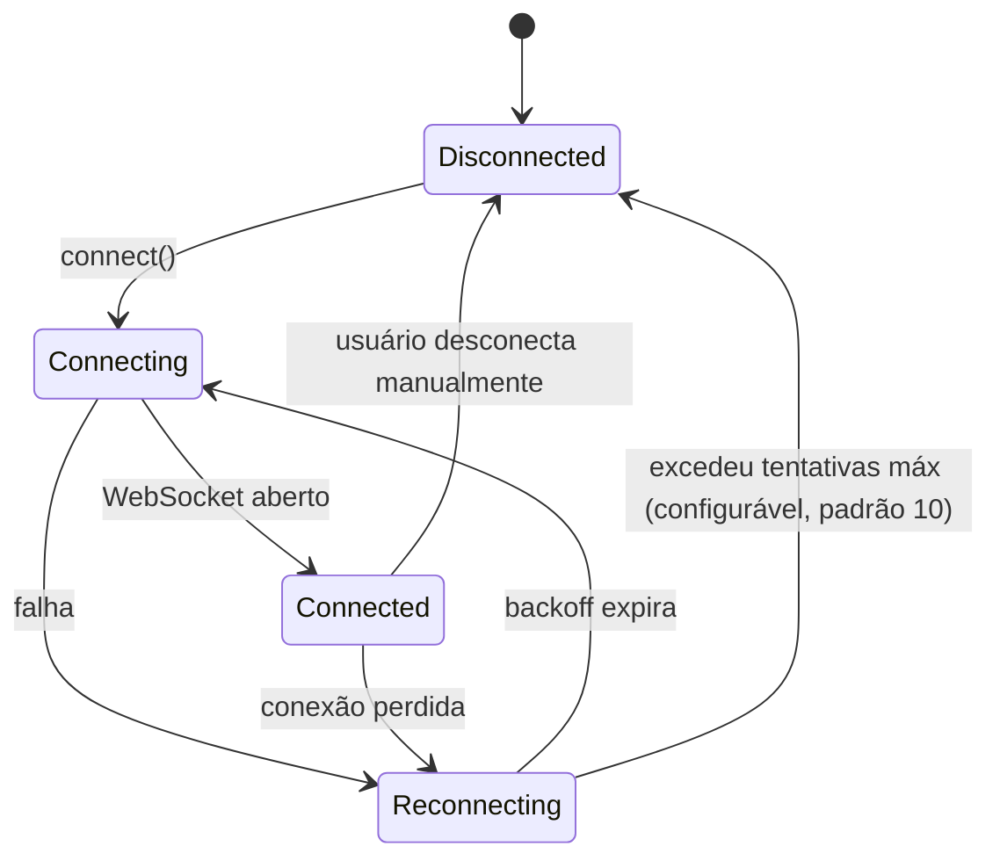
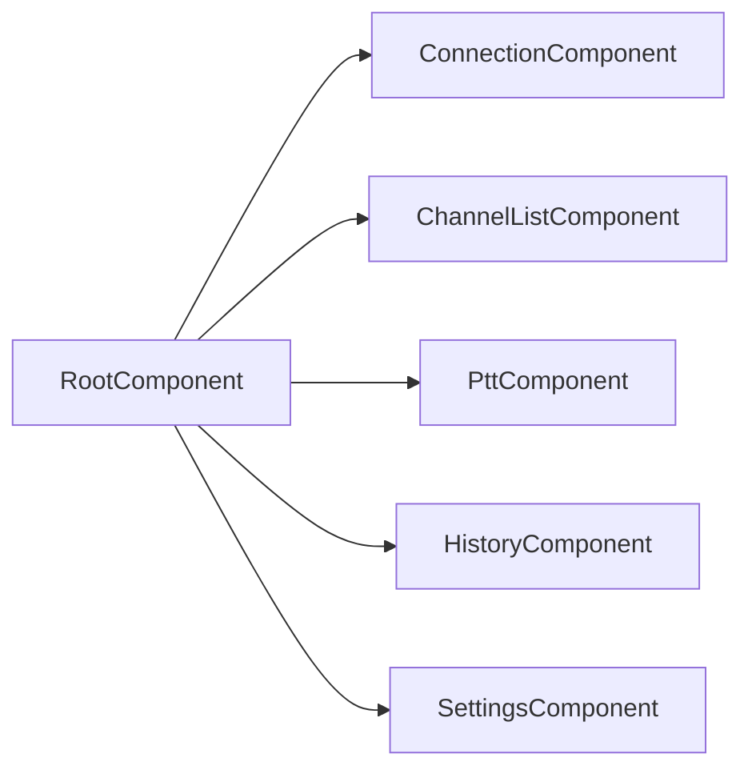
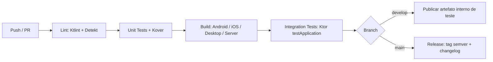
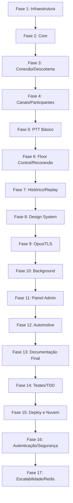

# PTT-LAN — Plano Técnico Completo (Single Source of Truth)
### App de Push-to-Talk via LAN em Kotlin Multiplatform

> Documento gerado para consumo por agente de IA via CLI. Toda decisão arquitetural está fechada. Não há pontos em aberto: onde havia múltiplas opções, uma foi escolhida e justificada. O agente deve seguir este documento como fonte única de verdade e não redefinir stack, arquitetura ou padrões durante a implementação.

---

## Sumário

1. [Visão Geral e Objetivos](#1-visão-geral-e-objetivos)
2. [Decisões Arquiteturais e Princípios](#2-decisões-arquiteturais-e-princípios)
3. [Stack Tecnológica (Decisões Fechadas)](#3-stack-tecnológica-decisões-fechadas)
4. [Estrutura de Diretórios](#4-estrutura-de-diretórios)
5. [Arquitetura em Camadas](#5-arquitetura-em-camadas)
6. [Modelo de Rede e Protocolo PTT](#6-modelo-de-rede-e-protocolo-ptt)
7. [Áudio: Captura, Codec e Playback (expect/actual)](#7-áudio-captura-codec-e-playback-expectactual)
8. [Gerenciamento de Estado (MVI)](#8-gerenciamento-de-estado-mvi)
9. [Navegação](#9-navegação)
10. [Persistência](#10-persistência)
11. [Injeção de Dependência](#11-injeção-de-dependência)
12. [Segurança](#12-segurança)
13. [Observabilidade](#13-observabilidade)
14. [Organização das Features](#14-organização-das-features)
15. [Convenções de Código e Git](#15-convenções-de-código-e-git)
16. [Estratégia de Testes](#16-estratégia-de-testes)
17. [Qualidade de Código](#17-qualidade-de-código)
18. [CI/CD](#18-cicd)
19. [Performance](#19-performance)
20. [Escalabilidade](#20-escalabilidade)
21. [Roadmap de Implementação por Fases](#21-roadmap-de-implementação-por-fases)
22. [Plano de Execução para Agente CLI](#22-plano-de-execução-para-agente-cli)
23. [Critérios de Aceite Globais](#23-critérios-de-aceite-globais)
24. [Checklist Final do Projeto](#24-checklist-final-do-projeto)

---

## 1. Visão Geral e Objetivos

### 1.1 O que é o projeto

PTT-LAN é um aplicativo estilo walkie-talkie (push-to-talk) que funciona **inteiramente dentro de uma rede local**, sem depender de internet ou de servidores externos na nuvem. Um dispositivo (ou processo desktop) atua como **servidor Ktor**, e os demais dispositivos (Android, iOS, Desktop) atuam como **clients KMP** que se conectam a esse servidor via Wi-Fi.

### 1.2 Objetivo de aprendizado (guia decisões de arquitetura)

Este projeto é, antes de tudo, um veículo de estudo prático e aprofundado de KMP. Por isso, toda decisão técnica abaixo prioriza:

- Compartilhamento máximo de lógica (não só UI, mas rede, protocolo, regras de negócio e parte do pipeline de áudio).
- Uso real de `expect`/`actual` nos pontos onde plataformas realmente divergem (captura/playback de áudio, descoberta mDNS/NSD, permissões).
- Exercitar client **e** servidor no mesmo monorepo Kotlin (servidor roda em Kotlin/JVM via Ktor).

### 1.3 Escopo funcional (fonte: descrição do produto)

| Categoria | Funcionalidade | Fase de entrega |
|---|---|---|
| MVP | Conexão ao servidor (IP manual + mDNS/NSD) | Fase 3 |
| MVP | Canais (salas) | Fase 4 |
| MVP | Botão PTT (segurar para falar) | Fase 5 |
| MVP | Recepção de áudio em tempo real | Fase 5 |
| MVP | Indicador de "quem está falando" | Fase 5 |
| MVP | Lista de participantes | Fase 4 |
| Intermediário | Múltiplos canais isolados no servidor | Fase 4 |
| Intermediário | Floor control (uma pessoa fala por vez) | Fase 6 |
| Intermediário | Reconexão automática | Fase 6 |
| Intermediário | Histórico de últimos N áudios (replay) | Fase 7 |
| Intermediário | Nickname do usuário | Fase 4 |
| Avançado | Novo Design System (UI/UX sóbrio e moderno) | Fase 8 |
| Avançado | Compressão Opus | Fase 9 |
| Avançado | Criptografia do stream | Fase 9 |
| Avançado | PTT em background | Fase 10 |
| Avançado | Modo "sempre ouvindo" vs "app aberto" | Fase 10 |
| Avançado | Painel admin web | Fase 11 |
| Avançado | Replay com waveform | Fase 11 |
| Avançado | Suporte Android Automotive | Fase 12 |

### 1.4 Público-alvo

Uso doméstico, times pequenos (eventos, obras, lojas) e como demonstração técnica de KMP para portfólio.

---

## 2. Decisões Arquiteturais e Princípios

Princípios aplicados de forma não negociável em todo o código:

| Princípio | Como é aplicado no projeto |
|---|---|
| Clean Architecture | 3 camadas por feature: `presentation`, `domain`, `data`. Dependências sempre apontam para dentro (`presentation → domain ← data`). Domain não conhece Android, iOS, Ktor client, nem SQLDelight. |
| SOLID | UseCases com responsabilidade única; interfaces de `Repository` no domain, implementação no data (DIP); extensão de features via novos módulos, não edição dos existentes (OCP). |
| KISS | Não introduzir abstrações especulativas; um único padrão de estado (MVI) para todas as telas. |
| DRY | Lógica de protocolo PTT, serialização de mensagens e regras de floor control vivem 100% em `shared`/`core`, nunca duplicadas por plataforma. |
| YAGNI | Funcionalidades avançadas (Opus, criptografia, painel admin) só entram a partir da Fase 9, não antes; não implementar "para o futuro" fora do roadmap. |
| Modularização | Um módulo Gradle por feature + módulos `core:*` reutilizáveis. Ver árvore completa na seção 4. |
| Baixo acoplamento / Alta coesão | Comunicação entre features apenas via contratos em `core:*`, nunca módulo de feature dependendo de outro módulo de feature. |
| Offline-first (parcial) | Não se aplica a áudio em tempo real (é um stream ao vivo), mas se aplica a: lista de canais recentes, nickname salvo, histórico de mensagens (replay) — que ficam em SQLDelight local e funcionam mesmo sem conexão ativa ao servidor. |
| Observabilidade | Logging estruturado (Kermit) + métricas de rede (latência, pacotes perdidos) expostas via `core:telemetry`, consumidas pelo painel admin (Fase 11) e por logs locais. |
| Segurança | TLS opcional sobre WebSocket (self-signed, ver seção 12), tokens de sessão por canal, sem credenciais hard-coded. |

### 2.1 Por que Clean Architecture aqui (e não algo mais simples)

Mesmo sendo um app pessoal, a motivação é pedagógica: o valor do projeto é servir de estudo de caso robusto. Uma arquitetura simplificada demais reduziria o valor de portfólio e dificultaria testar a lógica de rede/áudio isoladamente da UI — algo essencial quando se lida com protocolos de rede e streaming em tempo real.

---

## 3. Stack Tecnológica (Decisões Fechadas)

Todas as escolhas abaixo são finais. Nenhuma alternativa deve ser reavaliada durante a implementação.

### 3.1 Linguagem e build

| Item | Escolha | Justificativa |
|---|---|---|
| Kotlin | 2.4.x (K2 compiler) | K2 é o compilador padrão desde o Kotlin 2.0, com melhor desempenho de compilação e melhor suporte a multiplataforma; necessário para recursos modernos de KMP. |
| Build system | Gradle com Kotlin DSL + Version Catalog (`libs.versions.toml`) | Padrão de mercado para KMP; version catalog centraliza versões e evita divergência entre módulos (dor recorrente já observada em projetos reais do autor). |
| Gerenciador de targets | `org.jetbrains.kotlin.multiplatform` plugin | Targets: `androidTarget`, `iosArm64`/`iosSimulatorArm64`/`iosX64`, `jvm` (desktop e servidor), `wasmJs` opcional apenas se o painel admin (Fase 11) for feito em Compose Web — caso contrário painel admin é HTML/JS simples servido pelo próprio Ktor. |

### 3.2 UI — Compose Multiplatform + Decompose

| Opção avaliada | Decisão |
|---|---|
| Compose Multiplatform + Material 3 | **Escolhido.** É a única solução de UI verdadeiramente compartilhada entre Android, iOS e Desktop mantida pela JetBrains, com paridade de recursos crescente e Material 3 nativo. |
| Navigation Compose (Google) | Rejeitado — ainda com suporte multiplataforma imaturo fora do Android. |
| Voyager | Rejeitado — projeto mantido por terceiros com menor cadência de atualizações; risco para um projeto de estudo de longo prazo. |
| Circuit (Slack) | Rejeitado — ótimo para arquitetura MVI, mas acopla navegação e apresentação de um jeito que compete com a decisão de MVI manual da seção 8; adicionaria uma segunda camada de convenções redundante. |
| **Decompose** | **Escolhido para navegação.** Multiplataforma de verdade (Android/iOS/Desktop/Web), independente de Compose (o que facilita testar navegação sem UI), gerencia ciclo de vida e back-stack de forma explícita — ponto que o autor já identificou como fonte de bugs (back-stack do `ListDetailPaneScaffold`) em projetos anteriores, então usar Decompose de forma disciplinada mitiga esse risco. |

Resumindo o par escolhido: **Compose Multiplatform (UI) + Decompose (navegação/estado de tela)**.

### 3.3 Injeção de Dependência — Koin

| Opção | Decisão |
|---|---|
| Koin | **Escolhido.** Único framework de DI com suporte first-class a Kotlin Multiplatform (Android, iOS, JVM, Native) sem geração de código via KSP/KAPT específica de plataforma, o que evita problemas de alinhamento de versão de KSP já enfrentados pelo autor em outro projeto KMP. |
| Hilt / Dagger | Rejeitado para o `shared`/`commonMain` — são soluções Android-only (Dagger tecnicamente multiplataforma, mas com ecossistema e anotações fortemente acopladas ao Android). Hilt continua sendo a escolha correta em projetos Android puros (como o `com.imusica` do autor), mas não se aplica aqui. |
| Kotlin-Inject | Rejeitado — geração de código via KSP multiplataforma ainda é mais frágil hoje que a solução em runtime do Koin; para um projeto de estudo, a simplicidade de setup do Koin supera o ganho de performance em tempo de build do Kotlin-Inject. |

### 3.4 Networking — Ktor (client e server)

| Item | Escolha | Justificativa |
|---|---|---|
| Servidor | **Ktor Server** (engine Netty) | Kotlin puro, roda em JVM (o "servidor" pode ser um desktop Kotlin Multiplatform ou um serviço standalone), suporte nativo a WebSocket, que é o transporte escolhido para o stream PTT. |
| Cliente | **Ktor Client** (engine `CIO` em JVM/Android, `Darwin` em iOS) | Mesmo cliente HTTP/WebSocket compartilhado em `commonMain`; troca de engine via `expect`/`actual` apenas na configuração do `HttpClient`, sem duplicar lógica de protocolo. |
| Transporte de áudio | **WebSocket binário** (frames binários, não JSON) para os chunks de PCM/Opus; **WebSocket texto (JSON)** para mensagens de controle (join/leave canal, quem está falando, heartbeat). | Um único canal WebSocket por conexão simplifica o modelo de reconexão e evita gerenciar sockets UDP brutos, mantendo o projeto viável para o escopo de aprendizado, mesmo com uma pequena penalidade de latência frente a UDP puro (aceitável em LAN doméstica/escritório). |
| Descoberta de servidor | **mDNS/NSD** (`NsdManager` no Android via `expect`/`actual`; `dns_sd`/Bonjour no iOS; JmDNS no Desktop/JVM) + fallback de IP manual | mDNS é o padrão de fato para descoberta em LAN sem servidor central (mesmo mecanismo do Chromecast/AirPlay); fallback manual cobre redes que bloqueiam multicast. |
| Retry | `HttpRequestRetry` plugin do Ktor Client para chamadas de controle; reconexão de WebSocket implementada manualmente com backoff exponencial (ver seção 6.5) | O plugin de retry do Ktor não cobre reconexão de WebSocket nativamente, então essa parte é código de domínio próprio, testável isoladamente. |
| Timeout | `HttpTimeout` plugin, timeout de conexão 5s, timeout de socket configurável por ambiente (LAN = mais agressivo, 3s) | LAN é uma rede confiável e de baixa latência; timeouts curtos aceleram a detecção de falha e o gatilho de reconexão. |
| Interceptação/logging | Plugin `Logging` do Ktor Client, nível `INFO` em produção e `BODY` em debug (com redaction de tokens) | Ajuda a depurar handshakes de canal sem vazar tokens em log de produção. |

### 3.5 Serialização — kotlinx.serialization

| Opção | Decisão |
|---|---|
| kotlinx.serialization | **Escolhido.** É a única biblioteca de serialização com suporte pleno a Kotlin/Native e Kotlin/JS, portanto obrigatória para um projeto que roda em iOS e potencialmente Web. Usada com o formato `Json` para mensagens de controle e `ProtoBuf` (kotlinx-serialization-protobuf) para o envelope binário dos frames de áudio, reduzindo overhead de framing. |
| Moshi / Jackson | Rejeitados — dependem de reflection/Java, incompatíveis com Kotlin/Native (iOS). |

### 3.6 Banco de Dados — SQLDelight

| Opção | Decisão |
|---|---|
| SQLDelight | **Escolhido.** Único banco relacional com drivers oficiais para Android, iOS (SQLite nativo) e JVM/Desktop, com queries verificadas em tempo de compilação (`.sq` files), o que reduz bugs de SQL comparado a strings soltas. |
| Room | Rejeitado — Android-only, incompatível com iOS/Desktop no `commonMain`. |
| Realm | Rejeitado — motor próprio (não SQL), maior curva de aprendizado sem benefício claro para o volume de dados deste app (histórico de mensagens, canais recentes, preferências), e suporte a KMP historicamente mais instável que SQLDelight. |

Uso do SQLDelight neste projeto: canais recentes/favoritos, nickname, últimos N áudios (metadados + caminho do arquivo local), configurações de usuário.

### 3.7 Persistência (visão consolidada)

| Necessidade | Solução | Justificativa |
|---|---|---|
| Cache de canais/nickname/preferências | SQLDelight | Estruturado, consultável, compartilhado. |
| Preferences simples (tema, modo "sempre ouvindo") | `multiplatform-settings` (Russell Wolf) sobre `DataStore`/`NSUserDefaults`/`Preferences` conforme plataforma | Biblioteca padrão de mercado para key-value multiplataforma; evita reinventar `expect`/`actual` para settings simples. |
| Token de sessão do canal | `multiplatform-settings` com wrapper `EncryptedSettings` (Android Keystore / iOS Keychain via `expect`/`actual`) | Token não deve ficar em texto plano; ver seção 12. |
| Áudio gravado (replay) | Arquivos binários no diretório de cache da plataforma (`expect fun cacheDir(): String`), indexados via SQLDelight | Blobs de áudio não devem viver no banco relacional; só os metadados. |

### 3.8 Concorrência — Coroutines / Flow / StateFlow / SharedFlow

| Ferramenta | Quando usar neste projeto |
|---|---|
| `suspend fun` + Coroutines estruturadas | Toda operação assíncrona pontual: conectar ao servidor, entrar em um canal, enviar um comando de controle. |
| `Flow` (cold) | Streams derivados sob demanda: leitura de um `.sq` query como `Flow<List<Channel>>`, decodificação de um stream de áudio recebido. |
| `StateFlow` | Estado de UI (um valor atual sempre disponível): estado da tela MVI (`ChannelState`), estado da conexão (`Disconnected/Connecting/Connected`), quem está falando agora. |
| `SharedFlow` | Eventos que não são "estado" e não devem ser re-emitidos ao reinscrever: eventos de UI tipo "mostrar snackbar de erro de conexão", eventos de efeito colateral (`Effect`) no MVI (seção 8). |

### 3.9 Áudio nativo (captura/playback) — visão da stack

| Plataforma | Captura | Playback | Codec MVP | Codec avançado (Fase 9) |
|---|---|---|---|---|
| Android | `AudioRecord` (API nativa) | `AudioTrack` | PCM 16-bit/16kHz mono | Opus via `libopus` (JNI, wrapper próprio) |
| iOS | `AVAudioEngine` / `AVAudioInputNode` | `AVAudioEngine` / `AVAudioPlayerNode` | PCM 16-bit/16kHz mono | Opus via `libopus` (cinterop) |
| Desktop (JVM) | `javax.sound.sampled.TargetDataLine` | `javax.sound.sampled.SourceDataLine` | PCM 16-bit/16kHz mono | Opus via binding JNI |

Justificativa: cada plataforma tem sua própria API de baixo nível de áudio; não existe abstração multiplataforma madura o suficiente para captura/playback em tempo real com baixa latência, então essa é exatamente a fronteira correta para usar `expect`/`actual` — o valor pedagógico do projeto está justamente aqui (seção 7).

### 3.10 Ferramentas de qualidade

| Ferramenta | Uso |
|---|---|
| Detekt | Análise estática Kotlin (complexidade, code smells), rodando em `commonMain`, `androidMain`, `iosMain`, `jvmMain`. |
| Ktlint | Formatação de código consistente (regra oficial Kotlin), integrado via plugin Gradle, rodando em pre-commit e CI. |
| Kover | Cobertura de código (substitui JaCoCo em projetos Kotlin/KMP modernos, com suporte nativo a multiplataforma). |
| Dokka | Geração de documentação técnica a partir de KDoc, publicada como artefato de CI a partir da Fase 13. |

---

## 4. Estrutura de Diretórios

```
ptt-lan/
├── gradle/
│   └── libs.versions.toml                # Version Catalog único para todo o projeto
├── settings.gradle.kts
├── build.gradle.kts
│
├── androidApp/                           # Entry point Android (Activity única, Compose)
│   └── src/main/
│
├── desktopApp/                           # Entry point Desktop (main() Compose Desktop)
│   └── src/jvmMain/
│
├── iosApp/                               # Projeto Xcode + SwiftUI shell chamando Compose (via UIViewController)
│   └── iosApp/
│
├── serverApp/                            # Servidor Ktor standalone (roda em JVM, pode ser embarcado no desktopApp)
│   └── src/main/
│       ├── Application.kt                # Ponto de entrada Ktor (embeddedServer)
│       ├── routing/                      # Rotas HTTP + WebSocket
│       ├── channel/                      # Gerenciamento de canais em memória (ChannelRegistry)
│       └── floorcontrol/                 # Regra de "um fala por vez"
│
├── shared/                               # Módulo KMP principal (commonMain/androidMain/iosMain/jvmMain)
│   └── src/
│       ├── commonMain/
│       ├── androidMain/
│       ├── iosMain/
│       └── jvmMain/
│
├── core/
│   ├── core-network/                     # Cliente Ktor compartilhado, protocolo PTT, DTOs de rede
│   ├── core-audio/                       # Interfaces expect/actual de captura/playback/codec
│   ├── core-database/                    # SQLDelight setup, drivers expect/actual
│   ├── core-datastore/                   # multiplatform-settings wrapper (settings + encrypted settings)
│   ├── core-di/                          # Módulos Koin raiz, composição de módulos de feature
│   ├── core-navigation/                  # Decompose root component, contratos de navegação entre features
│   ├── core-designsystem/                # Compose Multiplatform theme, componentes visuais compartilhados
│   ├── core-telemetry/                   # Logging (Kermit), métricas, contrato de analytics
│   ├── core-testing/                     # Fakes, dispatchers de teste, builders de dados de teste
│   └── core-common/                      # Result wrapper, extensões, tipos utilitários puros
│
├── domain/
│   └── domain-ptt/                       # UseCases e regras de negócio puras (sem depender de core-network diretamente,
│                                          # apenas de interfaces de Repository)
│
├── data/
│   └── data-ptt/                         # Implementação de Repositories (usa core-network e core-database)
│
├── features/
│   ├── feature-connection/               # Tela de conexão/descoberta de servidor
│   ├── feature-channel-list/             # Lista/entrada de canais
│   ├── feature-ptt/                      # Tela principal do walkie-talkie (botão PTT, quem fala, participantes)
│   ├── feature-history/                  # Histórico/replay de mensagens (Fase 7+)
│   ├── feature-settings/                 # Nickname, tema, modo "sempre ouvindo"
│   └── feature-admin-web/                # Painel admin (HTML/JS servido pelo serverApp) — Fase 11
│
└── docs/
    ├── adr/                              # Architecture Decision Records
    └── PTT_KMP_PLANO_TECNICO.md          # Este documento
```

### 4.1 Responsabilidade de cada módulo

| Módulo | Responsabilidade | Pode depender de |
|---|---|---|
| `core-common` | Tipos base (`Result`, `Either`, extensões puras Kotlin) | nada |
| `core-network` | `HttpClient` Ktor configurado, protocolo de mensagens (DTOs + serialização), WebSocket session management | `core-common` |
| `core-audio` | Interfaces `AudioRecorder`/`AudioPlayer`/`AudioCodec` (expect) + implementações actual por plataforma | `core-common` |
| `core-database` | `Database` SQLDelight + drivers actual | `core-common` |
| `core-datastore` | Settings simples e criptografados | `core-common` |
| `core-di` | Agregação de todos os módulos Koin (`startKoin` chamado pelo app shell) | todos os `core-*`, `domain-*`, `data-*` |
| `core-navigation` | `RootComponent` Decompose, interfaces de navegação | `core-common` |
| `core-designsystem` | Cores, tipografia, componentes Compose reutilizáveis | nada (apenas Compose) |
| `core-telemetry` | Logger (Kermit), interface `AnalyticsTracker`, interface `MetricsCollector` | `core-common` |
| `core-testing` | Fakes de repositórios, `TestDispatcherRule`, builders | `domain-ptt` (para tipos) |
| `domain-ptt` | UseCases (`JoinChannelUseCase`, `StartTransmittingUseCase`, etc.), interfaces `*Repository`, modelos de domínio | `core-common` |
| `data-ptt` | Implementações de `*Repository`, mapeamento DTO ↔ Domain | `domain-ptt`, `core-network`, `core-database`, `core-audio` |
| `feature-*` | UI (Compose) + ViewModel/Component (Decompose) + testes de UI | `domain-ptt`, `core-designsystem`, `core-navigation`, `core-di` |
| `shared` | Módulo "guarda-chuva" que reexporta os módulos acima para os apps de plataforma quando necessário (framework KMP/CocoaPods para iOS) | todos os `core-*`, `domain-*`, `data-*` |
| `serverApp` | Servidor Ktor: rotas WebSocket, `ChannelRegistry`, floor control, painel admin (Fase 11) | `core-network` (DTOs compartilhados), `core-common` |

**Regra de dependência não negociável:** módulos `feature-*` nunca dependem uns dos outros. Comunicação entre features (ex.: `feature-channel-list` navegar para `feature-ptt`) acontece apenas através de contratos definidos em `core-navigation`.

---

## 5. Arquitetura em Camadas

### 5.1 Diagrama de camadas



### 5.2 Fluxo de dados: enviar um pacote de voz (transmitir)



### 5.3 Fluxo de dados: receber áudio



### 5.4 Regras de dependência entre camadas

| Camada | Pode importar | Não pode importar |
|---|---|---|
| `presentation` (feature-*) | `domain-ptt`, `core-designsystem`, `core-navigation`, `core-di` | `data-ptt` diretamente, `core-network`, `core-database` |
| `domain-ptt` | `core-common` apenas | Qualquer coisa de `core-network`, `core-audio`, `core-database`, Compose, Ktor |
| `data-ptt` | `domain-ptt`, `core-network`, `core-audio`, `core-database` | `feature-*`, Compose |

Essa regra é validada automaticamente via `Gradle module dependency rules` (seção 17.3) e falha o build de CI se violada.

---

## 6. Modelo de Rede e Protocolo PTT

### 6.1 Transporte

Um único **WebSocket** por client conectado ao `serverApp`, endpoint `/ws`. Dois tipos de frame:

- **Frame de texto (JSON)** — mensagens de controle.
- **Frame binário** — chunks de áudio, com um envelope pequeno em ProtoBuf antes do payload PCM/Opus.

### 6.2 Mensagens de controle (JSON via kotlinx.serialization)

```kotlin
@Serializable
sealed interface ControlMessage {

    @Serializable
    @SerialName("join_channel")
    data class JoinChannel(val channelId: String, val nickname: String) : ControlMessage

    @Serializable
    @SerialName("leave_channel")
    data class LeaveChannel(val channelId: String) : ControlMessage

    @Serializable
    @SerialName("start_speaking")
    data class StartSpeaking(val channelId: String) : ControlMessage

    @Serializable
    @SerialName("stop_speaking")
    data class StopSpeaking(val channelId: String) : ControlMessage

    @Serializable
    @SerialName("participant_list")
    data class ParticipantList(val channelId: String, val participants: List<ParticipantDto>) : ControlMessage

    @Serializable
    @SerialName("speaker_changed")
    data class SpeakerChanged(val channelId: String, val userId: String, val isSpeaking: Boolean) : ControlMessage

    @Serializable
    @SerialName("floor_denied")
    data class FloorDenied(val channelId: String, val reason: String) : ControlMessage

    @Serializable
    @SerialName("heartbeat")
    data object Heartbeat : ControlMessage
}
```

### 6.3 Envelope binário de áudio

```kotlin
@Serializable
data class AudioEnvelope(
    val channelId: String,
    val senderId: String,
    val sequenceNumber: Int,
    val codec: AudioCodecType, // PCM16 ou OPUS
    val timestampMs: Long
)
// Payload PCM/Opus segue imediatamente após o envelope serializado em ProtoBuf,
// dentro do mesmo frame binário WebSocket.
```

### 6.4 Floor Control (uma pessoa fala por vez)

Regra de negócio implementada em `domain-ptt` (testável sem rede) e replicada no `serverApp` como fonte de verdade:

1. Client envia `StartSpeaking`.
2. Servidor consulta `ChannelRegistry` — se ninguém está com o "floor", concede e faz broadcast de `SpeakerChanged(isSpeaking=true)`.
3. Se alguém já tem o floor, servidor responde `FloorDenied` ao solicitante; client bloqueia localmente o botão PTT (feedback visual/haptic) até receber `SpeakerChanged(isSpeaking=false)` do atual falante.
4. `StopSpeaking` ou timeout de heartbeat libera o floor automaticamente.

### 6.5 Reconexão automática



Backoff exponencial: 1s, 2s, 4s, 8s, até um teto de 30s, com jitter de ±20% para evitar reconexões sincronizadas de múltiplos clients.

### 6.6 Descoberta de servidor (mDNS/NSD)

Interface comum em `core-network`:

```kotlin
expect class ServerDiscoveryService() {
    fun discover(): Flow<DiscoveredServer>
    fun stopDiscovery()
}

data class DiscoveredServer(val name: String, val host: String, val port: Int)
```

- **Android (`actual`)**: `NsdManager.discoverServices` com `NsdManager.DiscoveryListener`.
- **iOS (`actual`)**: `NetServiceBrowser` (Bonjour) via interop Kotlin/Native.
- **Desktop/JVM (`actual`)**: biblioteca `JmDNS`.

Serviço anunciado pelo servidor: tipo `_pttlan._tcp.local.`, porta configurável (padrão `9393`).

---

## 7. Áudio: Captura, Codec e Playback (expect/actual)

### 7.1 Contratos comuns (`core-audio`, `commonMain`)

```kotlin
interface AudioRecorder {
    fun startCapture(sampleRate: Int = 16_000): Flow<ByteArray>
    fun stopCapture()
}

interface AudioPlayer {
    fun play(chunk: ByteArray, sampleRate: Int = 16_000)
    fun stop()
}

interface AudioCodec {
    fun encode(pcm: ByteArray): ByteArray
    fun decode(encoded: ByteArray): ByteArray
}

expect fun createAudioRecorder(): AudioRecorder
expect fun createAudioPlayer(): AudioPlayer
```

### 7.2 MVP: codec PCM (sem compressão)

Na Fase 5 (MVP), `AudioCodec` tem uma implementação `PcmPassthroughCodec` (no-op) comum a todas as plataformas — evita lidar com bindings nativos de Opus antes de o pipeline de rede/áudio básico estar validado ponta a ponta. Isso é uma aplicação direta de YAGNI: não introduzir Opus antes de precisar.

### 7.3 Fase 9: codec Opus

- Android: wrapper JNI sobre `libopus` (via `cinterop`/NDK, biblioteca `opus-android` ou build própria do libopus).
- iOS: `libopus` via CocoaPods + `cinterop` Kotlin/Native.
- Desktop: binding JNI equivalente ao do Android (mesma lib nativa, target `jvm`).

Justificativa de adiar para Fase 9: complexidade de build nativo (NDK/cinterop) é alta; validar o pipeline PCM primeiro reduz risco e permite testar toda a lógica de rede/floor-control sem essa complexidade adicional.

### 7.4 Permissões

- Android: `RECORD_AUDIO` runtime permission.
- iOS: `NSMicrophoneUsageDescription` no `Info.plist` + `AVAudioSession` category `.playAndRecord`.
- Desktop: nenhuma permissão em runtime (SO controla acesso ao microfone via OS settings).

Abstração comum:

```kotlin
expect class MicrophonePermissionManager() {
    suspend fun isGranted(): Boolean
    suspend fun request(): Boolean
}
```

---

## 8. Gerenciamento de Estado (MVI)

### 8.1 Escolha: MVI puro (não MVVM tradicional, não Redux com store global único)

| Opção | Decisão |
|---|---|
| MVI (por tela, via Decompose Component) | **Escolhido.** Estado imutável e unidirecional por tela (`State`, `Intent`, `Effect`) é o padrão que melhor se encaixa com `StateFlow`/Compose e evita o "estado mutável espalhado" comum em MVVM tradicional. Cada `Component` do Decompose já cumpre o papel de "container MVI". |
| MVVM tradicional (múltiplos `LiveData`/`StateFlow` soltos por tela) | Rejeitado — tende a gerar estado fragmentado e mais difícil de testar como transição única. |
| Redux com store global único para o app inteiro | Rejeitado — over-engineering para o escopo do projeto; um store global cria acoplamento entre features que a modularização (seção 4) está justamente tentando evitar. |

### 8.2 Contrato padrão (todo Component de feature segue este molde)

```kotlin
interface MviComponent<State : Any, Intent : Any, Effect : Any> {
    val state: StateFlow<State>
    val effects: SharedFlow<Effect>
    fun onIntent(intent: Intent)
}
```

Exemplo aplicado à feature PTT:

```kotlin
data class PttState(
    val connectionStatus: ConnectionStatus = ConnectionStatus.Disconnected,
    val currentChannel: Channel? = null,
    val participants: List<Participant> = emptyList(),
    val currentSpeakerId: String? = null,
    val isTransmitting: Boolean = false,
    val floorBlocked: Boolean = false
)

sealed interface PttIntent {
    data object PressPtt : PttIntent
    data object ReleasePtt : PttIntent
    data object LeaveChannel : PttIntent
}

sealed interface PttEffect {
    data class ShowFloorDeniedToast(val speakerName: String) : PttEffect
    data object ConnectionLostWarning : PttEffect
}
```

---

## 9. Navegação

### 9.1 Arquitetura: Decompose `RootComponent` + child stack



- `RootComponent` (em `core-navigation`) mantém o `ChildStack` e decide qual tela está ativa.
- Cada `feature-*` expõe uma factory que o `core-navigation` chama para instanciar seu `Component`, sem que as features se conheçam entre si (regra da seção 4).

### 9.2 Deep links

Formato: `pttlan://channel/{channelId}?token={base64Token}` — reaproveita o padrão de deep link com token base64 já validado pelo autor no fluxo de convite de Family Plan do `com.imusica`, incluindo o cuidado de usar `pathPattern` explícito (não `pathPrefix`) no `AndroidManifest.xml` para evitar correspondência ambígua com outras rotas do app Android.

### 9.3 Rotas e argumentos (`core-navigation`, `commonMain`)

```kotlin
sealed interface AppRoute {
    data object Connection : AppRoute
    data object ChannelList : AppRoute
    data class Ptt(val channelId: String) : AppRoute
    data object History : AppRoute
    data object Settings : AppRoute
}
```

---

## 10. Persistência

### 10.1 Esquema SQLDelight (resumo)

```sql
-- core-database/src/commonMain/sqldelight/.../Channel.sq
CREATE TABLE Channel (
    id TEXT NOT NULL PRIMARY KEY,
    name TEXT NOT NULL,
    lastJoinedAt INTEGER NOT NULL,
    isFavorite INTEGER AS Boolean NOT NULL DEFAULT 0
);

-- core-database/src/commonMain/sqldelight/.../VoiceMessage.sq
CREATE TABLE VoiceMessage (
    id TEXT NOT NULL PRIMARY KEY,
    channelId TEXT NOT NULL,
    senderNickname TEXT NOT NULL,
    filePath TEXT NOT NULL,
    durationMs INTEGER NOT NULL,
    recordedAt INTEGER NOT NULL
);
```

### 10.2 Estratégia de cache/sessão

| Dado | Onde vive | TTL / regra |
|---|---|---|
| Lista de canais recentes | SQLDelight | Sem expiração; ordenado por `lastJoinedAt` |
| Nickname atual | `multiplatform-settings` (plain) | Persistente até o usuário alterar |
| Token de sessão de canal | `multiplatform-settings` (encrypted) | Expira ao sair do canal ou após 24h |
| Histórico de áudio (replay) | Arquivos no cache dir + metadados SQLDelight | Mantém últimos N=50 áudios por canal (configurável), remove os mais antigos em FIFO |

---

## 11. Injeção de Dependência

### 11.1 Organização dos módulos Koin

```kotlin
// core-di/src/commonMain/.../CoreModule.kt
val coreModule = module {
    single { HttpClientFactory.create() }
    single { DatabaseDriverFactory().createDriver() }
    single { PttDatabase(get()) }
    single<Logger> { KermitLoggerFactory.create() }
}

// domain-ptt expõe seu próprio módulo com os UseCases
val domainModule = module {
    factory { JoinChannelUseCase(get()) }
    factory { StartTransmittingUseCase(get(), get()) }
}

// data-ptt liga as interfaces às implementações
val dataModule = module {
    single<ChannelRepository> { ChannelRepositoryImpl(get(), get()) }
    single<VoiceRepository> { VoiceRepositoryImpl(get(), get(), get()) }
}
```

Cada `feature-*` declara seu próprio módulo Koin com os `Component`/ViewModel; a composição final acontece em `core-di` via `modules(coreModule, domainModule, dataModule, connectionFeatureModule, pttFeatureModule, ...)`, chamada uma única vez no entry point de cada plataforma (`androidApp`, `iosApp`, `desktopApp`).

---

## 12. Segurança

| Aspecto | Estratégia |
|---|---|
| Autenticação | Não há login de usuário (é um app de LAN doméstica); a "identidade" é o nickname + um `deviceId` gerado localmente (UUID persistido). |
| Autorização de canal | Canais podem ter senha opcional; servidor emite um token de sessão (JWT simples assinado com chave simétrica gerada no boot do servidor) ao entrar, exigido nas mensagens subsequentes daquele canal. |
| Armazenamento seguro | Token de sessão salvo via `EncryptedSettings` (Android Keystore / iOS Keychain), nunca em texto plano nem em log. |
| Criptografia do stream | A partir da Fase 9: WebSocket sobre TLS com certificado self-signed gerado pelo próprio servidor no primeiro boot; client aceita o certificado via *trust-on-first-use* (TOFU) com fingerprint exibido ao usuário — abordagem adequada para LAN doméstica, sem depender de CA pública. |
| Proteção contra abuso local | Rate limiting simples por `deviceId` no servidor (máx. de mensagens de controle por segundo) para evitar flood acidental. |
| Gerenciamento de tokens | Token de canal expira em 24h ou ao `LeaveChannel`; nunca reutilizado entre canais diferentes. |

---

## 13. Observabilidade

| Pilar | Ferramenta | Detalhe |
|---|---|---|
| Logging | Kermit (multiplataforma) | Log estruturado com tags por módulo (`network`, `audio`, `floorcontrol`); nível `Debug` em dev, `Warn` em release. |
| Analytics | Interface própria `AnalyticsTracker` em `core-telemetry`, implementação `NoOpAnalyticsTracker` por padrão (app não envia dados para fora da LAN); pode ser trocada por implementação local que grava em SQLDelight para o painel admin. | Evita qualquer dependência de serviço de analytics externo, coerente com a proposta "sem depender de internet". |
| Crash reporting | Handler próprio (`UncaughtExceptionHandler`/`NSSetUncaughtExceptionHandler`) que grava stacktrace localmente em arquivo de log rotacionado; sem envio para serviço externo (diferente da abordagem com New Relic usada pelo autor no `com.imusica`, que é intencionalmente evitada aqui por não haver backend externo no escopo do produto). | |
| Métricas de rede | `core-telemetry` coleta latência de round-trip do heartbeat e contagem de pacotes de áudio perdidos (`sequenceNumber` com gap); exposto ao painel admin (Fase 11). | |

---

## 14. Organização das Features

Molde padrão que **toda** feature deve seguir (usando `feature-ptt` como exemplo):

```
feature-ptt/
└── src/
    ├── commonMain/kotlin/.../ptt/
    │   ├── PttComponent.kt          # Decompose Component + MVI (State/Intent/Effect)
    │   ├── PttScreen.kt             # Compose UI
    │   ├── PttComponentFactory.kt   # Factory usada pelo core-navigation
    │   └── di/PttFeatureModule.kt   # Módulo Koin da feature
    └── commonTest/kotlin/.../ptt/
        ├── PttComponentTest.kt
        └── fakes/FakeVoiceRepository.kt
```

| Elemento | Camada | Observação |
|---|---|---|
| Telas (Compose) | `presentation` | Sem lógica de negócio; apenas renderiza `State` e envia `Intent`. |
| Component (MVI) | `presentation` | Consome UseCases de `domain-ptt`. |
| UseCases | `domain-ptt` (compartilhado entre features) | `JoinChannelUseCase`, `LeaveChannelUseCase`, `StartTransmittingUseCase`, `StopTransmittingUseCase`, `ObserveParticipantsUseCase`, `ObserveSpeakerUseCase`, `ConnectToServerUseCase`, `DiscoverServersUseCase`, `GetRecentChannelsUseCase`, `CreateChannelUseCase`. |
| Repositories (interface) | `domain-ptt` | `ChannelRepository`, `VoiceRepository`, `ConnectionRepository`, `ChannelSessionRepository`. |
| Repositories (impl) | `data-ptt` | Implementam as interfaces acima. |
| DataSources | `data-ptt` | `RemoteChannelDataSource` (usa `core-network`), `LocalChannelDataSource` (usa `core-database`). |
| DTOs | `core-network` | `ControlMessage`, `AudioEnvelope`, `ParticipantDto`. |
| Models de domínio | `domain-ptt` | `Channel`, `Participant`, `VoiceMessage` — sem anotações de serialização. |
| Mappers | `data-ptt` | `ParticipantDto.toDomain()`, `Channel.toEntity()`. |
| Navegação | `core-navigation` + factory na própria feature | Ver seção 9. |
| Testes | `commonTest` da própria feature + `domain-ptt`/`data-ptt` | Ver seção 16. |

---

## 15. Convenções de Código e Git

### 15.1 Nomenclatura

| Elemento | Convenção | Exemplo |
|---|---|---|
| Pacotes | `com.pttlan.<módulo>.<subpacote>` | `com.pttlan.feature.ptt` |
| Classes | PascalCase, sufixo do papel arquitetural | `JoinChannelUseCase`, `ChannelRepositoryImpl`, `PttComponent` |
| Interfaces de Repository | Sem prefixo `I`, sufixo `Repository` | `ChannelRepository` (não `IChannelRepository`) |
| Constantes | `UPPER_SNAKE_CASE` com nome semântico (nunca abreviações ambíguas) | `MAX_HISTORY_MESSAGES`, `TOKEN_KEYWORD` |
| Funções | camelCase, verbo no início | `startTransmitting()`, `observeParticipants()` |
| Arquivos de teste | `<ClassName>Test.kt` | `PttComponentTest.kt` |

### 15.2 Limites de tamanho (regra dura, verificada por Detekt)

| Métrica | Limite |
|---|---|
| Linhas por classe | 300 |
| Linhas por função | 40 |
| Complexidade ciclomática por função | 10 |
| Parâmetros por função | 6 (acima disso, usar data class de parâmetros) |
| Profundidade de aninhamento | 4 |

### 15.3 Boas práticas obrigatórias

- Preferir `when` exaustivo sobre `if/else` encadeado, especialmente em `sealed interface`/`sealed class` (aplicar o mesmo raciocínio já usado pelo autor ao substituir `switch` sobre `R.id` por `when` no Android).
- Usar `listOfNotNull` e filtros de blank apenas quando semanticamente corretos, nunca para mascarar dados inválidos silenciosamente — validar a origem do dado nulo/vazio antes.
- Toda função pública em `domain-ptt` deve ter KDoc explicando a regra de negócio, não apenas o "o quê", mas o "por quê" (ex.: por que o floor control usa timeout de heartbeat).
- Nenhuma constante mágica solta em código; todas nomeadas em `companion object` ou arquivo de constantes do módulo.
- **Sempre pesquisar e utilizar a versão mais recente e estável das dependências ao adicioná-las ao projeto (e mantê-las atualizadas no `libs.versions.toml`).**

### 15.4 Commits e Git

- Convenção: **Conventional Commits** (`feat:`, `fix:`, `refactor:`, `test:`, `docs:`, `chore:`, `ci:`).
- Branches: `main` (protegida) → `develop` → `feature/<módulo>-<descrição-curta>` (ex.: `feature/ptt-floor-control`).
- Merge Request obrigatório para `develop` e `main`, com CI verde (seção 18) e ao menos 1 checklist de revisão (seção 24) cumprido.
- Squash merge em `feature/*` → `develop`; merge commit em `develop` → `main` (preserva histórico de release).

---

## 16. Estratégia de Testes

| Tipo | Ferramenta | Escopo |
|---|---|---|
| Unit Tests | `kotlin.test` + `kotlinx-coroutines-test` + MockK (nas plataformas que suportam; em `commonTest` usar fakes manuais quando MockK não estiver disponível para o target) | `domain-ptt` (UseCases), `data-ptt` (Repositories com fakes de DataSource), lógica de floor control e reconexão. |
| Integration Tests | Ktor `testApplication` (server) + `HttpClient` mock engine (client) | Handshake de canal ponta a ponta (client↔server) sem UI. |
| UI Tests | Compose Multiplatform UI Testing (`ComposeUiTest`) | Estados de tela (conectado/desconectado, botão PTT bloqueado por floor control). |
| Snapshot Tests | Paparazzi (Android) — não disponível nativamente para iOS/Desktop, portanto usado apenas para `androidApp`/`core-designsystem` como camada extra | Regressão visual do design system. |
| Fakes | `core-testing` centraliza `FakeChannelRepository`, `FakeVoiceRepository`, `FakeAudioRecorder`, `FakeAudioPlayer` | Reuso entre módulos, evita duplicar fakes por feature. |
| Contract Tests | Testes de serialização round-trip de `ControlMessage`/`AudioEnvelope` (serializa → desserializa → compara) | Garante que client e server nunca dessincronizem o protocolo. |

### 16.1 Padrão de teste de Component MVI (reaproveita o padrão de teste de ViewModel já usado pelo autor com MockK + coroutine test)

```kotlin
@Test
fun `quando PressPtt e floor esta livre, isTransmitting fica true`() = runTest {
    val fakeVoiceRepository = FakeVoiceRepository()
    val component = PttComponent(
        voiceRepository = fakeVoiceRepository,
        dispatcher = StandardTestDispatcher(testScheduler)
    )

    component.onIntent(PttIntent.PressPtt)
    advanceUntilIdle()

    assertTrue(component.state.value.isTransmitting)
}
```

### 16.2 Metas de cobertura (Kover)

| Módulo | Cobertura mínima |
|---|---|
| `domain-ptt` | 90% |
| `data-ptt` | 85% |
| `core-network` (protocolo/serialização) | 90% |
| `feature-*` (Components MVI) | 80% |
| UI Compose pura (sem lógica) | Não exigida (validada via UI/snapshot tests) |

---

## 17. Qualidade de Código

### 17.1 Ferramentas e configuração

| Ferramenta | Configuração-chave |
|---|---|
| Detekt | `detekt.yml` na raiz, baseline gerado apenas na Fase 1 (não permitido crescer depois); falha o build em qualquer novo issue. |
| Ktlint | Regras oficiais Kotlin, aplicado via `ktlintFormat` em pre-commit hook (Git hook local) e `ktlintCheck` no CI. |
| Kover | Relatório HTML publicado como artefato de CI; falha o pipeline se módulo ficar abaixo da meta da seção 16.2. |
| Dokka | Gerado a partir da Fase 13, publicado como site estático (artefato de CI, sem hospedagem externa obrigatória). |

### 17.2 Code Review — checklist obrigatório por MR

- [ ] Segue a árvore de dependências da seção 4.1 (nenhuma feature importando outra feature).
- [ ] Nenhuma função nova excede os limites da seção 15.2.
- [ ] Testes cobrem os `Intent`s novos do MVI.
- [ ] Nenhuma constante mágica introduzida sem nome semântico.
- [ ] KDoc presente em UseCases novos/alterados.

### 17.3 Regra de dependência entre módulos (Gradle)

Implementar via plugin `com.autonomousapps.dependency-analysis` (ou regra customizada em `buildSrc`) que falha o build caso um módulo `feature-*` declare `implementation(project(":features:feature-outra"))`.

---

## 18. CI/CD

### 18.1 Pipeline (GitHub Actions)



### 18.2 Jobs detalhados

| Job | Gatilho | Descrição |
|---|---|---|
| `lint` | Todo PR | `ktlintCheck` + `detekt` em todos os módulos. |
| `unit-test` | Todo PR | `koverVerify` com metas por módulo (seção 16.2). |
| `build-android` | Todo PR + merge | `assembleDebug` + `assembleRelease` (release apenas em `main`). |
| `build-desktop` | Todo PR + merge | `packageDistributionForCurrentOS`. |
| `build-ios` | Merge em `develop`/`main` (runner macOS) | `xcodebuild` do `iosApp` consumindo o framework KMP. |
| `build-server` | Todo PR + merge | `serverApp:build` + smoke test do `embeddedServer`. |
| `integration-test` | Merge em `develop`/`main` | Sobe `serverApp` via `testApplication`, roda client de teste simulando join/leave/floor control. |
| `versioning` | Merge em `main` | Versionamento semântico automático (`semantic-release` ou equivalente Gradle) baseado em Conventional Commits. |
| `distribute` | Tag de release | Gera artefatos assinados (APK/AAB, .dmg/.exe/.deb, `.ipa` via TestFlight interno) — distribuição interna, sem lojas públicas, coerente com o escopo de app de LAN doméstica/portfólio. |

### 18.3 Gates de qualidade obrigatórios para merge

- Lint: 0 issues novos.
- Testes: 100% dos testes passando.
- Cobertura: respeitando os mínimos da seção 16.2.
- Build: os 4 targets (Android, iOS, Desktop, Server) compilando sem erro.

---

## 19. Performance

| Área | Prática obrigatória |
|---|---|
| Carregamento/startup | Inicialização do Koin e do `RootComponent` de forma lazy onde possível; conexão ao servidor só é tentada após o usuário confirmar IP/canal (não bloquear o cold start do app). |
| Áudio/latência | Buffer de captura pequeno (chunks de ~20ms a 16kHz) para minimizar latência ponta a ponta, balanceado contra overhead de framing do WebSocket. |
| Listas (participantes, histórico) | `LazyColumn` do Compose com `key` estável por item (`participant.id`), evitando recomposição desnecessária. |
| Memória | Buffers de áudio reciclados (pool de `ByteArray`) em vez de alocar novo array a cada chunk capturado/recebido, para reduzir pressão de GC durante transmissões longas. |
| Cache | Histórico de áudio limitado a N=50 mensagens por canal (seção 10.2), com purge automático em FIFO para não crescer indefinidamente o storage local. |
| Rede | Heartbeat leve (JSON pequeno) a cada 5s, não a cada 1s, para não gerar overhead de tráfego desnecessário em redes domésticas mais fracas. |

---

## 20. Escalabilidade

| Dimensão | Como o projeto suporta crescimento |
|---|---|
| Dezenas de módulos | Convenção `core-*`/`domain-*`/`data-*`/`feature-*` já prevista desde a Fase 1; novos módulos seguem o mesmo template de `build.gradle.kts` via `buildSrc` convention plugins. |
| Centenas de telas | Cada tela nova é uma feature adicional com seu próprio `Component`, sem tocar em features existentes (Open/Closed Principle aplicado na prática). |
| Múltiplos desenvolvedores | Regra de dependência entre módulos (seção 17.3) evita que dois desenvolvedores em features diferentes causem conflitos de merge por acoplamento indevido; `core-di` é o único ponto de composição, revisado com atenção redobrada. |
| Servidor com mais canais/usuários | `ChannelRegistry` do `serverApp` já é indexado por `channelId` (estrutura de mapa em memória), permitindo Fase futura de particionamento por processo caso o volume de canais cresça além do que um único processo Ktor suporta confortavelmente. |

---

## 21. Roadmap de Implementação por Fases

> Cada fase só é considerada concluída quando todos os itens do checklist estiverem marcados **e** os critérios de aceite da seção 23 aplicáveis àquela fase estiverem satisfeitos.

### Fase 1 — Infraestrutura do Projeto
**Objetivo:** monorepo KMP compilável nos 4 targets, vazio de lógica de negócio, mas com toda a fundação de build.

Checklist:
- [x] `settings.gradle.kts` com todos os módulos da seção 4 declarados (mesmo que vazios).
- [x] `libs.versions.toml` criado com todas as versões da seção 3.
- [x] Convention plugins em `buildSrc` (ou `build-logic`) para: módulo KMP padrão, módulo Android-only, módulo Compose.
- [x] Detekt + Ktlint configurados e rodando (baseline vazio).
- [x] `androidApp`, `desktopApp`, `iosApp`, `serverApp` compilando com uma tela/rota "Hello PTT-LAN".
- [x] CI (seção 18) com jobs `lint`, `unit-test`, `build-android`, `build-desktop`, `build-server` rodando (ainda sem testes reais).

**Critério de conclusão:** os 4 apps buildam localmente e no CI sem erro; nenhum código de negócio ainda existe.

### Fase 2 — Core (fundações compartilhadas)
**Objetivo:** implementar `core-common`, `core-network` (setup do `HttpClient`, sem protocolo ainda), `core-database` (driver SQLDelight funcionando), `core-datastore`, `core-di`, `core-designsystem`, `core-telemetry`.

Checklist:
- [x] `HttpClient` Ktor configurado com plugins de `Logging`, `HttpTimeout`, `ContentNegotiation` (JSON).
- [x] `expect`/`actual` de driver SQLDelight funcionando nos 3 targets com uma tabela de exemplo.
- [x] `multiplatform-settings` configurado (plain + encrypted).
- [x] Koin `startKoin` chamado com sucesso em `androidApp`, `iosApp`, `desktopApp`.
- [x] Design system com tema Material 3 (cores, tipografia) compartilhado.
- [x] Kermit configurado com tags por módulo.

**Critério de conclusão:** todos os módulos `core-*` têm cobertura de testes unitários ≥ 80% e nenhum depende de `feature-*`.

### Fase 3 — Conexão e Descoberta de Servidor
**Objetivo:** `feature-connection` completa: conectar via IP manual ou mDNS/NSD.

Checklist:
- [x] `ServerDiscoveryService` implementado (Android/iOS/Desktop) — seção 6.6.
- [x] `ConnectionRepository` (domain + data) com `connect(host, port)`.
- [x] Tela de conexão (Compose) listando servidores descobertos + campo de IP manual.
- [x] Estados de conexão (`Disconnected/Connecting/Connected/Reconnecting`) refletidos na UI.
- [x] `serverApp` anunciando via mDNS no boot.

**Critério de conclusão:** um client Android e um client Desktop conseguem descobrir e se conectar ao `serverApp` na mesma rede local, validado manualmente e via `integration-test`.

### Fase 4 — Canais e Participantes
**Objetivo:** `feature-channel-list`, múltiplos canais isolados, lista de participantes, nickname.

Checklist:
- [x] `ChannelRegistry` no `serverApp` suportando N canais isolados.
- [x] `ControlMessage.JoinChannel`/`LeaveChannel`/`ParticipantList` implementados ponta a ponta.
- [x] `feature-settings`: tela de nickname (persistido via `core-datastore`).
- [x] `feature-channel-list`: listar salas ativas em tempo real (estado global do servidor) em vez de apenas recentes.
- [x] Servidor deve remover salas que ficarem vazias por mais de 5 minutos, emitindo atualização para todos os clientes conectados.

**Critério de conclusão:** 3+ clients conseguem entrar em canais diferentes no mesmo servidor sem vazamento de mensagens entre canais (validado por integration test).

### Fase 5 — PTT Básico (MVP de áudio)
**Objetivo:** captura, transmissão, recepção e playback de áudio PCM em tempo real, sem floor control ainda.

Checklist:
- [x] `AudioRecorder`/`AudioPlayer` implementados (Android/iOS/Desktop) com codec `PcmPassthroughCodec`.
- [x] `AudioEnvelope` + frame binário WebSocket implementados em `core-network`.
- [x] `feature-ptt`: botão PTT (segurar para falar), indicador "quem está falando" (sem bloqueio ainda).
- [x] `MicrophonePermissionManager` implementado e integrado ao fluxo de UI.

**Critério de conclusão:** dois dispositivos físicos diferentes conseguem se ouvir em tempo real na mesma LAN com latência perceptível aceitável (< 300ms subjetivo).

### Fase 6 — Floor Control e Reconexão
**Objetivo:** regra de "um fala por vez" e reconexão automática robusta.

Checklist:
- [x] Lógica de floor control implementada em `domain-ptt` e replicada no `serverApp` (seção 6.4).
- [x] `FloorDenied` tratado na UI (feedback visual/haptic de bloqueio).
- [x] Reconexão automática com backoff exponencial (seção 6.5) implementada e testada (queda de rede simulada).

**Critério de conclusão:** testes de integração cobrindo disputa de floor entre 2+ clients simultâneos, e reconexão automática validada com desligamento/religamento de Wi-Fi.

### Fase 7 — Histórico e Replay
**Objetivo:** `feature-history`, últimos N áudios por canal disponíveis para replay.

Checklist:
- [x] Persistência de áudio recebido em arquivo local + metadados SQLDelight.
- [x] `feature-history`: lista de mensagens recentes com player de replay.
- [x] Purge FIFO ao exceder N=50 mensagens por canal.

**Critério de conclusão:** replay funcional offline mesmo sem conexão ativa ao servidor (Offline-first parcial, seção 2).

### Fase 8 — Novo Design System (UI/UX Sóbria e Moderna)
**Objetivo:** substituir o tema visual provisório da Fase 2 por um design system definitivo — paleta sóbria (base grafite/escura + acentos de baixa saturação para estados de transmissão/recepção/conexão), tipografia e componentes reutilizáveis — aplicado retroativamente a todas as telas já existentes (Fases 3 a 7), sem alterar comportamento ou regras de domínio (Use ptt-lan-design-system.html como referência de design).

Checklist:
- [x] ADR documentando a paleta final (cores, papéis semânticos: background/surface/primary/accent-tx/status) e a dupla tipográfica escolhida (UI + monoespaçada para dados técnicos).
- [x] `core-designsystem` reescrito: `Color.kt`, `Typography.kt`, `Shape.kt` e tokens expostos via `MaterialTheme` (Material 3), substituindo o tema provisório da Fase 2.
- [x] Componentes compartilhados criados/atualizados em `core-designsystem`: `PttButton` (estados idle/transmitindo/recebendo), `ConnectionStatusBadge`, `ChannelCard`, `ParticipantAvatar`.
- [x] Suporte a tema claro e escuro (dark mode como padrão, alinhado ao uso em campo/baixa luminosidade).
- [x] Migração das telas existentes (`feature-connection`, `feature-channel-list`, `feature-ptt`, `feature-history`, `feature-settings`) para os novos tokens, removendo qualquer cor/tipografia hard-coded fora de `core-designsystem`.
- [x] Testes de snapshot/screenshot (Paparazzi ou equivalente Compose Multiplatform) para os componentes e telas migradas, evitando regressão visual em fases futuras.

**Critério de conclusão:** todas as telas das Fases 3-7 usam exclusivamente os tokens de `core-designsystem`; nenhuma cor ou estilo de texto hard-coded em módulos `feature-*` (validado por regra de lint/detekt customizada); testes de snapshot criados e passando no CI; ADR de paleta e tipografia publicado em `docs/adr/`.

### Fase 9 — Compressão Opus e Criptografia TLS
**Objetivo:** reduzir tráfego de rede e adicionar criptografia ao stream.

Checklist:
- [x] `OpusAudioCodec` implementado nos 3 targets (seção 7.3).
- [x] Toggle de codec configurável (PCM vs Opus) para comparação/estudo.
- [x] TLS self-signed no `serverApp` + fluxo TOFU no client (seção 12).

**Critério de conclusão:** comparação documentada (em `docs/adr/`) de banda consumida PCM vs Opus; conexão TLS validada com fingerprint exibido ao usuário.

### Fase 10 — Background e Modo "Sempre Ouvindo"
**Objetivo:** app tocando áudio recebido mesmo minimizado; toggle de modo de escuta.

Checklist:
- [x] Android: `Foreground Service` para manter WebSocket vivo em background.
- [x] iOS: exploração de `Background Modes` (Audio) — documentar limitações reais encontradas (restrição conhecida da plataforma).
- [x] `feature-settings`: toggle "sempre ouvindo" vs "só com app aberto".

**Critério de conclusão:** Android recebe áudio em background de forma confiável; limitações de iOS documentadas com decisão explícita de escopo (ADR).

### Fase 11 — Painel Admin Web
**Objetivo:** `feature-admin-web`, dashboard simples servido pelo `serverApp`.

Checklist:
- [x] Rota HTTP no `serverApp` servindo uma página estática (HTML/JS simples, sem framework pesado) mostrando canais ativos, participantes, uso de banda.
- [x] Métricas de `core-telemetry` expostas via endpoint JSON consumido pelo painel.
- [x] Replay com waveform visual no painel (usa os arquivos de áudio já persistidos na Fase 7). *[ADR 0005: Removido pois o servidor não persiste áudio]*

**Critério de conclusão:** painel acessível via navegador na mesma LAN, atualizado em tempo real (polling ou WebSocket próprio do painel).

### Fase 12 — Android Automotive
**Objetivo:** botão PTT acessível via volante ou tela do carro.

Checklist:
- [x] `androidApp` com módulo/flavor Android Automotive OS (`car-app-library` ou Compose para Automotive, conforme disponibilidade).
- [x] Mapeamento de botão físico do volante para `PressPtt`/`ReleasePtt`.
- [x] Testes manuais em emulador Automotive OS.

**Critério de conclusão:** fluxo completo de entrar em canal e transmitir validado no emulador Android Automotive.

### Fase 13 — Documentação Final e Polimento
**Objetivo:** Dokka publicado, ADRs completos, checklist final (seção 24) 100% concluído.

Checklist:
- [x] Dokka gerado para todos os módulos públicos.
- [x] Todos os ADRs relevantes documentados em `docs/adr/`.
- [x] Checklist final da seção 24 revisado item a item.

### Fase 14 — Cobertura Total de Testes (TDD/BDD)
**Objetivo:** Elevar a cobertura de código dos módulos para o padrão estipulado (≥ 80%), garantindo estabilidade via CI.

Checklist:
- [x] Testes Unitários: Components/ViewModels cobertos com MockK e coroutines-test.
- [x] Testes de Integração: Fluxos de `Floor Control` e concorrência testados no backend Ktor (`testApplication`).
- [x] Testes Visuais: Snapshot tests configurados (Paparazzi/Roborazzi) para o `core-designsystem`.

**Critério de conclusão:** Todos os requisitos da Seção 16 satisfeitos; pipeline de CI roda todos os 3 níveis de teste com sucesso.

### Fase 15 — Descoberta Híbrida (Internet e Local)
**Objetivo:** Preparar o cliente para se conectar a um domínio estático (internet) sem perder a capacidade de descoberta local (mDNS), permitindo o uso em ambos os cenários.

Checklist:
- [x] `feature-connection`: Manter `ServerDiscoveryService` (mDNS) para LAN, mas adicionar suporte opcional a URL/domínio estático na UI e armazenamento local (ex: Servidores Favoritos).
- [x] Ajustar timeouts do `HttpClient` (`core-network`) de forma dinâmica (agressivos para LAN, tolerantes para domínios externos via 4G/5G).
- [ ] Preparar a arquitetura para aceitar proxy reverso com SSL real (quando na internet) mantendo a viabilidade de SSL self-signed + TOFU (quando na LAN).

**Critério de conclusão:** Cliente mobile pode alternar sem erros entre descobrir um servidor na LAN (mDNS) ou inserir uma URL externa estática, adaptando as regras de SSL e timeout automaticamente.

### Fase 16 — Autenticação e Segurança Robusta
**Objetivo:** Substituir modelo de confiança LAN (UUID) por autenticação real para evitar acessos indevidos e spoofing na internet.

Checklist:
- [ ] `serverApp`: Integrar autenticação por JWT/OAuth ou provedor como Firebase Auth.
- [ ] Validar token JWT no handshake do WebSocket (`wss://.../ws?token=...`).
- [ ] Implementar Rate Limiting no Ktor (plugin oficial ou Redis) por IP/Usuário.
- [ ] `feature-settings`/`feature-connection`: Adicionar fluxo de login de usuário no App client.

**Critério de conclusão:** Impossível conectar ao WebSocket ou executar ações de controle sem um token de acesso válido de um usuário real.

### Fase 17 — Escalabilidade e Resiliência
**Objetivo:** Suportar tráfego escalável e lidar com perdas de pacotes na internet.

Checklist:
- [ ] `serverApp`: Extrair estado do `ChannelRegistry` (hoje em memória) para o Redis.
- [ ] Implementar Pub/Sub no Redis para distribuir áudio entre múltiplas instâncias Ktor.
- [ ] `core-audio`: Implementar um Jitter Buffer (cliente) para absorver variações de latência de áudio.

**Critério de conclusão:** Múltiplas instâncias do Ktor processando clientes da mesma sala (via Redis) sincronizadas.

---

## 22. Plano de Execução para Agente CLI

Esta seção define exatamente como um agente de IA via CLI deve implementar o projeto, fase a fase, de forma incremental e sem quebrar funcionalidades existentes. Cada etapa abaixo corresponde a uma fase da seção 21 e deve ser executada em ordem estrita.

### 22.1 Regras gerais de execução

1. O agente **nunca** pula uma fase; cada fase só começa quando a anterior atende seu critério de conclusão.
2. Antes de iniciar uma etapa, o agente roda a suíte de testes existente — se algo já quebrado, corrige antes de prosseguir (nunca soma dívida técnica nova sobre uma base quebrada).
3. Toda etapa termina com: código + testes + `ktlintFormat` + `detekt` limpo + commit seguindo Conventional Commits.
4. O agente cria um ADR em `docs/adr/NNNN-titulo.md` sempre que tomar uma decisão de implementação não explicitamente detalhada aqui (ex.: escolha de uma biblioteca auxiliar específica de Opus).

### 22.2 Template de etapa (aplicado a cada item do roadmap)

Para cada etapa do roadmap (seção 21), o agente segue este formato:

| Campo | Conteúdo |
|---|---|
| **Objetivo** | Cópia do objetivo da fase correspondente na seção 21. |
| **Entradas** | Estado atual do repositório (fases anteriores já concluídas) + este documento. |
| **Arquivos envolvidos** | Módulos listados na seção 4 relevantes à fase (ex.: Fase 5 → `core-audio`, `core-network`, `feature-ptt`). |
| **Dependências** | Fases anteriores concluídas + bibliotecas da seção 3 já configuradas. |
| **Resultado esperado** | Checklist da fase 100% marcado. |
| **Critérios de aceite** | Critério de conclusão da fase (seção 21) + gates de CI (seção 18.3). |

### 22.3 Sequenciamento explícito (ordem de execução)



### 22.4 Regra de não regressão

Antes de marcar qualquer fase como concluída, o agente deve confirmar:

- [ ] Todos os testes de fases anteriores continuam passando (nenhuma regressão).
- [ ] Nenhuma regra de dependência entre módulos (seção 4.1/17.3) foi violada pela nova fase.
- [ ] Cobertura de código não caiu abaixo dos mínimos da seção 16.2 em nenhum módulo tocado.

---

## 23. Critérios de Aceite Globais

| Categoria | Critério mensurável |
|---|---|
| Arquitetura | Zero violações de dependência entre camadas (seção 5.4) detectadas pela regra da seção 17.3. |
| Testes | 100% dos testes automatizados passando em todo merge para `develop`/`main`. |
| Cobertura | Mínimos por módulo respeitados (seção 16.2), validado via Kover no CI. |
| Qualidade | Zero issues novos de Detekt; zero violações de Ktlint. |
| Performance | Latência ponta a ponta de áudio < 300ms subjetivo em LAN doméstica (medido manualmente na Fase 5 e revalidado na Fase 9 com Opus). |
| Documentação | Todo UseCase público em `domain-ptt` com KDoc; Dokka gerado sem warnings a partir da Fase 13. |

---

## 24. Checklist Final do Projeto

- [x] Fase 1 — Infraestrutura concluída
- [x] Fase 2 — Core concluída
- [x] Fase 3 — Conexão e Descoberta concluída
- [x] Fase 4 — Canais e Participantes concluída
- [x] Fase 5 — PTT Básico (MVP) concluída
- [x] Fase 6 — Floor Control e Reconexão concluída
- [x] Fase 7 — Histórico e Replay concluída
- [x] Fase 8 — Novo Design System (UI/UX Sóbria e Moderna) concluída
- [x] Fase 9 — Opus e Criptografia TLS concluída
- [x] Fase 10 — Background e Modo "Sempre Ouvindo" concluída
- [x] Fase 11 — Painel Admin Web concluída
- [x] Fase 12 — Android Automotive concluída
- [x] Fase 13 — Documentação Final concluída
- [x] Fase 14 — Cobertura Total de Testes (TDD/BDD) concluída
- [ ] Fase 15 — Deploy na Nuvem e Descoberta Direta (Internet-ready) concluída
- [ ] Fase 16 — Autenticação e Segurança Robusta concluída
- [ ] Fase 17 — Escalabilidade e Resiliência concluída
- [ ] Todos os critérios de aceite globais (seção 23) satisfeitos
- [x] Nenhuma decisão arquitetural em aberto restante neste documento
- [x] Repositório com README de onboarding para novos desenvolvedores apontando para este documento como SSOT

---

*Fim do documento. Este arquivo deve ser mantido em `docs/PTT_KMP_PLANO_TECNICO.md` na raiz do repositório e referenciado por todo agente de IA responsável pela implementação.*
