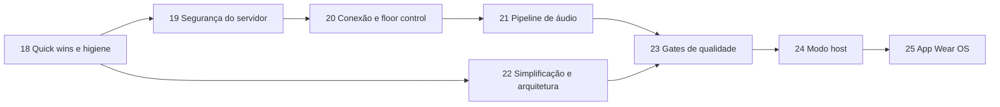

# PTT-LAN — Roadmap de Melhorias

> Continuação do roadmap do [Plano Técnico](PTT_KMP_PLANO_TECNICO.md) (fases 1–17 concluídas).
> Baseado na análise do código em `main` (commit `513c812`); contexto geral em [CONTEXTO.md](CONTEXTO.md).
>
> Legenda: **Esforço** P (≤ ½ dia) · M (1–2 dias) · G (3+ dias).
> **Status**: ✅ confirmado lendo o código · 🔎 provável, reproduzir antes de corrigir.

---

## Resumo por prioridade

| # | Problema | Impacto | Fase |
|---|---|---|---|
| 1 | Cliente pode se passar por outro `userId` (join, floor, stop) | Segurança | 19 |
| 2 | Painel e API admin sem autenticação (inclui `shutdown`) | Segurança | 19 |
| 3 | A UI derruba a sessão na primeira queda, então a reconexão automática nunca acontece | Funcional | 20 |
| 4 | Captura do iOS gera frames inválidos para o Opus | Funcional (iOS) | 21 |
| 5 | Floor pode ficar preso por ~35s se o speaker cair | Funcional | 20 |
| 6 | iOS aceita qualquer certificado, inclusive na internet | Segurança | 19 |
| 7 | Rate limit por IP quebra atrás de proxy reverso | Operação | 19 |
| 8 | `println` a cada pacote de áudio no servidor | Performance | 21 |
| 9 | Redis sobe mas não é usado | Complexidade | 22 |
| 10 | CI sem cache, JDK divergente e gates do plano (Kover, regra de módulos) ausentes | Qualidade | 18 / 23 |

## Sequência

A fase 18 vem primeiro porque é barata e deixa o CI confiável para as próximas. A 19 vem antes da 20 porque
a 20 depende de a identidade vir do JWT. A 22 pode rodar em paralelo com a 19–21, desde que não mexa nos mesmos arquivos.

Cada fase segue a regra 22.4 do plano: testes novos ou atualizados, nenhuma regressão, `ktlintFormat` + `detekt` limpos.

---

## Fase 18 — Quick wins e higiene do repositório

**Objetivo:** tirar ruído do repositório e alinhar build e CI, sem mudar comportamento.

| Item | Status | Evidência | Ação | Esforço |
|---|---|---|---|---|
| 18.1 Arquivos de máquina versionados | ✅ | `local.properties`, `hs_err_pid4676.log`, `.DS_Store`, `docs/.DS_Store`, `iosApp/**/xcuserdata/` | `git rm --cached`; os padrões já estão no `.gitignore` | P |
| 18.2 Lixo de bootstrap | ✅ | `ptt.zip` (13 bytes), `scratch/` vazio, `generate_modules.py`, `setup_apps.py`, `fetch_versions.py` | Apagar (o histórico fica no git) | P |
| 18.3 JDK divergente | ✅ | CI usa 17 (`ci.yml:17`), Docker e daemon toolchain usam 21 | Usar 21 em todos os jobs do CI e no README | P |
| 18.4 Versão fixa do plugin de serialização | ✅ | `core/core-navigation/build.gradle.kts:4` usa `"2.0.21"` com Kotlin 2.4.10 | Trocar por `alias(libs.plugins.serialization)` | P |
| 18.5 Dependências em string no servidor | ✅ | `serverApp/build.gradle.kts` (ktor-server-core/netty/websockets/content-negotiation, koin-ktor, tls-certificates) | Mover para `libs.versions.toml` | P |
| 18.6 CI lento e sem cache | ✅ | Cada job refaz setup e download | `gradle/actions/setup-gradle@v4` + `concurrency` com `cancel-in-progress` | P |
| 18.7 Docker publica imagem em PR | ✅ | `build-docker` com `push: true` roda também em `pull_request` | `push: ${{ github.event_name != 'pull_request' }}` | P |
| 18.8 README desatualizado | ✅ | Pede JDK 17+ e não cita portas, Docker nem os docs novos | Atualizar: JDK 21, portas 9393/9443, links para `CONTEXTO.md` e para este roadmap | P |

**Critério de conclusão:** CI verde com JDK 21 e cache ativo; `git ls-files` sem arquivos de máquina.

---

## Fase 19 — Segurança do servidor

**Objetivo:** fazer valer a promessa da Fase 16 ("impossível agir sem token válido") também dentro da sessão e no painel.

### 19.1 Identidade vem do token, não da mensagem ✅ — G
- **Problema:** `PttRoutes.kt:56` define `currentUserId = message.userId`; `requestFloor`/`releaseFloor` (`:89`, `:105`)
  usam o `userId` enviado pelo cliente. Qualquer cliente autenticado pode tomar ou soltar a palavra de outro,
  ou entrar com o `userId` de outro e sobrescrever a entrada dele no `PttChannel` (o mapa é indexado por `userId`).
- **Ação:** o servidor deriva `userId` (claim `deviceId` ou `sub`) e `nickname` do JWT validado no handshake e
  **ignora** esses campos nas mensagens. No protocolo, os campos `userId` de `JoinChannel`/`LeaveChannel`/`StartSpeaking`/`StopSpeaking`/`Heartbeat`
  passam a ser opcionais e depois são removidos (ver 21.5 sobre compatibilidade).
- **Testes:** em `ServerIntegrationTest`, um cliente B enviando `StopSpeaking(userId = A)` não libera a palavra de A.
- **Implementado:** o servidor gera o `userId` no login, grava como `sub` do JWT e o devolve em `LoginResponse`;
  `PttRoutes` usa só o `sub` e o `nickname` do token. O teste `serverUsesTokenIdentityAndIgnoresUserIdInMessages`
  falha no código anterior e passa no novo.

### 19.2 Autenticar o painel admin ✅ — M
- **Problema:** `DashboardRoutes.kt:85-87`: `/admin` e `/api/admin/*` estão abertos, inclusive `system/shutdown` (`exitProcess`, `:132`),
  `restart`, `kick` e `broadcast`. A porta HTTP 9393 também serve essas rotas sem TLS.
- **Ação (mínima):** Basic Auth do Ktor (`ktor-server-auth`, que já é dependência) com credencial vinda de variável de ambiente
  (`PTT_ADMIN_PASSWORD`). Sem a variável, as rotas de escrita ficam desligadas. Redirecionar 9393 → 9443 ou desligar o conector HTTP.
- **Testes:** `401` sem credencial e `200` com credencial.
- **Implementado:** provider `basic("auth-admin")` (usuário `admin`, senha em `ptt.adminPassword` / `PTT_ADMIN_PASSWORD`, comparação
  com `MessageDigest.isEqual`) envolvendo `/admin` e `/api/admin/*`; sem a variável o `authenticate` fica `optional` e as rotas de
  escrita (`restart`, `shutdown`, `broadcast`, `kick`, `delete`) não são registradas. O conector HTTP 9393 saiu do `application.conf`,
  então só resta o 9443 com TLS. Testes em `AdminAuthIntegrationTest`.

### 19.3 TLS consistente no iOS ✅ — M
- **Problema:** `HttpClient.ios.kt:18-21` aceita o `serverTrust` de qualquer host, então um MITM na internet passa.
  Android/JVM só relaxam a validação para hosts locais.
- **Ação:** repetir a regra do Android: `isLocalNetwork(challenge.protectionSpace.host)` → aceita; caso contrário,
  `NSURLSessionAuthChallengePerformDefaultHandling`.
- **Evolução opcional (plano, seção 12):** TOFU com fingerprint, guardando o hash do certificado por host nas settings. Só vale fazer se o uso em LAN com MITM for uma preocupação real.
- **Implementado:** o `handleChallenge` do Darwin só usa o `serverTrust` quando `isLocalNetwork(challenge.protectionSpace.host)`;
  fora da LAN cai em `NSURLSessionAuthChallengePerformDefaultHandling`, igual ao Android/JVM. Junto, `isLocalNetwork` passou a
  ignorar o ponto final do nome mDNS (`ptt-server.local.`, como o `NSNetService.hostName` devolve), com caso novo em
  `NetworkCommonUtilsTest` — sem isso a regra nova rejeitaria justamente o servidor da LAN descoberto por Bonjour. O TOFU com
  fingerprint continua fora.

### 19.4 Segredos fora do código ✅ — P
- **Problema:** senha do keystore `"password"` (`Application.kt:43`, `application.conf:10-11`); o segredo JWT é gerado a cada boot
  (`JwtConfig.kt:13`), então qualquer reinício ou deploy desloga todos e impede ter mais de uma instância.
- **Ação:** ler `PTT_JWT_SECRET` e `PTT_KEYSTORE_PASSWORD` do ambiente, com o valor aleatório atual como fallback para LAN.
  Documentar no README e no Dockerfile.
- **Implementado:** `JwtConfig` lê `PTT_JWT_SECRET` (fallback: UUID por boot); `main()` gera o keystore com `PTT_KEYSTORE_PASSWORD`
  e o `application.conf` sobrescreve `keyStorePassword`/`privateKeyPassword` com a mesma variável (fallback `password`).
  README ganhou a tabela de variáveis e o Dockerfile as declara.

### 19.5 Rate limit atrás de proxy reverso ✅ — P
- **Problema:** `requestKey { origin.remoteHost }` (`Application.kt:106,112`) sem o plugin `XForwardedHeaders`. Atrás do proxy
  da Fase 15, todos os usuários dividem o mesmo IP e o mesmo limite de 5 logins/min.
- **Ação:** instalar `XForwardedHeaders` só quando `PTT_TRUST_PROXY=true`, para não permitir spoofing de IP em LAN.
- **Implementado:** o plugin é instalado sob `ptt.trustProxy` (env `PTT_TRUST_PROXY`). `ProxyRateLimitTest` cobre os dois lados:
  com a flag ligada, seis logins de `X-Forwarded-For` diferentes passam; desligada, o sexto leva `429` porque todos dividem o mesmo IP.

**Critério de conclusão:** nenhuma ação de controle ou admin funciona com identidade forjada ou sem credencial,
com testes de integração cobrindo cada caso.

---

## Fase 20 — Conexão e floor control

**Objetivo:** fazer a reconexão automática (Fase 6) funcionar de verdade e impedir que o canal trave.

### 20.1 A UI anula a reconexão automática ✅ — M
- **Problema:** `RootComponent.kt:91`: na primeira transição `Connected → Reconnecting`, chama `disconnect()` e volta para a
  tela de conexão. O loop de backoff do `PttWebSocketClient` nunca chega a rodar.
- **Ação:** em `Reconnecting`, manter a tela atual com um banner "Reconectando…" (o `ConnectionStatusBadge` já existe).
  Só voltar para a tela de conexão quando o status for `Disconnected` (tentativas esgotadas ou saída manual).
  Adicionar ao `PttWebSocketClient` o limite de tentativas do plano (padrão 10), que hoje não existe.
  Depois de reconectar, reenviar `JoinChannel` para o canal ativo (`ChannelSessionRepository.activeSessionChannelId`).
- **Testes:** `PttWebSocketClient` com `MockEngine` simulando queda → status `Reconnecting` → `Connected` com re-join.
- **Implementado:** `RootComponent` só volta para a tela de conexão em `Disconnected`; em `Reconnecting` a tela atual
  continua e o `ConnectionStatusBadge` (agora alimentado pelo status real, não mais fixo em `Online`) mostra "reconectando".
  `PttWebSocketClient` ganhou `maxReconnectAttempts` (padrão 10) e reenvia sozinho o último `JoinChannel` ao reconectar.
  `PttWebSocketClientReconnectTest` sobe um servidor WSS de verdade: derruba a primeira sessão e exige o re-join na segunda,
  e verifica que o loop desiste depois do limite em vez de tentar para sempre.

### 20.2 Identidade estável do dispositivo ✅ — P
- **Problema:** desde a 19.1 o `userId` é emitido pelo servidor a cada login, então muda a cada conexão; `deviceId = "device-${nickname.hashCode()}"`
  (`ConnectionRepositoryImpl.kt:65`) muda se o nickname mudar e colide entre pessoas com o mesmo nome.
- **Ação:** gerar um UUID de dispositivo uma vez e persistir em settings (`device_id`), enviado como `deviceId` no login.
  O `userId` continua emitido pelo servidor (19.1); para a 20.3, o servidor pode reaproveitar o `userId` do mesmo `deviceId`.
- **Implementado:** `deviceId(settings)` em `ConnectionRepositoryImpl.kt` grava um `Uuid.random()` (stdlib do Kotlin) na chave
  `device_id` na primeira vez e reusa depois; o login passou a enviá-lo. `DeviceIdTest` cobre a estabilidade entre chamadas
  e a diferença entre instalações.

### 20.3 "Nome já em uso" ao reconectar 🔎 — M
- **Problema provável:** quando a rede cai sem close, o servidor só remove a sessão antiga no timeout de ping (~20s + timeout).
  Se o cliente reconectar antes disso, `addGlobalConnection` (`ChannelRegistry.kt:71`) recusa o próprio usuário.
  Além disso, a exceção lançada em `PttWebSocketClient.kt:150` acontece depois de `isFirstAttempt = false` (`:112`),
  então é engolida e a mensagem não chega à UI.
- **Ação:** unicidade por nickname só entre `deviceId`s **diferentes**. Se o mesmo `deviceId` reconectar, a nova sessão substitui a antiga,
  que é fechada. Propagar o motivo do close como `ConnectionStatus`/erro até a UI.
- **Reproduzir antes:** derrubar o Wi-Fi do cliente por ~3s com o servidor em pé.
- **Implementado:** `addGlobalConnection` passou a receber o `deviceId` (claim do JWT) e só recusa o nickname quando ele
  está em uso por **outro** dispositivo; o mesmo `deviceId` substitui a própria sessão antiga, que é fechada com
  "Sessão substituída por uma nova conexão". No cliente, um close `VIOLATED_POLICY` vira `ServerRefusedException`, que é
  relançada mesmo depois da primeira tentativa (antes era engolida) e fica em `lastCloseReason` → `ConnectionRepository.lastDisconnectReason`
  → mensagem real na tela de conexão. Testes: `ReconnectSameDeviceTest` (servidor) e `surfacesTheReasonWhenTheServerRefusesTheConnection` (cliente).

### 20.4 Floor preso quando o speaker some ✅ — M
- **Problema:** o servidor ignora `Heartbeat` (`PttRoutes.kt:107`) e nenhum cliente envia heartbeat. O floor só é liberado com
  `StopSpeaking` ou quando a sessão fecha, o que leva até ~35s com `pingPeriod = 20s`.
- **Ação (a mais simples que resolve):** timeout de inatividade no `PttChannel`. Se o speaker não mandar frame de áudio
  por N ms (ex.: 2000), libera o floor e faz broadcast de `SpeakerChanged(false)`. Também vale um teto de duração
  por fala (ex.: 60s), configurável. Com isso, o `Heartbeat` pode ser **removido** do protocolo, já que o ping do WebSocket cobre a conexão.
- **Testes:** `ServerIntegrationTest` com um speaker que para de enviar áudio → floor liberado após o timeout.
- **Implementado:** `PttChannel` ganhou um watchdog que solta a palavra quando o áudio para por `floorIdleTimeoutMs`
  (padrão 2s) ou quando a fala passa de `maxSpeechDurationMs` (padrão 60s); ambos configuráveis por `application.conf`
  (`ptt.floorIdleTimeoutMs`/`ptt.maxSpeechDurationMs`, com `PTT_FLOOR_IDLE_TIMEOUT_MS`/`PTT_MAX_SPEECH_DURATION_MS`).
  `FloorTimeoutTest` usa 300 ms e exige o `SpeakerChanged(isSpeaking = false)`. O `Heartbeat` continua no protocolo,
  mas segue sem uso — a remoção fica para a 21.5, junto com a discussão de compatibilidade.

### 20.5 Versão do app nunca chega ao servidor ✅ — P
- **Problema:** o painel lê o parâmetro `version` na query, mas `PttWebSocketClient` não o envia. O painel mostra sempre "Desconhecida".
- **Ação:** incluir `&version=` na URL do WebSocket (a mesma versão usada no 21.5).
- **Implementado:** `APP_VERSION` em `core-network/AppVersion.kt` vai na query do handshake; o teste de reconexão
  confere que as duas conexões (a original e a reconectada) informam a versão. A 21.5 acrescenta o `PROTOCOL_VERSION` ao lado dela.

**Critério de conclusão:** derrubar e religar o Wi-Fi durante uma fala não tira o usuário do canal, e o floor é liberado em ≤ 2s quando o speaker cai.

---

## Fase 21 — Pipeline de áudio

**Objetivo:** Opus funcionar em todas as plataformas e o servidor aguentar mais participantes.

### 21.1 Framing da captura no iOS ✅ / 🔎 — M
- **Problema:** `IosAudioInterfaces.kt:48` usa um tap de ~2048 frames e reamostra com salto inteiro (`:58`).
  2048 amostras não é um tamanho de frame Opus válido (a 48 kHz: 120/240/480/960/1920/2880), e o encoder
  engole a exceção e devolve `ByteArray(0)` (`OpusAudioCodec.kt:28`), então **com Opus ligado o iOS transmite pacotes vazios**.
  🔎 Se o hardware estiver a 44,1 kHz, `ratio = max(1, 44100/48000) = 1` e o áudio sai com a taxa errada (voz aguda ou acelerada).
- **Ação:** converter com `AVAudioConverter` para 48 kHz Int16 mono e acumular em buffer circular, emitindo exatamente 960 amostras (20ms),
  igual ao Android e ao JVM.
- **Testes:** teste comum do `OpusAudioCodec` garantindo que `encode` de 960 amostras não retorna vazio. Validação manual iOS ↔ Android com Opus.
- **Implementado:** o tap do iOS agora passa por um `AVAudioConverter` para 48 kHz Int16 mono e acumula em `pending`,
  emitindo blocos de exatamente 960 amostras (1920 bytes), como Android e JVM. Sai o decimador por passo inteiro, que
  desafinava quando o hardware estava a 44,1 kHz. `OpusAudioCodecTest` (commonTest) cobre os 960 samples e o round-trip;
  a validação iOS ↔ Android com Opus ligado continua sendo manual, em dispositivo.

### 21.2 Falhas silenciosas no codec ✅ — P
- **Ação:** `OpusAudioCodec` deixa de engolir exceções e passa a logar. O repositório faz fallback explícito: não envia frame vazio.
- **Implementado:** `OpusAudioCodec` loga a falha com Kermit (`tag=audio`) em vez de `catch (_: Exception)`.
  `VoiceRepositoryImpl` descarta o frame quando a codificação vem vazia — o fallback anterior mandava o PCM cru
  rotulado como OPUS, que nenhum receptor conseguia decodificar.

### 21.3 Hot path do servidor ✅ — M
- **Problemas:**
  - `println` a cada pacote (`PttChannel.kt:97`), o que dá ~50 linhas/s por speaker, mais uma por participante lento.
  - Um `launch` por frame (`PttRoutes.kt:120`), sem ordem garantida e sem limite de concorrência.
  - Um participante lento segura o `coroutineScope` e atrasa todos os outros.
  - `bytesCount`/`slowCount` são alterados em coroutines concorrentes (`PttChannel.kt:110,113`), o que é uma condição de corrida (afeta só métricas).
  - `frame.data.copyOf()` por destinatário (`:109`) quando o buffer poderia ser compartilhado (é só leitura).
- **Ação:** processar o áudio em sequência no handler (sem `launch`). Cada `Participant` ganha um `Channel<ByteArray>(capacity = N, DROP_OLDEST)`
  consumido por uma coroutine própria, e o broadcast só faz `trySend`. Contadores com `AtomicLong`/`AtomicInteger`. Logs de pacote em `debug` (21.4).
- **Resultado:** um cliente lento perde os próprios pacotes sem atrasar os demais.
- **Implementado:** cada `Participant` tem um `Channel<ByteArray>(50, DROP_OLDEST)` drenado por uma coroutine própria;
  `broadcastBinary` só faz `trySend` e compartilha o buffer do frame em vez de copiá-lo por destinatário.
  O handler do WebSocket processa o áudio em sequência (sem `launch` por frame), os contadores viraram
  `AtomicLong`/`AtomicInteger` e os logs de pacote foram para `debug` via SLF4J. `AudioBroadcastOrderTest` mostra o
  problema antigo de forma direta: com o código anterior, 30 pacotes chegavam como `[0, 20, 18, 17, …]`.

### 21.4 Logging de verdade ✅ — M
- **Problema:** 44 `println`/`printStackTrace` em servidor, core, data e features. Kermit está configurado no Koin, mas quase não é usado. O Logback do servidor fica sem uso.
- **Ação:** servidor usa SLF4J (`call.application.log` ou `LoggerFactory`), com nível configurável em `logback.xml`. Clientes usam `Logger.withTag("network"|"audio"|…)`.
  Regra do Detekt `ForbiddenMethodCall` para `println`/`printStackTrace` fora de testes.
- **Implementado:** os 44 `println`/`printStackTrace` de produção viraram SLF4J no servidor (`logback.xml` novo, nível por
  `PTT_LOG_LEVEL`, logs de pacote do `PttChannel` em `debug`) e Kermit nos clientes (`network`, `audio`, `ptt`).
  Mensagens de log passaram a ser escritas em inglês. A regra `ForbiddenMethodCall` foi ativada no `detekt.yml`, mas ela só
  roda com resolução de tipos (`detektMain`), que o build ainda não usa — então quem cobra hoje é a task `checkNoPrintln`
  (raiz), da qual todo `detekt` depende. Trocar por `detektMain` fica para a 23.3, junto com o baseline.

### 21.5 Robustez do protocolo ✅ — M
- **Problema:** as mensagens de controle usam o `Json` padrão (estrito) nos dois lados, então **adicionar um campo** quebra clientes antigos.
  Também não existe versão de protocolo. O envelope de áudio vai em JSON (~120 bytes) com `channelId`/`senderId` repetidos em cada pacote,
  o que costuma ser maior que o próprio payload Opus.
- **Ação:**
  1. `val PttJson = Json { ignoreUnknownKeys = true; encodeDefaults = false }` em `core-network`, usado por cliente e servidor.
  2. `PROTOCOL_VERSION` enviado na query do handshake. O servidor recusa versões incompatíveis com um close reason legível.
  3. (Opcional, medir antes) Cabeçalho binário fixo: `seq:Int32, timestamp:Int64, codec:Byte` (13 bytes). `channelId` e `senderId` saem do pacote,
     porque o servidor já sabe de quem é a sessão. Se fizer, registrar em ADR, já que o plano previa ProtoBuf.
- **Implementado:** itens 1 e 2. `PttJson` (`ignoreUnknownKeys`, `encodeDefaults = false`) em `core-network` é usado por
  cliente e servidor; `PROTOCOL_VERSION` vai na query do handshake e o servidor recusa versão diferente com close reason
  legível — cliente antigo, que não manda o parâmetro, continua entrando. O `Heartbeat` saiu do protocolo: ninguém enviava,
  o ping do WebSocket cobre a conexão e o watchdog da 20.4 cobre o floor. Testes: `ProtocolVersionTest` (servidor) e
  `ProtocolCompatibilityTest` (campo novo de um par mais recente é ignorado).
  O item 3 (cabeçalho binário) fica de fora: o roadmap pede medir antes, e ainda não há medição.

### 21.6 Arquivos órfãos no histórico ✅ — P
- **Problema:** o expurgo de 50 mensagens por canal apaga só as linhas do banco (`VoiceRepositoryImpl.kt:120-122`). Os `.pcm` ficam no disco
  até o limite de tamanho mandar apagar.
- **Ação:** buscar os mais antigos com `getOldestMessagesByChannel` (query que já existe), apagar os arquivos e depois as linhas.
- **Testes:** repositório com driver SQLite in-memory + `FakeFileSystem` do Okio.
- **Implementado:** `purgeOldestMessages` busca as mensagens mais antigas com `getOldestMessagesByChannel`, apaga os
  arquivos e só então remove as linhas. O `VoiceRepositoryImpl` passou a receber o `FileSystem` (padrão `FileSystem.SYSTEM`),
  o que tornou possível o `VoiceMessagePurgeTest` com driver SQLite in-memory + `FakeFileSystem`, incluindo o caso em que
  o arquivo já sumiu.

**Critério de conclusão:** iOS ↔ Android ↔ Desktop se ouvem com Opus; teste de carga simples (1 speaker, 10 ouvintes, 1 ouvinte com atraso artificial)
sem atraso para os demais; servidor sem log por pacote em `INFO`.

---

## Fase 22 — Simplificação e arquitetura

**Objetivo:** tirar o que não é usado e reduzir duplicação. Nada de abstração nova sem uso real.

| Item | Status | Evidência | Ação | Esforço |
|---|---|---|---|---|
| 22.1 Redis sem uso | ✔ feito | `RedisManager` sobe e tenta `localhost:6379` a cada boot; `ChannelRegistry.kt:46` recebe e nunca usa | **Decidido na [ADR 0007](adr/0007-remover-redis.md): removido.** `RedisManager`, Lettuce e o parâmetro morto do `ChannelRegistry` saíram; o estado segue em memória e multi-instância volta como fase própria quando houver necessidade real | P (remover) / G (implementar) |
| 22.2 Módulos vazios | ✔ feito | `core-testing`, `feature-admin-web` | Os dois saíram do `settings.gradle.kts` e do disco. O `core-testing` não tinha código, mas reexportava as dependências de teste: cada módulo passou a declarar as suas (`kotlin("test")`, `coroutines-test`, `mockk` e `turbine` onde é usado). Recriar só quando houver fakes compartilhados de fato | P |
| 22.3 HttpClient duplicado | ✔ feito | `HttpClient.android.kt` e `HttpClient.jvm.kt` idênticos | Source set `jvmAndAndroidMain` criado em `core-network` com a única implementação (`HttpClient.jvmAndAndroid.kt`); a diferença era só `@SuppressLint` vs `@Suppress`, e o `@Suppress` com o id do lint serve para os dois | P |
| 22.4 Jitter buffer duplicado | ✔ feito | `AudioPacket` + lógica de sequência em `AndroidAudioInterfaces.kt` e `jvmMain/AudioInterfaces.kt` | `AudioPacket` e `JitterBufferPolicy` (pré-buffer, ordenação, descarte de atrasado, resync de nova fala) foram para `commonMain`, com `JitterBufferPolicyTest`. Android e JVM mantêm só a fila e a escrita no `AudioTrack`/`SourceDataLine`. A política não tem lock: vive na thread de playback, onde o estado de sequência já estava | M |
| 22.5 DTO de login duplicado | ✔ feito na 19.1 | `LoginRequest`/`LoginResponse` em `AuthRoutes.kt:15` e `PttWebSocketClient.kt:34` | Servidor usa os de `core-network/protocol` (**feito na 19.1**: `protocol/AuthDto.kt`) | P |
| 22.6 Chaves de settings espalhadas | ✔ feito | `"allow_cache"` em 8 lugares, `"app_theme"` em 12 etc. | `SettingsKeys` + `SettingsDefaults` em `core-datastore`, usados por componentes, repositórios, `MainActivity` e testes. O default de `always_listening` era `true` na tela e virou constante única | P |
| 22.7 `VoiceRepositoryImpl` faz tudo | ✔ feito | 398 linhas: transmissão, recepção, gravação cifrada, cache, replay. Estado mutável acessado por várias coroutines em `Dispatchers.Default` sem sincronização | Virou três: `VoiceRepositoryImpl` (140 linhas, floor + TX/RX), `HistoryRepositoryImpl` (listagem, replay, exclusão) e `HistoryRecorder` (gravação e limite do cache), este com todo o estado confinado em `Dispatchers.Default.limitedParallelism(1)`. O domínio ganhou `HistoryRepository` ao lado de `VoiceRepository`, e `HistoryRecorderTest` cobre gravar, não gravar com cache desligado e descartar gravação vazia | M |
| 22.8 Regras de dependência | ✔ feito | `feature-ptt` depende de `core-network` só por `ParticipantDto` no `PttState` | `PttState.participants` virou `List<ParticipantDomain>` e a dependência saiu do `build.gradle.kts`. O papel agregador de `core-di`/`core-navigation` está documentado na [ADR 0008](adr/0008-grafo-de-dependencias-entre-modulos.md), que também define o alvo da regra automática da 23.4 | P |
| 22.9 `AudioCrypto` com chave fixa | ✔ feito | RC4 com chave no código (`AudioCrypto.kt`) só protege o cache | **Decidido na [ADR 0009](adr/0009-remover-audiocrypto.md): removido (opção a).** O histórico passa a gravar PCM puro; o cache gravado antes fica ilegível e sai no expurgo | P |
| 22.10 Telas grandes | ✔ feito (metade) | `SettingsScreen.kt` 493 linhas, `HistoryScreen.kt` 396 | `HistoryScreen.kt` foi de 546 para 244 linhas, com `HistoryMessageList.kt`, `HistoryPlayer.kt` e `HistoryDialogs.kt` ao lado — ela cresceu quando a barra de progresso entrou, então a condição do item ("só quando for mexer") passou a valer. `SettingsScreen.kt` (449 linhas) continua intocada e fica para quando alguém mexer nela | M |

**Critério de conclusão:** build sem Redis (ou com Redis usado de fato), sem módulos vazios e sem arquivos `actual` idênticos.

---

## Fase 23 — Gates de qualidade

**Objetivo:** fazer o CI cobrar o que a seção 18.3 do plano promete.

| Item | Status | Ação | Esforço |
|---|---|---|---|
| 23.1 Testes que faltam | ✔ feito (a lista) | `PttWebSocketClient` (reconexão/backoff), `PttChannel`/`ChannelRegistry` (cleanup de 5 min, floor timeout, spoofing), jitter buffer comum, expurgo do histórico | A maior parte caiu nas fases 19–22 (`PttWebSocketClientReconnectTest`, `FloorTimeoutTest`, `ServerIntegrationTest`, `JitterBufferPolicyTest`, `VoiceMessagePurgeTest`, `HistoryRecorderTest`, `HistoryPlaybackTest`). Nesta fase entraram `ChannelRegistryCleanupTest` (tempo virtual), `AdminActionsTest` (kick/broadcast/delete/restart) e os use cases do domínio: **domain-ptt foi de 10,5% para 91,9%** e o servidor de 80,8% para 86,3%. `AdminActionsTest` achou um bug real: o `SystemAlert` do painel era serializado pelo tipo concreto, sem o discriminador `type`, e nenhum cliente conseguia decodificar | G |
| 23.2 Cobertura no CI | ✔ feito | `koverVerify` com as metas da seção 16.2 no job `unit-test`; publicar o relatório HTML como artefato | Kover passou a ser aplicado em todos os módulos (antes só na raiz e no `serverApp`), com UI Compose pura (por anotação `@Composable`, não por nome de arquivo) e código gerado fora da medição, como a seção 16.2 isenta. `koverVerify` roda no CI e o HTML sobe como artefato. **As metas são o piso de hoje, não o alvo do plano** (`coverageFloors` na raiz): domain 90, data 30, core-network 45, core-audio 25, feature-ptt 60, connection 55, channel-list 85, history 35, settings 90, server 85. O gate barra regressão agora; a 23.1 sobe os números | P |
| 23.3 Detekt frouxo | ✔ feito | `LargeClass` 600 / `LongMethod` 60 (`detekt.yml:110,113`), contra 300/40 no plano | Limites voltaram para **300/40**. No `serverApp` não foi preciso baseline: sobraram só 3 violações (todas `LongMethod`), corrigidas extraindo funções. O `serverApp` passou a ser analisado **com resolução de tipos** (`detektMain`/`detektTest` no CI e no `detekt` local) e está limpo — as 6 issues que apareceram (`Thread.sleep` em suspend, tipo de plataforma, nomes qualificados, `InjectDispatcher`) foram corrigidas. **Implementado (KMP):** nos módulos KMP a task `detekt` procurava `src/main/kotlin` e **não analisava nada** (NO-SOURCE); só o `serverApp` era checado de fato. Agora ela depende das tasks com resolução de tipos (`detektMainJvm`, `detektTestJvm`, `detektMainAndroid`) e da `detektIosMainSourceSet`, sem tipos, então o CI roda só `detekt`. Dos 358 achados, 216 eram ruído: código gerado (SQLDelight, recursos do Compose), agora excluído, e convenção do Compose, com `FunctionNaming` ignorando `@Composable`, `UnusedPrivateFunction` ignorando `@Preview`, `MagicNumber` aceitando propriedade nomeada (a paleta do `Color.kt`) e `EmptyFunctionBlock` aceitando override vazio de listener. `MaxLineLength` foi para 140, o limite em que o `ktlint_official` formata, porque as duas ferramentas brigavam. Os pontuais foram corrigidos (`require`/`check`, sombra de nome, `enum` no próprio arquivo, `normalizeHost` com `NetworkUtilsTest`). **Decisão: baseline para o estrutural**, com 97 achados únicos (`LongMethod`, `MagicNumber`, `catch (Exception)`, `InjectDispatcher`) em `config/detekt/baseline/`, um arquivo por módulo e task, porque por padrão `mainJvm` e `mainAndroid` dividem um arquivo e o último sobrescreve o outro. Corrigir vai junto quando alguém mexer no arquivo, como na 22.10. O código novo da fase 24 entrou sem baseline: os dois achados dele (`InjectDispatcher` no `DesktopServerHost`, `ReturnCount` no `ConnectionComponent`) foram corrigidos. Verificado plantando um `MagicNumber` novo: antes passava, agora falha. **Limitação:** o Detekt analisa `commonMain` e a plataforma como um módulo só e acusa `expect`/`actual` como erro de compilação; só essas declarações perdem a resolução de tipos | M |
| 23.4 Regra de módulos | ✔ feito | A task do plano (17.3) não existe. Mínimo: task em `buildSrc` que falha se `features/*` depender de outra feature | `ptt.module-rules` em `buildSrc` registra `checkModuleDependencies`, da qual o `check` depende: falha se uma feature depender de outra feature ou de `core-network`, o alvo definido na [ADR 0008](adr/0008-grafo-de-dependencias-entre-modulos.md). Verificado plantando as duas dependências proibidas | P |
| 23.5 Snapshot tests | ✔ feito | Plano marca como feito, mas não existem. Roborazzi já está no catalog | `DesignSystemSnapshotTest` em `core-designsystem/src/androidHostTest`: 5 imagens (`PttButton` transmitindo e recebendo, `ConnectionStatusBadge`, `ChannelCard`, `ParticipantAvatar`), todas no tema escuro. `verifyRoborazziAndroidHostTest` roda no CI e os diffs sobem como artefato quando falha. O Robolectric precisou de `@Config(sdk = [34])`: no SDK do `compileSdk` ele quebra com "Failed to interact with raw FileDescriptor internals". **As imagens são gravadas no Linux**, pelo workflow manual `record-snapshots.yml`, porque o Robolectric renderiza gradiente e canto arredondado de forma diferente no macOS — imagem gravada no Mac nunca bate no runner | M |

**Critério de conclusão:** CI falha com cobertura abaixo da meta, nova issue de Detekt ou dependência proibida entre features.

---

## Fase 24 — Modo host

**Objetivo:** um dos aparelhos hospeda o canal, sem máquina à parte, como decidido na
[ADR 0010](adr/0010-modo-host-no-app.md). O `serverApp` e a imagem Docker continuam como estão.

| Item | Status | Ação | Esforço |
|---|---|---|---|
| 24.1 Núcleo do servidor em módulo próprio | ✔ feito | Extrair `ChannelRegistry`, `PttChannel`, rotas, `JwtConfig` e `Application.module()` para `server-core` (JVM), junto com os testes. Em `serverApp` ficam só `main`, keystore, Netty e JmDNS. Sem mudança de comportamento | `server-core` tem o `module()` (em `ServerModule.kt`), rotas, canais, auth, o painel estático e os 19 testes do servidor, com o piso de cobertura de 85 que era do `serverApp`. O `serverApp` ficou com `main`, keystore, Netty, JmDNS e o `application.conf`. O anúncio mDNS saiu do `module()` e passou a ser feito no `main`: os testes pararam de anunciar o servidor na rede, e quem embutir o núcleo decide como anunciar. O `/system/shutdown` do painel continua com `exitProcess`, o que derrubaria o app inteiro num host embutido; a 24.2 tem de tratar isso | M |
| 24.2 Hospedar no Desktop | ✔ feito | Ação "Hospedar" na tela de conexão do `desktopApp`: sobe o servidor no próprio processo, anuncia por mDNS e conecta nele como cliente comum | `PttHostServer` (em `server-core`) sobe o `module()` num Netty embutido, com certificado gerado em memória a cada início e anúncio mDNS como `PTT-LAN-<nome>`; o anúncio saiu do `serverApp` para `announceOnLan`, usado pelos dois. O domínio ganhou `LocalServerHost`, registrado só no Desktop (`DesktopServerHost`); o `ConnectionComponent` o recebe por `getOrNull()` e a tela mostra o cartão "Hospedar" apenas quando ele existe. Fechar a janela para o servidor, senão as threads do Netty manteriam o processo vivo. Sem `application.conf`, as rotas de escrita do painel ficam desligadas, então o `exitProcess` do shutdown não é alcançável no host. **Bug evitado:** o `install(Koin)` do servidor parava o Koin global do app e punha o dele no lugar; virou `KoinIsolated`. `PttHostServerTest` cobre TLS, anúncio, shutdown desligado, start idempotente e o Koin do app (falha com o plugin antigo) | M |
| 24.3 PIN de sala | ✔ feito | No modo host, `/api/auth/login` exige o PIN definido por quem hospeda. O `serverApp` segue sem PIN | `LoginRequest` ganhou `pin` opcional (clientes antigos seguem compatíveis) e o login compara com `ptt.roomPin` em tempo constante, respondendo 401 quando não bate. Só o `PttHostServer` preenche `ptt.roomPin`; o `serverApp` não tem a chave e continua aberto. A tela de conexão ganhou o campo "PIN da sala (opcional)", usado para entrar e para hospedar; PIN em branco hospeda uma sala aberta. O cliente trata o 401 como "PIN da sala incorreto" (antes viraria `NoTransformationFoundException`). O rate limit de login (5/min por IP) limita tentativa de força bruta. `RoomPinTest` e `PttHostServerTest` cobrem servidor e cliente real, ambos vistos falhando antes | P |
| 24.4 Spike Android | ✔ feito | Validar engine (Netty × CIO) com TLS, keystore PKCS12 gerado no aparelho, `NsdManager.registerService` e foreground service. Passa se um celular hospedar e outros dois falarem por 10 min com a tela bloqueada | **No emulador (Android 15, API 35), passou de primeira:** `HostModeSpikeTest` (instrumentado, `./gradlew :androidApp:connectedDebugAndroidTest`) sobe o `PttHostServer` no aparelho com **Netty + TLS**, faz login com PIN pelo `PttWebSocketClient` real, abre o WebSocket e recebe a lista de participantes, e acha o servidor anunciado por **NSD** (`announceWithNsd`). Achados: CIO nem precisou ser testado, o Netty funciona (tenta o `epoll` nativo, não acha e cai para NIO, só log de debug); o certificado em memória não pediu PKCS12, porque o `buildKeyStore` usa o tipo padrão da plataforma; o `KoinIsolated` da 24.2 também convive com o Koin do app no Android; o Netty 4.2 arrasta nativos de QUIC para desktop, excluídos (`netty-codec-native-quic`); o servidor soma **+5,1 MB** ao APK de release sem R8 (17,4 → 22,5 MB), então fica só no APK de teste até a 24.5. **Roteiro manual com aparelhos físicos: passou** (21/09), com um Motorola razr 60 hospedando. Os testes em aparelho acharam e corrigiram bugs de descoberta e reconexão (PR #18): apelido com espaço no fim, iOS conectando pelo nome de host e reconexão por cima de uma sessão aberta. Nada abaixo da API 35 foi testado (o `minSdk` é 26) | M (prazo de 1–2 dias) |
| 24.5 Hospedar no Android | ✔ feito | Só se a 24.4 passar. Opus como padrão no host; painel admin não é exposto | `AndroidServerHost` liga o `PttHostServer` com anúncio por NSD e é registrado no Koin do `PttApplication`, então o cartão "Hospedar" aparece no Android. O foreground service passou a subir também enquanto houver sala hospedada, mesmo fora de canal (`listeningServiceWanted`, com teste); o "Stop" da notificação encerra a sala. O painel admin não é servido no modo host (`ptt.adminPanel=false`): as métricas usam `ManagementFactory`, que o Android não tem, e o shutdown chamaria `exitProcess`. **Opus não virou padrão:** o codec é de quem fala, e o custo do host é retransmitir a fala de cada participante, então trocar só o do host quase não muda a carga. O ganho real pede Opus como padrão para todos, decisão à parte. Verificado no emulador pela interface: hospedar com PIN leva à lista de canais, com o serviço em primeiro plano; do Mac, via `adb forward`, o login dá 401 sem PIN e com PIN errado e 200 com o certo, e `/api/admin/metrics` dá 404. O APK de release cresce 5,1 MB | G |

**Roteiro manual da 24.4** (três aparelhos na mesma Wi-Fi, com o build da 24.5): (1) o celular A hospeda com PIN; (2) B e C acham "PTT-LAN-<nome>" na lista e entram com o
PIN; (3) A bloqueia a tela; (4) B e C alternam falas por 10 min; (5) anotar cortes de áudio, quedas de conexão e o
consumo de bateria de A no período. Pontos a observar: Doze e economia de energia do fabricante derrubando o
servidor com a tela bloqueada, e se o Wi-Fi em modo de economia aumenta a latência (se sim, a 24.5 pega um
`WifiLock` de baixa latência enquanto hospeda).

**Critério de conclusão:** Desktop (e Android, se o spike passar) hospeda um canal descoberto pelos outros
clientes via mDNS, sem `serverApp` rodando na rede.

---

## Fase 25 — App Wear OS

**Objetivo:** o relógio entra num canal como cliente e fala e ouve sem depender do celular, como decidido na
[ADR 0011](adr/0011-app-wear-os.md). Só cliente: o relógio não hospeda sala.

| Item | Status | Ação | Esforço |
|---|---|---|---|
| 25.1 Spike em relógio físico | 🔎 parcial | Validar, sem o celular por perto: Wi-Fi sob demanda (`requestNetwork` com `TRANSPORT_WIFI` + `bindProcessToNetwork`), descoberta NSD por esse Wi-Fi, `AudioRecord`/`AudioTrack` com Opus, alto-falante, botões físicos e consumo de bateria. Passa se o relógio achar o servidor, entrar num canal e falar e ouvir com um celular por 30 min | **Parte automática passou** no Galaxy Watch9 (SM-L355F, Wear OS sobre Android 17/API 37, só `armeabi-v7a`): `WearSpikeTest` (`./gradlew :wearApp:connectedDebugAndroidTest`, com um servidor na rede) sobe o Wi-Fi com `requestNetwork`, acha o servidor por NSD em ~0,4 s, entra no "Geral" com o `PttWebSocketClient` real em ~2 s, captura 20 ms do microfone e o Opus aceita todos os frames (~110 bytes cada), e acha o alto-falante. **Achado:** no Android 17 o app só vê e alcança a rede local com `ACCESS_LOCAL_NETWORK` (permissão em tempo de execução); sem ela o NSD só abre um seletor do sistema (`NsdPickerActivity`) e o login para `192.168.x.x` estoura o tempo, enquanto o `adb shell` conecta. O `androidApp` também tem `targetSdk` 37 e vai precisar dela em celulares com Android 17 (hoje o razr está na API 36). `MulticastLock` não foi necessário. **Falta, à mão, com as telas da 25.3:** o roteiro abaixo (30 min, bateria, volume) e o tempo do Wi-Fi a frio — no spike ele já estava ligado pelo `adb` sem fio | M (prazo de 1–2 dias) |
| 25.2 Módulo `:wearApp` | ✔ feito | Só se a 25.1 passar. App Android (`minSdk` 30) com o mesmo papel do `androidApp`: depende das features e do `core-di`, sem `server-core`. Reusa `RootComponent` e os componentes das features | `WearApplication` sobe o mesmo grafo do Koin do celular, sem o host de sala; `MainActivity` usa o `RootComponent` com os componentes das features; `LanNetwork` pede o Wi-Fi e prende o processo a ele, e refaz a busca quando a LAN fica acessível. Dependências novas no catálogo: Compose for Wear OS 1.6.2 e `activity-compose`. **Achado no relógio:** criar a navegação antes da permissão fazia a busca abrir o seletor do sistema (`NsdPickerActivity`) por cima do pedido; agora as permissões (microfone e, no Android 17, rede local) vêm antes, com um aviso na tela. O `androidApp` ainda busca antes da permissão: num celular com Android 17 o seletor pode aparecer no primeiro uso | M |
| 25.3 Telas do relógio | a fazer | Compose for Wear OS: servidores (descoberta + IP manual), canais e PTT (botão de segurar e participantes). Sem histórico e com configurações mínimas (nome e PIN) | M |
| 25.4 Sessão e bateria | a fazer | Foreground service com Ongoing Activity, só enquanto há sessão; sem "sempre escutando"; botões `KEYCODE_STEM_*` mapeados para o PTT pelo `handlePttKey`; saída de áudio verificada (alto-falante ou fone Bluetooth) | M |
| 25.5 CI | a fazer | Build do `:wearApp` no workflow, ao lado do `androidApp` | P |
| 25.6 Rede local no Android 17 (celular) | ✔ feito | Achado na 25.1: o `androidApp` tem `targetSdk` 37 e, num celular com Android 17, não acharia salas nem conectaria sem `ACCESS_LOCAL_NETWORK` | Permissão declarada no manifesto e pedida na abertura junto com microfone e notificações, só a partir da API 37 (`startupPermissions`, com `StartupPermissionsTest`). Não verificado em celular: o razr está na API 36; a necessidade foi vista no relógio com Android 17 | P |

**Roteiro da 25.1** (relógio físico, celular desligado ou longe): (1) um servidor ou host na rede; (2) o relógio
pede o Wi-Fi e acha o servidor na lista, ou entra por IP; (3) entra num canal com um celular; (4) os dois alternam
falas por 30 min; (5) anotar tempo para o Wi-Fi subir, latência percebida, cortes, volume do alto-falante e
bateria gasta. Se o Wi-Fi sob demanda falhar ou variar demais entre fabricantes, a ADR 0011 cai para o plano B
(extensão do app do celular pela Data Layer).

**Critério de conclusão:** o relógio entra num canal (servidor ou host) e fala e ouve com celular e Desktop,
sem o celular por perto.

---

## A confirmar (não entra em fase até reproduzir)

| Suspeita | Onde | Como verificar |
|---|---|---|
| ~~`startForegroundService` com tipo `microphone` em background~~ | **Confirmado e corrigido**: a coleta virou `repeatOnLifecycle(STARTED)` e o start ganhou `try/catch`. A 20.1 aumentou a exposição, porque agora o cliente reconecta sozinho em background e produz a transição que dispara a chamada | Validar em Android 14+: conectar, app em background, derrubar e restaurar o servidor |
| ~~Timeout de socket do `HttpTimeout` (5s) no WebSocket~~ | **Confirmado e corrigido**: `socketTimeoutMillis` era 5s, igual ao `pingIntervalMillis`, sem margem nenhuma — um ping atrasado derrubava a conexão. Agora 30s, com `HttpClientTimeoutTest` travando a relação entre os dois | Validar: canal parado por 2 min sem desconexão no log |
| Sessões `CoroutineScope(Dispatchers.Default)` de repositórios singleton nunca canceladas | `data-ptt/*RepositoryImpl` | **Verificado: inerte hoje.** Os três repositórios são singletons do Koin e vivem o processo inteiro; não existe logout nem troca de servidor sem reiniciar, então nada vaza. Vira problema no dia em que existir "sair do servidor" com o app aberto |
