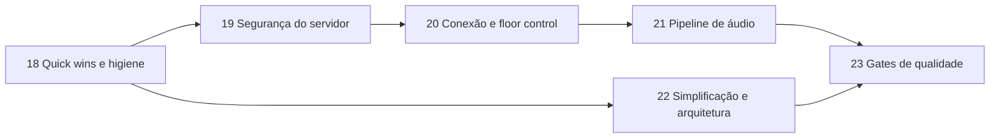

# PTT-LAN — Roadmap de Melhorias

> Continuação do roadmap do [Plano Técnico](PTT_KMP_PLANO_TECNICO.md) (fases 1–17 concluídas).
> Baseado na análise do código em `main` (commit `513c812`); contexto geral em [CONTEXTO.md](CONTEXTO.md).
>
> Legenda: **Esforço** P (≤ ½ dia) · M (1–2 dias) · G (3+ dias).
> **Status**: ✅ confirmado lendo o código · 🔎 provável, reproduzir antes de corrigir.

---

## Resumo por prioridade

| # | Problema | Impacto | Fase |
|---|---|---|---|
| 1 | Cliente pode se passar por outro `userId` (join, floor, stop) | Segurança | 19 |
| 2 | Painel e API admin sem autenticação (inclui `shutdown`) | Segurança | 19 |
| 3 | A UI derruba a sessão na primeira queda, então a reconexão automática nunca acontece | Funcional | 20 |
| 4 | Captura do iOS gera frames inválidos para o Opus | Funcional (iOS) | 21 |
| 5 | Floor pode ficar preso por ~35s se o speaker cair | Funcional | 20 |
| 6 | iOS aceita qualquer certificado, inclusive na internet | Segurança | 19 |
| 7 | Rate limit por IP quebra atrás de proxy reverso | Operação | 19 |
| 8 | `println` a cada pacote de áudio no servidor | Performance | 21 |
| 9 | Redis sobe mas não é usado | Complexidade | 22 |
| 10 | CI sem cache, JDK divergente e gates do plano (Kover, regra de módulos) ausentes | Qualidade | 18 / 23 |

## Sequência

A fase 18 vem primeiro porque é barata e deixa o CI confiável para as próximas. A 19 vem antes da 20 porque
a 20 depende de a identidade vir do JWT. A 22 pode rodar em paralelo com a 19–21, desde que não mexa nos mesmos arquivos.

Cada fase segue a regra 22.4 do plano: testes novos ou atualizados, nenhuma regressão, `ktlintFormat` + `detekt` limpos.

---

## Fase 18 — Quick wins e higiene do repositório

**Objetivo:** tirar ruído do repositório e alinhar build e CI, sem mudar comportamento.

| Item | Status | Evidência | Ação | Esforço |
|---|---|---|---|---|
| 18.1 Arquivos de máquina versionados | ✅ | `local.properties`, `hs_err_pid4676.log`, `.DS_Store`, `docs/.DS_Store`, `iosApp/**/xcuserdata/` | `git rm --cached`; os padrões já estão no `.gitignore` | P |
| 18.2 Lixo de bootstrap | ✅ | `ptt.zip` (13 bytes), `scratch/` vazio, `generate_modules.py`, `setup_apps.py`, `fetch_versions.py` | Apagar (o histórico fica no git) | P |
| 18.3 JDK divergente | ✅ | CI usa 17 (`ci.yml:17`), Docker e daemon toolchain usam 21 | Usar 21 em todos os jobs do CI e no README | P |
| 18.4 Versão fixa do plugin de serialização | ✅ | `core/core-navigation/build.gradle.kts:4` usa `"2.0.21"` com Kotlin 2.4.10 | Trocar por `alias(libs.plugins.serialization)` | P |
| 18.5 Dependências em string no servidor | ✅ | `serverApp/build.gradle.kts` (ktor-server-core/netty/websockets/content-negotiation, koin-ktor, tls-certificates) | Mover para `libs.versions.toml` | P |
| 18.6 CI lento e sem cache | ✅ | Cada job refaz setup e download | `gradle/actions/setup-gradle@v4` + `concurrency` com `cancel-in-progress` | P |
| 18.7 Docker publica imagem em PR | ✅ | `build-docker` com `push: true` roda também em `pull_request` | `push: ${{ github.event_name != 'pull_request' }}` | P |
| 18.8 README desatualizado | ✅ | Pede JDK 17+ e não cita portas, Docker nem os docs novos | Atualizar: JDK 21, portas 9393/9443, links para `CONTEXTO.md` e para este roadmap | P |

**Critério de conclusão:** CI verde com JDK 21 e cache ativo; `git ls-files` sem arquivos de máquina.

---

## Fase 19 — Segurança do servidor

**Objetivo:** fazer valer a promessa da Fase 16 ("impossível agir sem token válido") também dentro da sessão e no painel.

### 19.1 Identidade vem do token, não da mensagem ✅ — G
- **Problema:** `PttRoutes.kt:56` define `currentUserId = message.userId`; `requestFloor`/`releaseFloor` (`:89`, `:105`)
  usam o `userId` enviado pelo cliente. Qualquer cliente autenticado pode tomar ou soltar a palavra de outro,
  ou entrar com o `userId` de outro e sobrescrever a entrada dele no `PttChannel` (o mapa é indexado por `userId`).
- **Ação:** o servidor deriva `userId` (claim `deviceId` ou `sub`) e `nickname` do JWT validado no handshake e
  **ignora** esses campos nas mensagens. No protocolo, os campos `userId` de `JoinChannel`/`LeaveChannel`/`StartSpeaking`/`StopSpeaking`/`Heartbeat`
  passam a ser opcionais e depois são removidos (ver 21.5 sobre compatibilidade).
- **Testes:** em `ServerIntegrationTest`, um cliente B enviando `StopSpeaking(userId = A)` não libera a palavra de A.
- **Implementado:** o servidor gera o `userId` no login, grava como `sub` do JWT e o devolve em `LoginResponse`;
  `PttRoutes` usa só o `sub` e o `nickname` do token. O teste `serverUsesTokenIdentityAndIgnoresUserIdInMessages`
  falha no código anterior e passa no novo.

### 19.2 Autenticar o painel admin ✅ — M
- **Problema:** `DashboardRoutes.kt:85-87`: `/admin` e `/api/admin/*` estão abertos, inclusive `system/shutdown` (`exitProcess`, `:132`),
  `restart`, `kick` e `broadcast`. A porta HTTP 9393 também serve essas rotas sem TLS.
- **Ação (mínima):** Basic Auth do Ktor (`ktor-server-auth`, que já é dependência) com credencial vinda de variável de ambiente
  (`PTT_ADMIN_PASSWORD`). Sem a variável, as rotas de escrita ficam desligadas. Redirecionar 9393 → 9443 ou desligar o conector HTTP.
- **Testes:** `401` sem credencial e `200` com credencial.
- **Implementado:** provider `basic("auth-admin")` (usuário `admin`, senha em `ptt.adminPassword` / `PTT_ADMIN_PASSWORD`, comparação
  com `MessageDigest.isEqual`) envolvendo `/admin` e `/api/admin/*`; sem a variável o `authenticate` fica `optional` e as rotas de
  escrita (`restart`, `shutdown`, `broadcast`, `kick`, `delete`) não são registradas. O conector HTTP 9393 saiu do `application.conf`,
  então só resta o 9443 com TLS. Testes em `AdminAuthIntegrationTest`.

### 19.3 TLS consistente no iOS ✅ — M
- **Problema:** `HttpClient.ios.kt:18-21` aceita o `serverTrust` de qualquer host, então um MITM na internet passa.
  Android/JVM só relaxam a validação para hosts locais.
- **Ação:** repetir a regra do Android: `isLocalNetwork(challenge.protectionSpace.host)` → aceita; caso contrário,
  `NSURLSessionAuthChallengePerformDefaultHandling`.
- **Evolução opcional (plano, seção 12):** TOFU com fingerprint, guardando o hash do certificado por host nas settings. Só vale fazer se o uso em LAN com MITM for uma preocupação real.
- **Implementado:** o `handleChallenge` do Darwin só usa o `serverTrust` quando `isLocalNetwork(challenge.protectionSpace.host)`;
  fora da LAN cai em `NSURLSessionAuthChallengePerformDefaultHandling`, igual ao Android/JVM. Junto, `isLocalNetwork` passou a
  ignorar o ponto final do nome mDNS (`ptt-server.local.`, como o `NSNetService.hostName` devolve), com caso novo em
  `NetworkCommonUtilsTest` — sem isso a regra nova rejeitaria justamente o servidor da LAN descoberto por Bonjour. O TOFU com
  fingerprint continua fora.

### 19.4 Segredos fora do código ✅ — P
- **Problema:** senha do keystore `"password"` (`Application.kt:43`, `application.conf:10-11`); o segredo JWT é gerado a cada boot
  (`JwtConfig.kt:13`), então qualquer reinício ou deploy desloga todos e impede ter mais de uma instância.
- **Ação:** ler `PTT_JWT_SECRET` e `PTT_KEYSTORE_PASSWORD` do ambiente, com o valor aleatório atual como fallback para LAN.
  Documentar no README e no Dockerfile.
- **Implementado:** `JwtConfig` lê `PTT_JWT_SECRET` (fallback: UUID por boot); `main()` gera o keystore com `PTT_KEYSTORE_PASSWORD`
  e o `application.conf` sobrescreve `keyStorePassword`/`privateKeyPassword` com a mesma variável (fallback `password`).
  README ganhou a tabela de variáveis e o Dockerfile as declara.

### 19.5 Rate limit atrás de proxy reverso ✅ — P
- **Problema:** `requestKey { origin.remoteHost }` (`Application.kt:106,112`) sem o plugin `XForwardedHeaders`. Atrás do proxy
  da Fase 15, todos os usuários dividem o mesmo IP e o mesmo limite de 5 logins/min.
- **Ação:** instalar `XForwardedHeaders` só quando `PTT_TRUST_PROXY=true`, para não permitir spoofing de IP em LAN.
- **Implementado:** o plugin é instalado sob `ptt.trustProxy` (env `PTT_TRUST_PROXY`). `ProxyRateLimitTest` cobre os dois lados:
  com a flag ligada, seis logins de `X-Forwarded-For` diferentes passam; desligada, o sexto leva `429` porque todos dividem o mesmo IP.

**Critério de conclusão:** nenhuma ação de controle ou admin funciona com identidade forjada ou sem credencial,
com testes de integração cobrindo cada caso.

---

## Fase 20 — Conexão e floor control

**Objetivo:** fazer a reconexão automática (Fase 6) funcionar de verdade e impedir que o canal trave.

### 20.1 A UI anula a reconexão automática ✅ — M
- **Problema:** `RootComponent.kt:91`: na primeira transição `Connected → Reconnecting`, chama `disconnect()` e volta para a
  tela de conexão. O loop de backoff do `PttWebSocketClient` nunca chega a rodar.
- **Ação:** em `Reconnecting`, manter a tela atual com um banner "Reconectando…" (o `ConnectionStatusBadge` já existe).
  Só voltar para a tela de conexão quando o status for `Disconnected` (tentativas esgotadas ou saída manual).
  Adicionar ao `PttWebSocketClient` o limite de tentativas do plano (padrão 10), que hoje não existe.
  Depois de reconectar, reenviar `JoinChannel` para o canal ativo (`ChannelSessionRepository.activeSessionChannelId`).
- **Testes:** `PttWebSocketClient` com `MockEngine` simulando queda → status `Reconnecting` → `Connected` com re-join.

### 20.2 Identidade estável do dispositivo ✅ — P
- **Problema:** desde a 19.1 o `userId` é emitido pelo servidor a cada login, então muda a cada conexão; `deviceId = "device-${nickname.hashCode()}"`
  (`ConnectionRepositoryImpl.kt:65`) muda se o nickname mudar e colide entre pessoas com o mesmo nome.
- **Ação:** gerar um UUID de dispositivo uma vez e persistir em settings (`device_id`), enviado como `deviceId` no login.
  O `userId` continua emitido pelo servidor (19.1); para a 20.3, o servidor pode reaproveitar o `userId` do mesmo `deviceId`.

### 20.3 "Nome já em uso" ao reconectar 🔎 — M
- **Problema provável:** quando a rede cai sem close, o servidor só remove a sessão antiga no timeout de ping (~20s + timeout).
  Se o cliente reconectar antes disso, `addGlobalConnection` (`ChannelRegistry.kt:71`) recusa o próprio usuário.
  Além disso, a exceção lançada em `PttWebSocketClient.kt:150` acontece depois de `isFirstAttempt = false` (`:112`),
  então é engolida e a mensagem não chega à UI.
- **Ação:** unicidade por nickname só entre `deviceId`s **diferentes**. Se o mesmo `deviceId` reconectar, a nova sessão substitui a antiga,
  que é fechada. Propagar o motivo do close como `ConnectionStatus`/erro até a UI.
- **Reproduzir antes:** derrubar o Wi-Fi do cliente por ~3s com o servidor em pé.

### 20.4 Floor preso quando o speaker some ✅ — M
- **Problema:** o servidor ignora `Heartbeat` (`PttRoutes.kt:107`) e nenhum cliente envia heartbeat. O floor só é liberado com
  `StopSpeaking` ou quando a sessão fecha, o que leva até ~35s com `pingPeriod = 20s`.
- **Ação (a mais simples que resolve):** timeout de inatividade no `PttChannel`. Se o speaker não mandar frame de áudio
  por N ms (ex.: 2000), libera o floor e faz broadcast de `SpeakerChanged(false)`. Também vale um teto de duração
  por fala (ex.: 60s), configurável. Com isso, o `Heartbeat` pode ser **removido** do protocolo, já que o ping do WebSocket cobre a conexão.
- **Testes:** `ServerIntegrationTest` com um speaker que para de enviar áudio → floor liberado após o timeout.

### 20.5 Versão do app nunca chega ao servidor ✅ — P
- **Problema:** o painel lê o parâmetro `version` na query, mas `PttWebSocketClient` não o envia. O painel mostra sempre "Desconhecida".
- **Ação:** incluir `&version=` na URL do WebSocket (a mesma versão usada no 21.5).

**Critério de conclusão:** derrubar e religar o Wi-Fi durante uma fala não tira o usuário do canal, e o floor é liberado em ≤ 2s quando o speaker cai.

---

## Fase 21 — Pipeline de áudio

**Objetivo:** Opus funcionar em todas as plataformas e o servidor aguentar mais participantes.

### 21.1 Framing da captura no iOS ✅ / 🔎 — M
- **Problema:** `IosAudioInterfaces.kt:48` usa um tap de ~2048 frames e reamostra com salto inteiro (`:58`).
  2048 amostras não é um tamanho de frame Opus válido (a 48 kHz: 120/240/480/960/1920/2880), e o encoder
  engole a exceção e devolve `ByteArray(0)` (`OpusAudioCodec.kt:28`), então **com Opus ligado o iOS transmite pacotes vazios**.
  🔎 Se o hardware estiver a 44,1 kHz, `ratio = max(1, 44100/48000) = 1` e o áudio sai com a taxa errada (voz aguda ou acelerada).
- **Ação:** converter com `AVAudioConverter` para 48 kHz Int16 mono e acumular em buffer circular, emitindo exatamente 960 amostras (20ms),
  igual ao Android e ao JVM.
- **Testes:** teste comum do `OpusAudioCodec` garantindo que `encode` de 960 amostras não retorna vazio. Validação manual iOS ↔ Android com Opus.

### 21.2 Falhas silenciosas no codec ✅ — P
- **Ação:** `OpusAudioCodec` deixa de engolir exceções e passa a logar. O repositório faz fallback explícito: não envia frame vazio.

### 21.3 Hot path do servidor ✅ — M
- **Problemas:**
  - `println` a cada pacote (`PttChannel.kt:97`), o que dá ~50 linhas/s por speaker, mais uma por participante lento.
  - Um `launch` por frame (`PttRoutes.kt:120`), sem ordem garantida e sem limite de concorrência.
  - Um participante lento segura o `coroutineScope` e atrasa todos os outros.
  - `bytesCount`/`slowCount` são alterados em coroutines concorrentes (`PttChannel.kt:110,113`), o que é uma condição de corrida (afeta só métricas).
  - `frame.data.copyOf()` por destinatário (`:109`) quando o buffer poderia ser compartilhado (é só leitura).
- **Ação:** processar o áudio em sequência no handler (sem `launch`). Cada `Participant` ganha um `Channel<ByteArray>(capacity = N, DROP_OLDEST)`
  consumido por uma coroutine própria, e o broadcast só faz `trySend`. Contadores com `AtomicLong`/`AtomicInteger`. Logs de pacote em `debug` (21.4).
- **Resultado:** um cliente lento perde os próprios pacotes sem atrasar os demais.

### 21.4 Logging de verdade ✅ — M
- **Problema:** 44 `println`/`printStackTrace` em servidor, core, data e features. Kermit está configurado no Koin, mas quase não é usado. O Logback do servidor fica sem uso.
- **Ação:** servidor usa SLF4J (`call.application.log` ou `LoggerFactory`), com nível configurável em `logback.xml`. Clientes usam `Logger.withTag("network"|"audio"|…)`.
  Regra do Detekt `ForbiddenMethodCall` para `println`/`printStackTrace` fora de testes.

### 21.5 Robustez do protocolo ✅ — M
- **Problema:** as mensagens de controle usam o `Json` padrão (estrito) nos dois lados, então **adicionar um campo** quebra clientes antigos.
  Também não existe versão de protocolo. O envelope de áudio vai em JSON (~120 bytes) com `channelId`/`senderId` repetidos em cada pacote,
  o que costuma ser maior que o próprio payload Opus.
- **Ação:**
  1. `val PttJson = Json { ignoreUnknownKeys = true; encodeDefaults = false }` em `core-network`, usado por cliente e servidor.
  2. `PROTOCOL_VERSION` enviado na query do handshake. O servidor recusa versões incompatíveis com um close reason legível.
  3. (Opcional, medir antes) Cabeçalho binário fixo: `seq:Int32, timestamp:Int64, codec:Byte` (13 bytes). `channelId` e `senderId` saem do pacote,
     porque o servidor já sabe de quem é a sessão. Se fizer, registrar em ADR, já que o plano previa ProtoBuf.

### 21.6 Arquivos órfãos no histórico ✅ — P
- **Problema:** o expurgo de 50 mensagens por canal apaga só as linhas do banco (`VoiceRepositoryImpl.kt:120-122`). Os `.pcm` ficam no disco
  até o limite de tamanho mandar apagar.
- **Ação:** buscar os mais antigos com `getOldestMessagesByChannel` (query que já existe), apagar os arquivos e depois as linhas.
- **Testes:** repositório com driver SQLite in-memory + `FakeFileSystem` do Okio.

**Critério de conclusão:** iOS ↔ Android ↔ Desktop se ouvem com Opus; teste de carga simples (1 speaker, 10 ouvintes, 1 ouvinte com atraso artificial)
sem atraso para os demais; servidor sem log por pacote em `INFO`.

---

## Fase 22 — Simplificação e arquitetura

**Objetivo:** tirar o que não é usado e reduzir duplicação. Nada de abstração nova sem uso real.

| Item | Status | Evidência | Ação | Esforço |
|---|---|---|---|---|
| 22.1 Redis sem uso | ✅ | `RedisManager` sobe e tenta `localhost:6379` a cada boot; `ChannelRegistry.kt:46` recebe e nunca usa | **Decisão via ADR 0006.** Recomendado: remover `RedisManager`, Lettuce e o item da Fase 17 até existir necessidade real de várias instâncias. A alternativa, estado e pub/sub no Redis, é G e só vale com deploy multi-instância em vista | P (remover) / G (implementar) |
| 22.2 Módulos vazios | ✅ | `core-testing`, `feature-admin-web` | Remover do `settings.gradle.kts` (o painel vive no `serverApp`). Recriar `core-testing` só quando houver fakes compartilhados de fato | P |
| 22.3 HttpClient duplicado | ✅ | `HttpClient.android.kt` e `HttpClient.jvm.kt` idênticos | Source set intermediário `jvmAndAndroidMain` (hierarquia KMP) com uma única implementação | P |
| 22.4 Jitter buffer duplicado | ✅ | `AudioPacket` + lógica de sequência em `AndroidAudioInterfaces.kt` e `jvmMain/AudioInterfaces.kt` | Extrair a lógica de ordenação/descarte para `commonMain` (classe pura, testável). Plataformas só escrevem no `AudioTrack`/`SourceDataLine` | M |
| 22.5 DTO de login duplicado | ✅ | `LoginRequest`/`LoginResponse` em `AuthRoutes.kt:15` e `PttWebSocketClient.kt:34` | Servidor usa os de `core-network/protocol` (**feito na 19.1**: `protocol/AuthDto.kt`) | P |
| 22.6 Chaves de settings espalhadas | ✅ | `"allow_cache"` em 8 lugares, `"app_theme"` em 12 etc. | `object SettingsKeys` + defaults em `core-datastore` | P |
| 22.7 `VoiceRepositoryImpl` faz tudo | ✅ | 398 linhas: transmissão, recepção, gravação cifrada, cache, replay. Estado mutável acessado por várias coroutines em `Dispatchers.Default` sem sincronização | Separar em duas classes: `VoiceRepositoryImpl` (TX/RX) e `HistoryRepositoryImpl` (gravação, cache, replay). Confinar o estado de gravação a um único coroutine/dispatcher (`limitedParallelism(1)`) | M |
| 22.8 Regras de dependência | ✅ | `feature-ptt` depende de `core-network` só por `ParticipantDto` no `PttState` | Usar `ParticipantDomain` no estado e remover a dependência. Aceitar e documentar (ADR) que `core-di`/`core-navigation` agregam features, já que o grafo real é esse | P |
| 22.9 `AudioCrypto` com chave fixa | ✅ | RC4 com chave no código (`AudioCrypto.kt`) só protege o cache | Decidir em ADR: (a) remover, porque o arquivo fica no sandbox do app e a chave fixa não protege nada, ou (b) chave por instalação no Keystore/Keychain. Recomendado: (a) | P / M |
| 22.10 Telas grandes | ✅ | `SettingsScreen.kt` 493 linhas, `HistoryScreen.kt` 396 | Quebrar em composables privados por seção no mesmo módulo. Só quando for mexer nessas telas | M |

**Critério de conclusão:** build sem Redis (ou com Redis usado de fato), sem módulos vazios e sem arquivos `actual` idênticos.

---

## Fase 23 — Gates de qualidade

**Objetivo:** fazer o CI cobrar o que a seção 18.3 do plano promete.

| Item | Status | Ação | Esforço |
|---|---|---|---|
| 23.1 Testes que faltam | ✅ | `PttWebSocketClient` (reconexão/backoff via `MockEngine`), `PttChannel`/`ChannelRegistry` (cleanup de 5 min com `runTest` + tempo virtual, floor timeout, spoofing), jitter buffer comum (22.4), `VoiceRepositoryImpl`/`HistoryRepositoryImpl` (expurgo) | G |
| 23.2 Cobertura no CI | ✅ | `koverVerify` com as metas da seção 16.2 no job `unit-test`; publicar o relatório HTML como artefato | P |
| 23.3 Detekt frouxo | ✅ | `LargeClass` 600 / `LongMethod` 60 (`detekt.yml:110,113`), contra 300/40 no plano. Gerar baseline com o estado atual e voltar aos limites do plano, para que só código novo seja cobrado. Revisar os `@Suppress("LongMethod", "CyclomaticComplexMethod", "TooGenericExceptionCaught")` do servidor depois da 21.3 | M |
| 23.4 Regra de módulos | ✅ | A task do plano (17.3) não existe. Mínimo: task em `buildSrc` que falha se `features/*` depender de outra feature | P |
| 23.5 Snapshot tests | ✅ | Plano marca como feito, mas não existem. Roborazzi já está no catalog: 1 teste por componente do design system (4 componentes) | M |

**Critério de conclusão:** CI falha com cobertura abaixo da meta, nova issue de Detekt ou dependência proibida entre features.

---

## A confirmar (não entra em fase até reproduzir)

| Suspeita | Onde | Como verificar |
|---|---|---|
| `startForegroundService` com tipo `microphone` disparado com o app em background pode lançar `ForegroundServiceStartNotAllowedException`/`SecurityException` no Android 14+ | `MainActivity.kt:70-76`, coleta em `lifecycleScope` sem `repeatOnLifecycle` | Conectar, mandar o app para background e derrubar/restaurar o servidor em um Android 14+ |
| Timeout de socket do `HttpTimeout` (5s) afetando o WebSocket em silêncio longo | `HttpClient.kt` | Canal parado por 2 min, observando desconexões no log |
| Sessões `CoroutineScope(Dispatchers.Default)` de repositórios singleton nunca canceladas | `data-ptt/*RepositoryImpl` | Só importa se um dia houver logout ou troca de servidor sem reiniciar o app. Revisar junto com a 22.7 |
