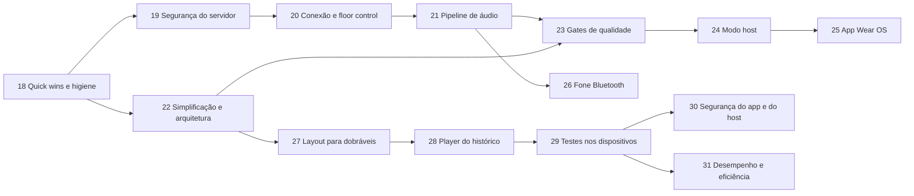

# PTT-LAN — Roadmap de Melhorias

> Continuação do roadmap do [Plano Técnico](PTT_KMP_PLANO_TECNICO.md) (fases 1–17 concluídas).
> Baseado na análise do código em `main` (commit `513c812`); contexto geral em [CONTEXTO.md](CONTEXTO.md).
>
> Legenda: **Esforço** P (≤ ½ dia) · M (1–2 dias) · G (3+ dias).
> **Status**: ✅ confirmado lendo o código · 🔎 provável, reproduzir antes de corrigir.

---

## Resumo por prioridade

| # | Problema | Impacto | Fase |
|---|---|---|---|
| 1 | Cliente pode se passar por outro `userId` (join, floor, stop) | Segurança | 19 |
| 2 | Painel e API admin sem autenticação (inclui `shutdown`) | Segurança | 19 |
| 3 | A UI derruba a sessão na primeira queda, então a reconexão automática nunca acontece | Funcional | 20 |
| 4 | Captura do iOS gera frames inválidos para o Opus | Funcional (iOS) | 21 |
| 5 | Floor pode ficar preso por ~35s se o speaker cair | Funcional | 20 |
| 6 | iOS aceita qualquer certificado, inclusive na internet | Segurança | 19 |
| 7 | Rate limit por IP quebra atrás de proxy reverso | Operação | 19 |
| 8 | `println` a cada pacote de áudio no servidor | Performance | 21 |
| 9 | Redis sobe mas não é usado | Complexidade | 22 |
| 10 | CI sem cache, JDK divergente e gates do plano (Kover, regra de módulos) ausentes | Qualidade | 18 / 23 |

## Sequência

A fase 18 vem primeiro porque é barata e deixa o CI confiável para as próximas. A 19 vem antes da 20 porque
a 20 depende de a identidade vir do JWT. A 22 pode rodar em paralelo com a 19–21, desde que não mexa nos mesmos arquivos.

Cada fase segue a regra 22.4 do plano: testes novos ou atualizados, nenhuma regressão, `ktlintFormat` + `detekt` limpos.

---

## Fase 18 — Quick wins e higiene do repositório

**Objetivo:** tirar ruído do repositório e alinhar build e CI, sem mudar comportamento.

| Item | Status | Evidência | Ação | Esforço |
|---|---|---|---|---|
| 18.1 Arquivos de máquina versionados | ✅ | `local.properties`, `hs_err_pid4676.log`, `.DS_Store`, `docs/.DS_Store`, `iosApp/**/xcuserdata/` | `git rm --cached`; os padrões já estão no `.gitignore` | P |
| 18.2 Lixo de bootstrap | ✅ | `ptt.zip` (13 bytes), `scratch/` vazio, `generate_modules.py`, `setup_apps.py`, `fetch_versions.py` | Apagar (o histórico fica no git) | P |
| 18.3 JDK divergente | ✅ | CI usa 17 (`ci.yml:17`), Docker e daemon toolchain usam 21 | Usar 21 em todos os jobs do CI e no README | P |
| 18.4 Versão fixa do plugin de serialização | ✅ | `core/core-navigation/build.gradle.kts:4` usa `"2.0.21"` com Kotlin 2.4.10 | Trocar por `alias(libs.plugins.serialization)` | P |
| 18.5 Dependências em string no servidor | ✅ | `serverApp/build.gradle.kts` (ktor-server-core/netty/websockets/content-negotiation, koin-ktor, tls-certificates) | Mover para `libs.versions.toml` | P |
| 18.6 CI lento e sem cache | ✅ | Cada job refaz setup e download | `gradle/actions/setup-gradle@v4` + `concurrency` com `cancel-in-progress` | P |
| 18.7 Docker publica imagem em PR | ✅ | `build-docker` com `push: true` roda também em `pull_request` | `push: ${{ github.event_name != 'pull_request' }}` | P |
| 18.8 README desatualizado | ✅ | Pede JDK 17+ e não cita portas, Docker nem os docs novos | Atualizar: JDK 21, portas 9393/9443, links para `CONTEXTO.md` e para este roadmap | P |

**Critério de conclusão:** CI verde com JDK 21 e cache ativo; `git ls-files` sem arquivos de máquina.

---

## Fase 19 — Segurança do servidor

**Objetivo:** fazer valer a promessa da Fase 16 ("impossível agir sem token válido") também dentro da sessão e no painel.

### 19.1 Identidade vem do token, não da mensagem ✅ — G
- **Problema:** `PttRoutes.kt:56` define `currentUserId = message.userId`; `requestFloor`/`releaseFloor` (`:89`, `:105`)
  usam o `userId` enviado pelo cliente. Qualquer cliente autenticado pode tomar ou soltar a palavra de outro,
  ou entrar com o `userId` de outro e sobrescrever a entrada dele no `PttChannel` (o mapa é indexado por `userId`).
- **Ação:** o servidor deriva `userId` (claim `deviceId` ou `sub`) e `nickname` do JWT validado no handshake e
  **ignora** esses campos nas mensagens. No protocolo, os campos `userId` de `JoinChannel`/`LeaveChannel`/`StartSpeaking`/`StopSpeaking`/`Heartbeat`
  passam a ser opcionais e depois são removidos (ver 21.5 sobre compatibilidade).
- **Testes:** em `ServerIntegrationTest`, um cliente B enviando `StopSpeaking(userId = A)` não libera a palavra de A.
- **Implementado:** o servidor gera o `userId` no login, grava como `sub` do JWT e o devolve em `LoginResponse`;
  `PttRoutes` usa só o `sub` e o `nickname` do token. O teste `serverUsesTokenIdentityAndIgnoresUserIdInMessages`
  falha no código anterior e passa no novo.

### 19.2 Autenticar o painel admin ✅ — M
- **Problema:** `DashboardRoutes.kt:85-87`: `/admin` e `/api/admin/*` estão abertos, inclusive `system/shutdown` (`exitProcess`, `:132`),
  `restart`, `kick` e `broadcast`. A porta HTTP 9393 também serve essas rotas sem TLS.
- **Ação (mínima):** Basic Auth do Ktor (`ktor-server-auth`, que já é dependência) com credencial vinda de variável de ambiente
  (`PTT_ADMIN_PASSWORD`). Sem a variável, as rotas de escrita ficam desligadas. Redirecionar 9393 → 9443 ou desligar o conector HTTP.
- **Testes:** `401` sem credencial e `200` com credencial.
- **Implementado:** provider `basic("auth-admin")` (usuário `admin`, senha em `ptt.adminPassword` / `PTT_ADMIN_PASSWORD`, comparação
  com `MessageDigest.isEqual`) envolvendo `/admin` e `/api/admin/*`; sem a variável o `authenticate` fica `optional` e as rotas de
  escrita (`restart`, `shutdown`, `broadcast`, `kick`, `delete`) não são registradas. O conector HTTP 9393 saiu do `application.conf`,
  então só resta o 9443 com TLS. Testes em `AdminAuthIntegrationTest`.

### 19.3 TLS consistente no iOS ✅ — M
- **Problema:** `HttpClient.ios.kt:18-21` aceita o `serverTrust` de qualquer host, então um MITM na internet passa.
  Android/JVM só relaxam a validação para hosts locais.
- **Ação:** repetir a regra do Android: `isLocalNetwork(challenge.protectionSpace.host)` → aceita; caso contrário,
  `NSURLSessionAuthChallengePerformDefaultHandling`.
- **Evolução opcional (plano, seção 12):** TOFU com fingerprint, guardando o hash do certificado por host nas settings. Só vale fazer se o uso em LAN com MITM for uma preocupação real.
- **Implementado:** o `handleChallenge` do Darwin só usa o `serverTrust` quando `isLocalNetwork(challenge.protectionSpace.host)`;
  fora da LAN cai em `NSURLSessionAuthChallengePerformDefaultHandling`, igual ao Android/JVM. Junto, `isLocalNetwork` passou a
  ignorar o ponto final do nome mDNS (`ptt-server.local.`, como o `NSNetService.hostName` devolve), com caso novo em
  `NetworkCommonUtilsTest` — sem isso a regra nova rejeitaria justamente o servidor da LAN descoberto por Bonjour. O TOFU com
  fingerprint continua fora.

### 19.4 Segredos fora do código ✅ — P
- **Problema:** senha do keystore `"password"` (`Application.kt:43`, `application.conf:10-11`); o segredo JWT é gerado a cada boot
  (`JwtConfig.kt:13`), então qualquer reinício ou deploy desloga todos e impede ter mais de uma instância.
- **Ação:** ler `PTT_JWT_SECRET` e `PTT_KEYSTORE_PASSWORD` do ambiente, com o valor aleatório atual como fallback para LAN.
  Documentar no README e no Dockerfile.
- **Implementado:** `JwtConfig` lê `PTT_JWT_SECRET` (fallback: UUID por boot); `main()` gera o keystore com `PTT_KEYSTORE_PASSWORD`
  e o `application.conf` sobrescreve `keyStorePassword`/`privateKeyPassword` com a mesma variável (fallback `password`).
  README ganhou a tabela de variáveis e o Dockerfile as declara.

### 19.5 Rate limit atrás de proxy reverso ✅ — P
- **Problema:** `requestKey { origin.remoteHost }` (`Application.kt:106,112`) sem o plugin `XForwardedHeaders`. Atrás do proxy
  da Fase 15, todos os usuários dividem o mesmo IP e o mesmo limite de 5 logins/min.
- **Ação:** instalar `XForwardedHeaders` só quando `PTT_TRUST_PROXY=true`, para não permitir spoofing de IP em LAN.
- **Implementado:** o plugin é instalado sob `ptt.trustProxy` (env `PTT_TRUST_PROXY`). `ProxyRateLimitTest` cobre os dois lados:
  com a flag ligada, seis logins de `X-Forwarded-For` diferentes passam; desligada, o sexto leva `429` porque todos dividem o mesmo IP.

**Critério de conclusão:** nenhuma ação de controle ou admin funciona com identidade forjada ou sem credencial,
com testes de integração cobrindo cada caso.

---

## Fase 20 — Conexão e floor control

**Objetivo:** fazer a reconexão automática (Fase 6) funcionar de verdade e impedir que o canal trave.

### 20.1 A UI anula a reconexão automática ✅ — M
- **Problema:** `RootComponent.kt:91`: na primeira transição `Connected → Reconnecting`, chama `disconnect()` e volta para a
  tela de conexão. O loop de backoff do `PttWebSocketClient` nunca chega a rodar.
- **Ação:** em `Reconnecting`, manter a tela atual com um banner "Reconectando…" (o `ConnectionStatusBadge` já existe).
  Só voltar para a tela de conexão quando o status for `Disconnected` (tentativas esgotadas ou saída manual).
  Adicionar ao `PttWebSocketClient` o limite de tentativas do plano (padrão 10), que hoje não existe.
  Depois de reconectar, reenviar `JoinChannel` para o canal ativo (`ChannelSessionRepository.activeSessionChannelId`).
- **Testes:** `PttWebSocketClient` com `MockEngine` simulando queda → status `Reconnecting` → `Connected` com re-join.
- **Implementado:** `RootComponent` só volta para a tela de conexão em `Disconnected`; em `Reconnecting` a tela atual
  continua e o `ConnectionStatusBadge` (agora alimentado pelo status real, não mais fixo em `Online`) mostra "reconectando".
  `PttWebSocketClient` ganhou `maxReconnectAttempts` (padrão 10) e reenvia sozinho o último `JoinChannel` ao reconectar.
  `PttWebSocketClientReconnectTest` sobe um servidor WSS de verdade: derruba a primeira sessão e exige o re-join na segunda,
  e verifica que o loop desiste depois do limite em vez de tentar para sempre.

### 20.2 Identidade estável do dispositivo ✅ — P
- **Problema:** desde a 19.1 o `userId` é emitido pelo servidor a cada login, então muda a cada conexão; `deviceId = "device-${nickname.hashCode()}"`
  (`ConnectionRepositoryImpl.kt:65`) muda se o nickname mudar e colide entre pessoas com o mesmo nome.
- **Ação:** gerar um UUID de dispositivo uma vez e persistir em settings (`device_id`), enviado como `deviceId` no login.
  O `userId` continua emitido pelo servidor (19.1); para a 20.3, o servidor pode reaproveitar o `userId` do mesmo `deviceId`.
- **Implementado:** `deviceId(settings)` em `ConnectionRepositoryImpl.kt` grava um `Uuid.random()` (stdlib do Kotlin) na chave
  `device_id` na primeira vez e reusa depois; o login passou a enviá-lo. `DeviceIdTest` cobre a estabilidade entre chamadas
  e a diferença entre instalações.

### 20.3 "Nome já em uso" ao reconectar 🔎 — M
- **Problema provável:** quando a rede cai sem close, o servidor só remove a sessão antiga no timeout de ping (~20s + timeout).
  Se o cliente reconectar antes disso, `addGlobalConnection` (`ChannelRegistry.kt:71`) recusa o próprio usuário.
  Além disso, a exceção lançada em `PttWebSocketClient.kt:150` acontece depois de `isFirstAttempt = false` (`:112`),
  então é engolida e a mensagem não chega à UI.
- **Ação:** unicidade por nickname só entre `deviceId`s **diferentes**. Se o mesmo `deviceId` reconectar, a nova sessão substitui a antiga,
  que é fechada. Propagar o motivo do close como `ConnectionStatus`/erro até a UI.
- **Reproduzir antes:** derrubar o Wi-Fi do cliente por ~3s com o servidor em pé.
- **Implementado:** `addGlobalConnection` passou a receber o `deviceId` (claim do JWT) e só recusa o nickname quando ele
  está em uso por **outro** dispositivo; o mesmo `deviceId` substitui a própria sessão antiga, que é fechada com
  "Sessão substituída por uma nova conexão". No cliente, um close `VIOLATED_POLICY` vira `ServerRefusedException`, que é
  relançada mesmo depois da primeira tentativa (antes era engolida) e fica em `lastCloseReason` → `ConnectionRepository.lastDisconnectReason`
  → mensagem real na tela de conexão. Testes: `ReconnectSameDeviceTest` (servidor) e `surfacesTheReasonWhenTheServerRefusesTheConnection` (cliente).

### 20.4 Floor preso quando o speaker some ✅ — M
- **Problema:** o servidor ignora `Heartbeat` (`PttRoutes.kt:107`) e nenhum cliente envia heartbeat. O floor só é liberado com
  `StopSpeaking` ou quando a sessão fecha, o que leva até ~35s com `pingPeriod = 20s`.
- **Ação (a mais simples que resolve):** timeout de inatividade no `PttChannel`. Se o speaker não mandar frame de áudio
  por N ms (ex.: 2000), libera o floor e faz broadcast de `SpeakerChanged(false)`. Também vale um teto de duração
  por fala (ex.: 60s), configurável. Com isso, o `Heartbeat` pode ser **removido** do protocolo, já que o ping do WebSocket cobre a conexão.
- **Testes:** `ServerIntegrationTest` com um speaker que para de enviar áudio → floor liberado após o timeout.
- **Implementado:** `PttChannel` ganhou um watchdog que solta a palavra quando o áudio para por `floorIdleTimeoutMs`
  (padrão 2s) ou quando a fala passa de `maxSpeechDurationMs` (padrão 60s); ambos configuráveis por `application.conf`
  (`ptt.floorIdleTimeoutMs`/`ptt.maxSpeechDurationMs`, com `PTT_FLOOR_IDLE_TIMEOUT_MS`/`PTT_MAX_SPEECH_DURATION_MS`).
  `FloorTimeoutTest` usa 300 ms e exige o `SpeakerChanged(isSpeaking = false)`. O `Heartbeat` continua no protocolo,
  mas segue sem uso — a remoção fica para a 21.5, junto com a discussão de compatibilidade.

### 20.5 Versão do app nunca chega ao servidor ✅ — P
- **Problema:** o painel lê o parâmetro `version` na query, mas `PttWebSocketClient` não o envia. O painel mostra sempre "Desconhecida".
- **Ação:** incluir `&version=` na URL do WebSocket (a mesma versão usada no 21.5).
- **Implementado:** `APP_VERSION` em `core-network/AppVersion.kt` vai na query do handshake; o teste de reconexão
  confere que as duas conexões (a original e a reconectada) informam a versão. A 21.5 acrescenta o `PROTOCOL_VERSION` ao lado dela.

**Critério de conclusão:** derrubar e religar o Wi-Fi durante uma fala não tira o usuário do canal, e o floor é liberado em ≤ 2s quando o speaker cai.

---

## Fase 21 — Pipeline de áudio

**Objetivo:** Opus funcionar em todas as plataformas e o servidor aguentar mais participantes.

### 21.1 Framing da captura no iOS ✅ / 🔎 — M
- **Problema:** `IosAudioInterfaces.kt:48` usa um tap de ~2048 frames e reamostra com salto inteiro (`:58`).
  2048 amostras não é um tamanho de frame Opus válido (a 48 kHz: 120/240/480/960/1920/2880), e o encoder
  engole a exceção e devolve `ByteArray(0)` (`OpusAudioCodec.kt:28`), então **com Opus ligado o iOS transmite pacotes vazios**.
  🔎 Se o hardware estiver a 44,1 kHz, `ratio = max(1, 44100/48000) = 1` e o áudio sai com a taxa errada (voz aguda ou acelerada).
- **Ação:** converter com `AVAudioConverter` para 48 kHz Int16 mono e acumular em buffer circular, emitindo exatamente 960 amostras (20ms),
  igual ao Android e ao JVM.
- **Testes:** teste comum do `OpusAudioCodec` garantindo que `encode` de 960 amostras não retorna vazio. Validação manual iOS ↔ Android com Opus.
- **Implementado:** o tap do iOS agora passa por um `AVAudioConverter` para 48 kHz Int16 mono e acumula em `pending`,
  emitindo blocos de exatamente 960 amostras (1920 bytes), como Android e JVM. Sai o decimador por passo inteiro, que
  desafinava quando o hardware estava a 44,1 kHz. `OpusAudioCodecTest` (commonTest) cobre os 960 samples e o round-trip;
  a validação iOS ↔ Android com Opus ligado continua sendo manual, em dispositivo.

### 21.2 Falhas silenciosas no codec ✅ — P
- **Ação:** `OpusAudioCodec` deixa de engolir exceções e passa a logar. O repositório faz fallback explícito: não envia frame vazio.
- **Implementado:** `OpusAudioCodec` loga a falha com Kermit (`tag=audio`) em vez de `catch (_: Exception)`.
  `VoiceRepositoryImpl` descarta o frame quando a codificação vem vazia — o fallback anterior mandava o PCM cru
  rotulado como OPUS, que nenhum receptor conseguia decodificar.

### 21.3 Hot path do servidor ✅ — M
- **Problemas:**
  - `println` a cada pacote (`PttChannel.kt:97`), o que dá ~50 linhas/s por speaker, mais uma por participante lento.
  - Um `launch` por frame (`PttRoutes.kt:120`), sem ordem garantida e sem limite de concorrência.
  - Um participante lento segura o `coroutineScope` e atrasa todos os outros.
  - `bytesCount`/`slowCount` são alterados em coroutines concorrentes (`PttChannel.kt:110,113`), o que é uma condição de corrida (afeta só métricas).
  - `frame.data.copyOf()` por destinatário (`:109`) quando o buffer poderia ser compartilhado (é só leitura).
- **Ação:** processar o áudio em sequência no handler (sem `launch`). Cada `Participant` ganha um `Channel<ByteArray>(capacity = N, DROP_OLDEST)`
  consumido por uma coroutine própria, e o broadcast só faz `trySend`. Contadores com `AtomicLong`/`AtomicInteger`. Logs de pacote em `debug` (21.4).
- **Resultado:** um cliente lento perde os próprios pacotes sem atrasar os demais.
- **Implementado:** cada `Participant` tem um `Channel<ByteArray>(50, DROP_OLDEST)` drenado por uma coroutine própria;
  `broadcastBinary` só faz `trySend` e compartilha o buffer do frame em vez de copiá-lo por destinatário.
  O handler do WebSocket processa o áudio em sequência (sem `launch` por frame), os contadores viraram
  `AtomicLong`/`AtomicInteger` e os logs de pacote foram para `debug` via SLF4J. `AudioBroadcastOrderTest` mostra o
  problema antigo de forma direta: com o código anterior, 30 pacotes chegavam como `[0, 20, 18, 17, …]`.

### 21.4 Logging de verdade ✅ — M
- **Problema:** 44 `println`/`printStackTrace` em servidor, core, data e features. Kermit está configurado no Koin, mas quase não é usado. O Logback do servidor fica sem uso.
- **Ação:** servidor usa SLF4J (`call.application.log` ou `LoggerFactory`), com nível configurável em `logback.xml`. Clientes usam `Logger.withTag("network"|"audio"|…)`.
  Regra do Detekt `ForbiddenMethodCall` para `println`/`printStackTrace` fora de testes.
- **Implementado:** os 44 `println`/`printStackTrace` de produção viraram SLF4J no servidor (`logback.xml` novo, nível por
  `PTT_LOG_LEVEL`, logs de pacote do `PttChannel` em `debug`) e Kermit nos clientes (`network`, `audio`, `ptt`).
  Mensagens de log passaram a ser escritas em inglês. A regra `ForbiddenMethodCall` foi ativada no `detekt.yml`, mas ela só
  roda com resolução de tipos (`detektMain`), que o build ainda não usa — então quem cobra hoje é a task `checkNoPrintln`
  (raiz), da qual todo `detekt` depende. Trocar por `detektMain` fica para a 23.3, junto com o baseline.

### 21.5 Robustez do protocolo ✅ — M
- **Problema:** as mensagens de controle usam o `Json` padrão (estrito) nos dois lados, então **adicionar um campo** quebra clientes antigos.
  Também não existe versão de protocolo. O envelope de áudio vai em JSON (~120 bytes) com `channelId`/`senderId` repetidos em cada pacote,
  o que costuma ser maior que o próprio payload Opus.
- **Ação:**
  1. `val PttJson = Json { ignoreUnknownKeys = true; encodeDefaults = false }` em `core-network`, usado por cliente e servidor.
  2. `PROTOCOL_VERSION` enviado na query do handshake. O servidor recusa versões incompatíveis com um close reason legível.
  3. (Opcional, medir antes) Cabeçalho binário fixo: `seq:Int32, timestamp:Int64, codec:Byte` (13 bytes). `channelId` e `senderId` saem do pacote,
     porque o servidor já sabe de quem é a sessão. Se fizer, registrar em ADR, já que o plano previa ProtoBuf.
- **Implementado:** itens 1 e 2. `PttJson` (`ignoreUnknownKeys`, `encodeDefaults = false`) em `core-network` é usado por
  cliente e servidor; `PROTOCOL_VERSION` vai na query do handshake e o servidor recusa versão diferente com close reason
  legível — cliente antigo, que não manda o parâmetro, continua entrando. O `Heartbeat` saiu do protocolo: ninguém enviava,
  o ping do WebSocket cobre a conexão e o watchdog da 20.4 cobre o floor. Testes: `ProtocolVersionTest` (servidor) e
  `ProtocolCompatibilityTest` (campo novo de um par mais recente é ignorado).
  O item 3 (cabeçalho binário) fica de fora: o roadmap pede medir antes, e ainda não há medição.

### 21.6 Arquivos órfãos no histórico ✅ — P
- **Problema:** o expurgo de 50 mensagens por canal apaga só as linhas do banco (`VoiceRepositoryImpl.kt:120-122`). Os `.pcm` ficam no disco
  até o limite de tamanho mandar apagar.
- **Ação:** buscar os mais antigos com `getOldestMessagesByChannel` (query que já existe), apagar os arquivos e depois as linhas.
- **Testes:** repositório com driver SQLite in-memory + `FakeFileSystem` do Okio.
- **Implementado:** `purgeOldestMessages` busca as mensagens mais antigas com `getOldestMessagesByChannel`, apaga os
  arquivos e só então remove as linhas. O `VoiceRepositoryImpl` passou a receber o `FileSystem` (padrão `FileSystem.SYSTEM`),
  o que tornou possível o `VoiceMessagePurgeTest` com driver SQLite in-memory + `FakeFileSystem`, incluindo o caso em que
  o arquivo já sumiu.

**Critério de conclusão:** iOS ↔ Android ↔ Desktop se ouvem com Opus; teste de carga simples (1 speaker, 10 ouvintes, 1 ouvinte com atraso artificial)
sem atraso para os demais; servidor sem log por pacote em `INFO`.

---

## Fase 22 — Simplificação e arquitetura

**Objetivo:** tirar o que não é usado e reduzir duplicação. Nada de abstração nova sem uso real.

| Item | Status | Evidência | Ação | Esforço |
|---|---|---|---|---|
| 22.1 Redis sem uso | ✔ feito | `RedisManager` sobe e tenta `localhost:6379` a cada boot; `ChannelRegistry.kt:46` recebe e nunca usa | **Decidido na [ADR 0007](adr/0007-remover-redis.md): removido.** `RedisManager`, Lettuce e o parâmetro morto do `ChannelRegistry` saíram; o estado segue em memória e multi-instância volta como fase própria quando houver necessidade real | P (remover) / G (implementar) |
| 22.2 Módulos vazios | ✔ feito | `core-testing`, `feature-admin-web` | Os dois saíram do `settings.gradle.kts` e do disco. O `core-testing` não tinha código, mas reexportava as dependências de teste: cada módulo passou a declarar as suas (`kotlin("test")`, `coroutines-test`, `mockk` e `turbine` onde é usado). Recriar só quando houver fakes compartilhados de fato | P |
| 22.3 HttpClient duplicado | ✔ feito | `HttpClient.android.kt` e `HttpClient.jvm.kt` idênticos | Source set `jvmAndAndroidMain` criado em `core-network` com a única implementação (`HttpClient.jvmAndAndroid.kt`); a diferença era só `@SuppressLint` vs `@Suppress`, e o `@Suppress` com o id do lint serve para os dois | P |
| 22.4 Jitter buffer duplicado | ✔ feito | `AudioPacket` + lógica de sequência em `AndroidAudioInterfaces.kt` e `jvmMain/AudioInterfaces.kt` | `AudioPacket` e `JitterBufferPolicy` (pré-buffer, ordenação, descarte de atrasado, resync de nova fala) foram para `commonMain`, com `JitterBufferPolicyTest`. Android e JVM mantêm só a fila e a escrita no `AudioTrack`/`SourceDataLine`. A política não tem lock: vive na thread de playback, onde o estado de sequência já estava | M |
| 22.5 DTO de login duplicado | ✔ feito na 19.1 | `LoginRequest`/`LoginResponse` em `AuthRoutes.kt:15` e `PttWebSocketClient.kt:34` | Servidor usa os de `core-network/protocol` (**feito na 19.1**: `protocol/AuthDto.kt`) | P |
| 22.6 Chaves de settings espalhadas | ✔ feito | `"allow_cache"` em 8 lugares, `"app_theme"` em 12 etc. | `SettingsKeys` + `SettingsDefaults` em `core-datastore`, usados por componentes, repositórios, `MainActivity` e testes. O default de `always_listening` era `true` na tela e virou constante única | P |
| 22.7 `VoiceRepositoryImpl` faz tudo | ✔ feito | 398 linhas: transmissão, recepção, gravação cifrada, cache, replay. Estado mutável acessado por várias coroutines em `Dispatchers.Default` sem sincronização | Virou três: `VoiceRepositoryImpl` (140 linhas, floor + TX/RX), `HistoryRepositoryImpl` (listagem, replay, exclusão) e `HistoryRecorder` (gravação e limite do cache), este com todo o estado confinado em `Dispatchers.Default.limitedParallelism(1)`. O domínio ganhou `HistoryRepository` ao lado de `VoiceRepository`, e `HistoryRecorderTest` cobre gravar, não gravar com cache desligado e descartar gravação vazia | M |
| 22.8 Regras de dependência | ✔ feito | `feature-ptt` depende de `core-network` só por `ParticipantDto` no `PttState` | `PttState.participants` virou `List<ParticipantDomain>` e a dependência saiu do `build.gradle.kts`. O papel agregador de `core-di`/`core-navigation` está documentado na [ADR 0008](adr/0008-grafo-de-dependencias-entre-modulos.md), que também define o alvo da regra automática da 23.4 | P |
| 22.9 `AudioCrypto` com chave fixa | ✔ feito | RC4 com chave no código (`AudioCrypto.kt`) só protege o cache | **Decidido na [ADR 0009](adr/0009-remover-audiocrypto.md): removido (opção a).** O histórico passa a gravar PCM puro; o cache gravado antes fica ilegível e sai no expurgo | P |
| 22.10 Telas grandes | ✔ feito (metade) | `SettingsScreen.kt` 493 linhas, `HistoryScreen.kt` 396 | `HistoryScreen.kt` foi de 546 para 244 linhas, com `HistoryMessageList.kt`, `HistoryPlayer.kt` e `HistoryDialogs.kt` ao lado — ela cresceu quando a barra de progresso entrou, então a condição do item ("só quando for mexer") passou a valer. `SettingsScreen.kt` (449 linhas) continua intocada e fica para quando alguém mexer nela | M |

**Critério de conclusão:** build sem Redis (ou com Redis usado de fato), sem módulos vazios e sem arquivos `actual` idênticos.

---

## Fase 23 — Gates de qualidade

**Objetivo:** fazer o CI cobrar o que a seção 18.3 do plano promete.

| Item | Status | Ação | Esforço |
|---|---|---|---|
| 23.1 Testes que faltam | ✔ feito (a lista) | `PttWebSocketClient` (reconexão/backoff), `PttChannel`/`ChannelRegistry` (cleanup de 5 min, floor timeout, spoofing), jitter buffer comum, expurgo do histórico | A maior parte caiu nas fases 19–22 (`PttWebSocketClientReconnectTest`, `FloorTimeoutTest`, `ServerIntegrationTest`, `JitterBufferPolicyTest`, `VoiceMessagePurgeTest`, `HistoryRecorderTest`, `HistoryPlaybackTest`). Nesta fase entraram `ChannelRegistryCleanupTest` (tempo virtual), `AdminActionsTest` (kick/broadcast/delete/restart) e os use cases do domínio: **domain-ptt foi de 10,5% para 91,9%** e o servidor de 80,8% para 86,3%. `AdminActionsTest` achou um bug real: o `SystemAlert` do painel era serializado pelo tipo concreto, sem o discriminador `type`, e nenhum cliente conseguia decodificar | G |
| 23.2 Cobertura no CI | ✔ feito | `koverVerify` com as metas da seção 16.2 no job `unit-test`; publicar o relatório HTML como artefato | Kover passou a ser aplicado em todos os módulos (antes só na raiz e no `serverApp`), com UI Compose pura (por anotação `@Composable`, não por nome de arquivo) e código gerado fora da medição, como a seção 16.2 isenta. `koverVerify` roda no CI e o HTML sobe como artefato. **As metas são o piso de hoje, não o alvo do plano** (`coverageFloors` na raiz): domain 90, data 30, core-network 45, core-audio 25, feature-ptt 60, connection 55, channel-list 85, history 35, settings 90, server 85. O gate barra regressão agora; a 23.1 sobe os números | P |
| 23.3 Detekt frouxo | ✔ feito | `LargeClass` 600 / `LongMethod` 60 (`detekt.yml:110,113`), contra 300/40 no plano | Limites voltaram para **300/40**. No `serverApp` não foi preciso baseline: sobraram só 3 violações (todas `LongMethod`), corrigidas extraindo funções. O `serverApp` passou a ser analisado **com resolução de tipos** (`detektMain`/`detektTest` no CI e no `detekt` local) e está limpo — as 6 issues que apareceram (`Thread.sleep` em suspend, tipo de plataforma, nomes qualificados, `InjectDispatcher`) foram corrigidas. **Implementado (KMP):** nos módulos KMP a task `detekt` procurava `src/main/kotlin` e **não analisava nada** (NO-SOURCE); só o `serverApp` era checado de fato. Agora ela depende das tasks com resolução de tipos (`detektMainJvm`, `detektTestJvm`, `detektMainAndroid`) e da `detektIosMainSourceSet`, sem tipos, então o CI roda só `detekt`. Dos 358 achados, 216 eram ruído: código gerado (SQLDelight, recursos do Compose), agora excluído, e convenção do Compose, com `FunctionNaming` ignorando `@Composable`, `UnusedPrivateFunction` ignorando `@Preview`, `MagicNumber` aceitando propriedade nomeada (a paleta do `Color.kt`) e `EmptyFunctionBlock` aceitando override vazio de listener. `MaxLineLength` foi para 140, o limite em que o `ktlint_official` formata, porque as duas ferramentas brigavam. Os pontuais foram corrigidos (`require`/`check`, sombra de nome, `enum` no próprio arquivo, `normalizeHost` com `NetworkUtilsTest`). **Decisão: baseline para o estrutural**, com 97 achados únicos (`LongMethod`, `MagicNumber`, `catch (Exception)`, `InjectDispatcher`) em `config/detekt/baseline/`, um arquivo por módulo e task, porque por padrão `mainJvm` e `mainAndroid` dividem um arquivo e o último sobrescreve o outro. Corrigir vai junto quando alguém mexer no arquivo, como na 22.10. O código novo da fase 24 entrou sem baseline: os dois achados dele (`InjectDispatcher` no `DesktopServerHost`, `ReturnCount` no `ConnectionComponent`) foram corrigidos. Verificado plantando um `MagicNumber` novo: antes passava, agora falha. **Limitação:** o Detekt analisa `commonMain` e a plataforma como um módulo só e acusa `expect`/`actual` como erro de compilação; só essas declarações perdem a resolução de tipos | M |
| 23.4 Regra de módulos | ✔ feito | A task do plano (17.3) não existe. Mínimo: task em `buildSrc` que falha se `features/*` depender de outra feature | `ptt.module-rules` em `buildSrc` registra `checkModuleDependencies`, da qual o `check` depende: falha se uma feature depender de outra feature ou de `core-network`, o alvo definido na [ADR 0008](adr/0008-grafo-de-dependencias-entre-modulos.md). Verificado plantando as duas dependências proibidas | P |
| 23.5 Snapshot tests | ✔ feito | Plano marca como feito, mas não existem. Roborazzi já está no catalog | `DesignSystemSnapshotTest` em `core-designsystem/src/androidHostTest`: 5 imagens (`PttButton` transmitindo e recebendo, `ConnectionStatusBadge`, `ChannelCard`, `ParticipantAvatar`), todas no tema escuro. `verifyRoborazziAndroidHostTest` roda no CI e os diffs sobem como artefato quando falha. O Robolectric precisou de `@Config(sdk = [34])`: no SDK do `compileSdk` ele quebra com "Failed to interact with raw FileDescriptor internals". **As imagens são gravadas no Linux**, pelo workflow manual `record-snapshots.yml`, porque o Robolectric renderiza gradiente e canto arredondado de forma diferente no macOS — imagem gravada no Mac nunca bate no runner | M |

**Critério de conclusão:** CI falha com cobertura abaixo da meta, nova issue de Detekt ou dependência proibida entre features.

---

## Fase 24 — Modo host

**Objetivo:** um dos aparelhos hospeda o canal, sem máquina à parte, como decidido na
[ADR 0010](adr/0010-modo-host-no-app.md). O `serverApp` e a imagem Docker continuam como estão.

| Item | Status | Ação | Esforço |
|---|---|---|---|
| 24.1 Núcleo do servidor em módulo próprio | ✔ feito | Extrair `ChannelRegistry`, `PttChannel`, rotas, `JwtConfig` e `Application.module()` para `server-core` (JVM), junto com os testes. Em `serverApp` ficam só `main`, keystore, Netty e JmDNS. Sem mudança de comportamento | `server-core` tem o `module()` (em `ServerModule.kt`), rotas, canais, auth, o painel estático e os 19 testes do servidor, com o piso de cobertura de 85 que era do `serverApp`. O `serverApp` ficou com `main`, keystore, Netty, JmDNS e o `application.conf`. O anúncio mDNS saiu do `module()` e passou a ser feito no `main`: os testes pararam de anunciar o servidor na rede, e quem embutir o núcleo decide como anunciar. O `/system/shutdown` do painel continua com `exitProcess`, o que derrubaria o app inteiro num host embutido; a 24.2 tem de tratar isso | M |
| 24.2 Hospedar no Desktop | ✔ feito | Ação "Hospedar" na tela de conexão do `desktopApp`: sobe o servidor no próprio processo, anuncia por mDNS e conecta nele como cliente comum | `PttHostServer` (em `server-core`) sobe o `module()` num Netty embutido, com certificado gerado em memória a cada início e anúncio mDNS como `PTT-LAN-<nome>`; o anúncio saiu do `serverApp` para `announceOnLan`, usado pelos dois. O domínio ganhou `LocalServerHost`, registrado só no Desktop (`DesktopServerHost`); o `ConnectionComponent` o recebe por `getOrNull()` e a tela mostra o cartão "Hospedar" apenas quando ele existe. Fechar a janela para o servidor, senão as threads do Netty manteriam o processo vivo. Sem `application.conf`, as rotas de escrita do painel ficam desligadas, então o `exitProcess` do shutdown não é alcançável no host. **Bug evitado:** o `install(Koin)` do servidor parava o Koin global do app e punha o dele no lugar; virou `KoinIsolated`. `PttHostServerTest` cobre TLS, anúncio, shutdown desligado, start idempotente e o Koin do app (falha com o plugin antigo) | M |
| 24.3 PIN de sala | ✔ feito | No modo host, `/api/auth/login` exige o PIN definido por quem hospeda. O `serverApp` segue sem PIN | `LoginRequest` ganhou `pin` opcional (clientes antigos seguem compatíveis) e o login compara com `ptt.roomPin` em tempo constante, respondendo 401 quando não bate. Só o `PttHostServer` preenche `ptt.roomPin`; o `serverApp` não tem a chave e continua aberto. A tela de conexão ganhou o campo "PIN da sala (opcional)", usado para entrar e para hospedar; PIN em branco hospeda uma sala aberta. O cliente trata o 401 como "PIN da sala incorreto" (antes viraria `NoTransformationFoundException`). O rate limit de login (5/min por IP) limita tentativa de força bruta. `RoomPinTest` e `PttHostServerTest` cobrem servidor e cliente real, ambos vistos falhando antes | P |
| 24.4 Spike Android | ✔ feito | Validar engine (Netty × CIO) com TLS, keystore PKCS12 gerado no aparelho, `NsdManager.registerService` e foreground service. Passa se um celular hospedar e outros dois falarem por 10 min com a tela bloqueada | **No emulador (Android 15, API 35), passou de primeira:** `HostModeSpikeTest` (instrumentado, `./gradlew :androidApp:connectedDebugAndroidTest`) sobe o `PttHostServer` no aparelho com **Netty + TLS**, faz login com PIN pelo `PttWebSocketClient` real, abre o WebSocket e recebe a lista de participantes, e acha o servidor anunciado por **NSD** (`announceWithNsd`). Achados: CIO nem precisou ser testado, o Netty funciona (tenta o `epoll` nativo, não acha e cai para NIO, só log de debug); o certificado em memória não pediu PKCS12, porque o `buildKeyStore` usa o tipo padrão da plataforma; o `KoinIsolated` da 24.2 também convive com o Koin do app no Android; o Netty 4.2 arrasta nativos de QUIC para desktop, excluídos (`netty-codec-native-quic`); o servidor soma **+5,1 MB** ao APK de release sem R8 (17,4 → 22,5 MB), então fica só no APK de teste até a 24.5. **Roteiro manual com aparelhos físicos: passou** (21/09), com um Motorola razr 60 hospedando. Os testes em aparelho acharam e corrigiram bugs de descoberta e reconexão (PR #18): apelido com espaço no fim, iOS conectando pelo nome de host e reconexão por cima de uma sessão aberta. Nada abaixo da API 35 foi testado (o `minSdk` é 26) | M (prazo de 1–2 dias) |
| 24.5 Hospedar no Android | ✔ feito | Só se a 24.4 passar. Opus como padrão no host; painel admin não é exposto | `AndroidServerHost` liga o `PttHostServer` com anúncio por NSD e é registrado no Koin do `PttApplication`, então o cartão "Hospedar" aparece no Android. O foreground service passou a subir também enquanto houver sala hospedada, mesmo fora de canal (`listeningServiceWanted`, com teste); o "Stop" da notificação encerra a sala. O painel admin não é servido no modo host (`ptt.adminPanel=false`): as métricas usam `ManagementFactory`, que o Android não tem, e o shutdown chamaria `exitProcess`. **Opus não virou padrão:** o codec é de quem fala, e o custo do host é retransmitir a fala de cada participante, então trocar só o do host quase não muda a carga. O ganho real pede Opus como padrão para todos, decisão à parte. Verificado no emulador pela interface: hospedar com PIN leva à lista de canais, com o serviço em primeiro plano; do Mac, via `adb forward`, o login dá 401 sem PIN e com PIN errado e 200 com o certo, e `/api/admin/metrics` dá 404. O APK de release cresce 5,1 MB | G |

**Roteiro manual da 24.4** (três aparelhos na mesma Wi-Fi, com o build da 24.5): (1) o celular A hospeda com PIN; (2) B e C acham "PTT-LAN-<nome>" na lista e entram com o
PIN; (3) A bloqueia a tela; (4) B e C alternam falas por 10 min; (5) anotar cortes de áudio, quedas de conexão e o
consumo de bateria de A no período. Pontos a observar: Doze e economia de energia do fabricante derrubando o
servidor com a tela bloqueada, e se o Wi-Fi em modo de economia aumenta a latência (se sim, a 24.5 pega um
`WifiLock` de baixa latência enquanto hospeda).

**Critério de conclusão:** Desktop (e Android, se o spike passar) hospeda um canal descoberto pelos outros
clientes via mDNS, sem `serverApp` rodando na rede.

---

## Fase 25 — App Wear OS

**Objetivo:** o relógio entra num canal como cliente e fala e ouve sem depender do celular, como decidido na
[ADR 0011](adr/0011-app-wear-os.md). Só cliente: o relógio não hospeda sala.

| Item | Status | Ação | Esforço |
|---|---|---|---|
| 25.1 Spike em relógio físico | 🔎 parcial | Validar, sem o celular por perto: Wi-Fi sob demanda (`requestNetwork` com `TRANSPORT_WIFI` + `bindProcessToNetwork`), descoberta NSD por esse Wi-Fi, `AudioRecord`/`AudioTrack` com Opus, alto-falante, botões físicos e consumo de bateria. Passa se o relógio achar o servidor, entrar num canal e falar e ouvir com um celular por 30 min | **Parte automática passou** no Galaxy Watch9 (SM-L355F, Wear OS sobre Android 17/API 37, só `armeabi-v7a`): `WearSpikeTest` (`./gradlew :wearApp:connectedDebugAndroidTest`, com um servidor na rede) sobe o Wi-Fi com `requestNetwork`, acha o servidor por NSD em ~0,4 s, entra no "Geral" com o `PttWebSocketClient` real em ~2 s, captura 20 ms do microfone e o Opus aceita todos os frames (~110 bytes cada), e acha o alto-falante. **Achado:** no Android 17 o app só vê e alcança a rede local com `ACCESS_LOCAL_NETWORK` (permissão em tempo de execução); sem ela o NSD só abre um seletor do sistema (`NsdPickerActivity`) e o login para `192.168.x.x` estoura o tempo, enquanto o `adb shell` conecta. O `androidApp` também tem `targetSdk` 37 e vai precisar dela em celulares com Android 17 (hoje o razr está na API 36). `MulticastLock` não foi necessário. **Só Bluetooth (Wi-Fi do relógio desligado):** o IP manual de um servidor da LAN funciona pelo proxy do celular no Galaxy Watch9; a descoberta não, porque o proxy não repassa multicast. **Falta, à mão, com as telas da 25.3:** o roteiro abaixo (30 min, bateria, volume) e o tempo do Wi-Fi a frio — no spike ele já estava ligado pelo `adb` sem fio | M (prazo de 1–2 dias) |
| 25.2 Módulo `:wearApp` | ✔ feito | Só se a 25.1 passar. App Android (`minSdk` 30) com o mesmo papel do `androidApp`: depende das features e do `core-di`, sem `server-core`. Reusa `RootComponent` e os componentes das features | `WearApplication` sobe o mesmo grafo do Koin do celular, sem o host de sala; `MainActivity` usa o `RootComponent` com os componentes das features; `LanNetwork` pede o Wi-Fi e prende o processo a ele, e refaz a busca quando a LAN fica acessível. Dependências novas no catálogo: Compose for Wear OS 1.6.2 e `activity-compose`. **Achado no relógio:** criar a navegação antes da permissão fazia a busca abrir o seletor do sistema (`NsdPickerActivity`) por cima do pedido; agora as permissões (microfone e, no Android 17, rede local) vêm antes, com um aviso na tela. O `androidApp` ainda busca antes da permissão: num celular com Android 17 o seletor pode aparecer no primeiro uso | M |
| 25.3 Telas do relógio | ✔ feito | Compose for Wear OS: servidores (descoberta + IP manual), canais e PTT (botão de segurar e participantes). Sem histórico e com configurações mínimas (nome e PIN) | Três telas em Compose for Wear OS (Material 3) sobre os componentes do celular: conexão (nome, PIN, servidores achados, procurar de novo e IP), canais ativos com o número de pessoas e "Sair do servidor", e PTT com botão redondo de segurar, vibração ao apertar e soltar, quem está falando e "Sair". Texto (nome, PIN, IP) pelo `RemoteInput` do sistema (`wear-input` 1.2.0). Histórico e configurações ficam no celular. Verificado no Galaxy Watch9 falando e ouvindo com o celular; o nome da sala ficava sob a hora do relógio até a tela de PTT usar o `contentPadding` do `ScreenScaffold` | M |
| 25.4 Sessão e bateria | ✔ feito | Foreground service com Ongoing Activity, só enquanto há sessão; sem "sempre escutando"; botões `KEYCODE_STEM_*` mapeados para o PTT pelo `handlePttKey`; saída de áudio verificada (alto-falante ou fone Bluetooth) | `WearSessionService` (foreground service de microfone e reprodução) com Ongoing Activity no mostrador: sobe quando a conexão se completa e se encerra sozinho quando ela termina; a notificação tem "Sair". `LanNetwork` virou um só por processo, com contagem de quem o segura (tela e sessão), para um não soltar o Wi-Fi do outro. **Decisão:** deslizar para a direita volta uma tela (`SwipeToDismissBox`): no PTT sai do canal, nos canais sai do servidor; fechar o app (na primeira tela ou pelos recentes) encerra a sessão, e o botão de início mantém no canal ouvindo. Antes, fechar o app destruía a tela do canal, que saía do canal, e a conexão ficava aberta sem canal. **Botões físicos:** o Galaxy Watch9 só expõe `KEY_POWER` e `KEY_APPSELECT`, ambos do sistema, então não há PTT por botão; o código de `KEYCODE_STEM_*` saiu por não ter onde ser verificado. Verificado no relógio: sessão com a tela apagada e o app no mostrador, atalho reabrindo o canal, "Sair" e fechar pelos recentes | M |
| 25.5 CI | ✔ feito | Build do `:wearApp` no workflow, ao lado do `androidApp` | Job `build-wear`: compila o app e o APK de teste do spike (que só roda num relógio, mas assim não apodrece) e publica o APK como artefato | P |
| 25.6 Rede local no Android 17 (celular) | ✔ feito | Achado na 25.1: o `androidApp` tem `targetSdk` 37 e, num celular com Android 17, não acharia salas nem conectaria sem `ACCESS_LOCAL_NETWORK` | Permissão declarada no manifesto e pedida na abertura junto com microfone e notificações, só a partir da API 37 (`startupPermissions`, com `StartupPermissionsTest`). Não verificado em celular: o razr está na API 36; a necessidade foi vista no relógio com Android 17 | P |
| 25.7 Ícone do relógio | ✔ feito | O `:wearApp` aparecia com o ícone genérico do Android | Usa o ícone adaptativo do celular (fundo, frente e monocromático, em vetor); o Wear OS o recorta em círculo | P |
| 25.8 Visual do relógio | ✔ feito | As telas usavam o tema padrão do Material 3 para Wear e não se pareciam com o app | `WearPttTheme` leva a paleta escura e a IBM Plex Sans do design system para o tema do Wear, e envolve o `PttTheme` para os componentes do design system. A tela de PTT usa o `PttButton` do celular (mesmos estados e animações; `buttonState()` ficou público para os dois usarem a mesma regra) e põe canal e pessoas em texto curvo junto da hora. Cada tela virou `…Screen(component)` + `…Content(state, onIntent)` sem estado, com 11 previews em relógio redondo grande e pequeno | P |

**Roteiro da 25.1** (relógio físico, celular desligado ou longe): (1) um servidor ou host na rede; (2) o relógio
pede o Wi-Fi e acha o servidor na lista, ou entra por IP; (3) entra num canal com um celular; (4) os dois alternam
falas por 30 min; (5) anotar tempo para o Wi-Fi subir, latência percebida, cortes, volume do alto-falante e
bateria gasta. Se o Wi-Fi sob demanda falhar ou variar demais entre fabricantes, a ADR 0011 cai para o plano B
(extensão do app do celular pela Data Layer).

**Critério de conclusão:** o relógio entra num canal (servidor ou host) e fala e ouve com celular e Desktop,
sem o celular por perto.

---

## Fase 26 — Fone Bluetooth

**Objetivo:** ouvir e falar pelo fone Bluetooth em todas as plataformas. Hoje (lido no código, não testado com
fone): Android e Wear tocam no fone mas gravam pelo microfone do aparelho; o iOS ignora o fone e toca no alto-falante;
o Desktop segue o dispositivo padrão do sistema.

| Item | Status | Ação | Esforço |
|---|---|---|---|
| 26.1 iOS toca no fone | 🔎 parcial | A sessão usa `PlayAndRecord` só com `defaultToSpeaker`; sem opção de Bluetooth o iOS não roteia para o fone. Acrescentar `allowBluetoothA2DP` (saída em qualidade cheia; o microfone continua o do iPhone) | As duas configurações da sessão (captura e reprodução) passaram a usar as mesmas opções, `SESSION_OPTIONS` = `DefaultToSpeaker` + `AllowBluetoothA2DP`. Compila para o simulador. **Falta:** verificar num iPhone com fone — o simulador não tem Bluetooth | P |
| 26.2 Microfone do fone, como opção | ✔ feito | Opção "Usar microfone do fone Bluetooth" nas configurações, desligada por padrão. Ligada: Android e Wear com `setCommunicationDevice` (SCO/LE Audio) e `VOICE_COMMUNICATION`; iOS com `allowBluetooth` (HFP). O microfone do fone clássico só funciona no perfil de chamada, que baixa todo o áudio para qualidade de telefone (8–16 kHz) e leva ~1 s para ativar: decidir numa ADR entre ativar só enquanto se segura o botão (atraso para começar a falar) e a sessão toda (sem atraso, qualidade de telefone). LE Audio não tem a perda | **Decidido na [ADR 0012](adr/0012-microfone-do-fone-bluetooth.md): a sessão toda.** Opção desligada por padrão (`use_headset_mic`). `HeadsetMicSession` (no `data-ptt`) liga a rota ao conectar e a desliga ao sair, sem trocar na reconexão; a opção é lida quando a sessão começa. Rota por plataforma (`HeadsetMicRoute`): Android e Wear com `setCommunicationDevice` e, enquanto ativa, captura `VOICE_COMMUNICATION` e reprodução `USAGE_VOICE_COMMUNICATION` (o player reabre a saída quando o modo muda); iOS com HFP (`AllowBluetooth`) e o fone como entrada preferida; Desktop sem efeito. Verificado no razr com fone: a fala sai pelo microfone do fone e o Desktop a ouviu. **Limitação aceita:** o relógio pareado com o mesmo celular vê o modo de chamada como chamada ativa e silencia a mídia; está no aviso da opção. iOS não verificado | M |

**Critério de conclusão:** com um fone Bluetooth, o áudio sai nele em Android, Wear, iOS e Desktop, e, com a opção
ligada, a fala é captada pelo microfone do fone.

---

## Fase 27 — Layout para dobráveis

**Objetivo:** a UI se adapta a dobráveis (Galaxy Fold e Flip, iPhone dobrável) e, de quebra, a tablets, iPad
em Split View e Desktop. Toda a UI é Compose Multiplatform em `commonMain` (o iOS só embrulha a `ComposeView`),
então o trabalho é um só para todas as plataformas. Hoje só a `PttScreen` se adapta, e a regra
`maxWidth > maxHeight && maxHeight < 600dp` foi pensada para celular deitado e para carro: no Fold aberto
(~840×900dp) ela não é atendida e sai uma coluna única esticada. As outras quatro telas não se adaptam. O iOS não
informa ao app onde fica a dobradiça, só o tamanho da janela: no iPhone dobrável basta o layout por largura, e a
postura (meio aberto) é só no Android.

| Item | Status | Ação | Resultado | Esforço |
|---|---|---|---|---|
| 27.1 Pontos de quebra por largura | ✔ feito | Trocar a regra de "tela larga" por faixas de largura (< 600 / 600–840 / > 840dp) e aplicar nas 5 telas, com o `BoxWithConstraints` que já existe, sem dependência nova | Abaixo de 600dp nada muda. A partir de 600dp, listas, formulários, docks e barras do topo param em 600dp e ficam centralizados (`Modifier.readableWidth()` no design system); o fundo continua ocupando a tela. A partir de 840dp (`ExpandedWidth`) o PTT põe fala e canal lado a lado, como já fazia no celular deitado e no carro (`isSideBySide`, com `PttLayoutTest`). Sem dependência nova: o limite vale para a janela, então cobre também iPad em Split View e a janela do Desktop | P |
| 27.2 Lista e detalhe lado a lado | ✔ feito | Em larguras > 840dp (Fold aberto, tablet, Desktop), canais e PTT lado a lado. Mexe na navegação Decompose | Sem mudar a navegação: dentro de um canal a pilha já é [conexão, canais, PTT], e a lista de canais continua viva (e atualizando) logo abaixo. A partir de 840dp o `RootScreen` desenha essa lista numa coluna de 360dp ao lado do PTT, e tira a animação de deslizar, que levaria a lista junto. Escolher outro canal ao lado troca o canal aberto em vez de empilhar um segundo (`openingChannel`, com `OpeningChannelTest`); o servidor tira do canal anterior pelo `channelId` da mensagem, então entrar no novo e sair do antigo em paralelo é seguro. Sem canal aberto, a lista fica sozinha e centralizada (27.1). **Verificado no razr 60** com `adb shell wm density 200` (tela com 864dp): a lista aparece ao lado do canal, criar ou tocar noutro canal troca o da direita (a contagem de pessoas passa de um para o outro), voltar deixa a lista sozinha e, na densidade normal, o canal volta a abrir em tela cheia. **Achado:** o nome digitado para criar um canal continuava no campo, agora visível ao lado do canal; o `CreateChannel` passou a limpá-lo. **Verificado no Desktop (macOS)**, hospedando no próprio app: com a janela a 420, 800 e 1280dp, a Conexão ocupa a largura toda e depois para em 600dp centralizada; com o canal aberto a 1280dp, a lista fica ao lado e o PTT põe fala e participantes lado a lado. Redimensionar a janela ao vivo troca o layout sem sair do canal, e encolher de 1280 para 420dp com o botão segurado encerra a fala na troca, com o canal seguindo em "Canal livre" | M |
| 27.3 Postura mesa (Flip meio aberto) | ✔ feito | Botão PTT na metade de baixo e status na de cima, via `FoldingFeature` do `androidx.window` com `expect/actual`, sem efeito no iOS | Sem `expect/actual`: o design system tem um `LocalTabletopFold` (a altura da dobra, nulo por padrão) e só o `MainActivity` o preenche, a partir do `WindowInfoTracker`. Postura mesa é dobra meio aberta atravessando a tela (`tabletopFold`, com `TabletopFoldTest` em Robolectric); segurar como livro, com a dobra de cima a baixo, não conta. Nessa postura o PTT põe barra do topo, status e participantes acima da dobra, e botão, dica e "Sair do canal" abaixo. A barra do topo do canal foi para `ChannelTopBar.kt` para caber nos limites do detekt. Dependência nova: `androidx.window` 1.5.1 (e `window-testing` nos testes). **Verificado no razr 60:** meio aberto na mesa (`HALF_OPENED_MAIN`) a tela troca para a postura mesa, com os participantes terminando logo acima da dobra; o botão transmite ali e o status de cima acompanha; aberto de novo (`OPENED`), volta ao layout normal | M |
| 27.4 Tela externa do Flip | ✔ feito | Validar e ajustar o modo compacto para a tela externa pequena | Verificado no razr 60, na tela externa: o sistema dá ao app só a área acima das câmeras, 469×342dp, mais larga que alta, então o PTT já cai no lado a lado do celular deitado e cabe inteiro (só a dica abaixo do botão fica cortada). Canais e o diálogo "Encerrar a sala?" também cabem. **Ajuste:** na Conexão o dock "Conectar manualmente" flutuava sobre quase metade da altura e cobria o card de hospedar; abaixo de 480dp de altura ele vira o último item da lista e rola junto. Sem teste de unidade (a regra é uma comparação de altura); a prova são as capturas antes e depois na tela externa | P |
| 27.5 Dobrar sem cair | ✔ feito | Dobrar ou desdobrar com o botão pressionado ou durante uma fala não pode derrubar a conexão nem prender o floor. Teste de configuration change | Já estava certo, faltava a trava: o `RootComponent` é `retainedComponent`, então a troca de tela recria a Activity mas não o canal (nada de sair e entrar de novo), e o `PttButton` encerra a fala num `finally`, que roda também quando o gesto é cancelado com a tela indo embora. `PttButtonReleaseTest` (Robolectric) aperta o botão, tira o botão da tela e exige o `onPressEnd`; ele falha se a fala só terminar num toque solto de verdade. **Verificado no razr 60, nos dois sentidos, com o botão segurado por um toque injetado pelo `adb`:** abrindo o celular com o app na tela externa, a Activity foi recriada e o microfone parou 55 ms depois; fechando o celular com o app na tela interna, o app foi para segundo plano (o razr não o leva sozinho para a tela externa) e o microfone parou ao fechar. Nos dois casos o canal continuou aberto, com "Canal livre" e sem "reconectando", e o serviço de sessão seguiu ativo | P |

**Critério de conclusão:** no Fold aberto e fechado, no Flip aberto, meio aberto e na tela externa, e no iPhone e
iPad, nenhuma tela fica esticada ou cortada, e dobrar durante uma transmissão não afeta a conexão.

---

## Fase 28 — Player do histórico e lista de reprodução

**Objetivo:** ouvir o que foi falado numa sala na ordem em que foi publicado, em sequência, sem tocar um áudio de
cada vez. Hoje o player (`HistoryPlayer.kt`, `HistoryComponent.playMessage`) toca uma mensagem por vez, com tocar,
pausar e parar; a barra de progresso só mostra o andamento, não dá para arrastar. A lista já vem do banco em ordem
de gravação (`VoiceMessage.sq`, `ORDER BY recordedAt ASC`) e a tela já agrupa por canal (`HistoryMessageList.kt:86`),
então a ordem de publicação está pronta para usar. Limite que continua: o histórico é local, com o que o aparelho
ouviu enquanto estava no canal. O servidor não guarda áudio, então o que se perdeu fora do canal não aparece. Vem
antes da Fase 29 para entrar na rodada de testes nos aparelhos.

| Item | Status | Ação | Resultado | Esforço |
|---|---|---|---|---|
| 28.1 Lista de reprodução por sala | ✔ feito | Botão "Tocar a sala" no cabeçalho de cada canal: toca todas as mensagens daquela sala em ordem de `recordedAt`, uma atrás da outra, e para no fim. Tocar numa mensagem com a fila ativa segue a partir dela. O mini player mostra a posição na fila ("3 de 12"), a sala e quem falou. A fila fica no `HistoryComponent`, sobre o `playMessage` que já existe, que termina quando o áudio acaba. Testes da ordem, do avanço automático e do fim da fila | A fila fica no `HistoryComponent` (`queue`): um só job toca uma mensagem, espera o `playMessage` terminar e passa à seguinte da fila; no fim, a fila esvazia e o mini player some. Tocar numa mensagem da fila segue a partir dela; tocar numa de outra sala toca só ela e desfaz a fila; parar ou sair da tela encerra a fila. Apagar uma mensagem a tira da fila, e apagar a que está tocando encerra a fila. Botão "Tocar a sala" (ícone de playlist) no cabeçalho de cada canal; o mini player mostra "# sala · 3 de 12" (a posição na fila no lugar de "tocando", que o botão já mostra). Testes em `HistoryComponentTest`: ordem por `recordedAt` só com a sala escolhida, avanço só quando a mensagem acaba, fim da fila, tocar dentro e fora da fila e parar | M |
| 28.2 Anterior e próxima | ✔ feito | Botões de voltar e avançar no mini player com a fila ativa. Voltar nos primeiros segundos vai para a mensagem anterior; depois disso, reinicia a atual | `playPrevious` e `playNext` no `HistoryComponent`. Voltar nos primeiros 3 s (`RESTART_AFTER_MS`) vai para a anterior; depois, ou na primeira da fila, reinicia a atual. Na última, "Próxima" fica desabilitada. Os botões ficam nas pontas da linha de transporte, abaixo da barra (ver 28.3), e só aparecem com a fila ativa. Testes em `HistoryComponentTest`: próxima, próxima na última, anterior no começo e depois de 3 s, anterior na primeira | P |
| 28.3 Pular dentro do áudio | ✔ feito | Barra de progresso arrastável e botões de voltar e avançar 5 s. No PCM a posição é direta (96 bytes por ms, a 48 kHz e 16 bits, o formato que o gravador escreve). Se a 31.4 (histórico em Opus) vier antes, o pulo usa um índice de frames | `seekTo` no `HistoryRepository`: o laço de reprodução atende o pedido antes do próximo chunk, para o player (descarta o que estava na fila na posição antiga), reabre o arquivo e pula até a posição, alinhada a uma amostra de 16 bits e limitada ao tamanho do arquivo; funciona também pausado. Pular além do fim encerra a mensagem, e a fila segue para a próxima. `HistoryPlaybackTest.seekingGoesOnFromTheNewPosition` exige que, depois do pulo, o player receba exatamente os bytes a partir da nova posição. Na tela, o mini player virou duas partes: em cima avatar, nome, sala e tocar; embaixo, na largura toda, a barra (o `Slider` do Material, desenhado fino como a barra de antes; a posição fica presa ao dedo enquanto arrasta) o tempo decorrido e o total nas pontas, e a linha de transporte: anterior, −5 s, velocidade (28.4), +5 s e próxima. Conferido renderizando a tela a 360dp nos dois temas; no Desktop o `stop()` do player drena o que já está na linha de áudio, então o pulo pode atrasar uma fração de segundo | M |
| 28.4 Velocidade | ✔ feito | 1×, 1,5× e 2× sem mudar o tom da voz. Android tem isso pronto (`PlaybackParams` no `AudioTrack`); iOS também (`AVAudioUnitTimePitch`). O Desktop não tem nada pronto e precisa de um time-stretch (WSOLA ou uma porta do Sonic). Pode sair primeiro no Android e no iOS | **Decidido: um time-stretch comum em vez do nativo por plataforma.** `TimeStretcher` (WSOLA em Kotlin puro, no `core-audio`): quadros de 20 ms com metade de sobreposição, cada um buscado a até ±5 ms de onde deveria cair para emendar em fase com o anterior. Um só código para Android, Wear, iOS e Desktop, sem mexer no `AudioPlayer`, que também toca o ao vivo. Em 1× o áudio passa intacto. O `HistoryRepository` expõe `playbackSpeed` (vale para as próximas mensagens e fica salva em `playback_speed`, para a próxima vez que o app abrir; conferido no razr 60 fechando o app à força e reabrindo em 1,5×) e passa o PCM pelo stretcher antes do player; o ritmo de alimentação segue o que sai do stretcher, e a posição continua no tempo original da mensagem. Botão "1× / 1,5× / 2×" no centro da linha de transporte do mini player. Para caber no limite de funções do detekt, a reprodução saiu do `HistoryComponent` para o `HistoryPlayback`. Testes: `TimeStretcherTest` (1× intacto; 2× e 1,5× com a duração esperada e o tom de 220 Hz preservado, medido por cruzamentos de zero), `HistoryPlaybackTest.doubleSpeedPlaysInHalfTheTimeAndStillReachesTheEnd` o ciclo do botão em `HistoryComponentTest` e `theSpeedIsKeptForTheNextTimeTheAppOpens`. **Ouvido no razr 60:** uma fala de 19 s gravada pelo Desktop, tocada em 1×, 1,5× e 2×, manteve o tom e ficou inteligível nas três | M/G |
| 28.5 Não ouvidas e "continuar de onde parei" | ✔ feito | Coluna `playedAt` em `VoiceMessage`, marcada quando a mensagem toca até o fim. Contador de não ouvidas no cabeçalho de cada sala e opção "Tocar não ouvidas", que monta a fila da 28.1 só com elas. É a primeira migração do banco (hoje não existe nenhum `.sqm`), então precisa de teste de migração | Coluna `playedAt` (anulável) e a primeira migração, `1.sqm` (`ALTER TABLE ... ADD COLUMN`); o banco passa à versão 2 e o Android e o iOS migram sozinhos ao abrir (o Desktop usa banco em memória). `VoiceMessageMigrationTest` monta o esquema da versão 1 com uma mensagem, migra e exige a mensagem intacta, com `playedAt` nulo e marcável. O repositório marca `playedAt` só quando a reprodução chega ao fim do arquivo; parar no meio mantém a mensagem não ouvida (`HistoryPlaybackTest`). No cabeçalho de cada sala, "N novas" conta as não ouvidas e, tocado, monta a fila da 28.1 só com elas (`playUnheard`, testado em `HistoryComponentTest`); sem não ouvidas, o botão some. Conferido no razr 60 atualizando por cima da versão com banco v1: as 8 mensagens gravadas antes continuaram lá, todas como novas. **Atenção:** "ouvida" é só o que tocou no histórico; uma fala ouvida ao vivo no canal continua contando como nova | M |
| 28.6 Ao vivo tem prioridade | ✔ feito | Reproduzir o que acontece hoje quando chega uma fala ao vivo durante um replay. O esperado: pausar a fila, tocar o ao vivo e retomar a fila quando o canal ficar livre. Sem isso, os dois áudios saem juntos | **Confirmado lendo o código, e pior que "saem juntos":** o ao vivo e o replay usam o mesmo `AudioPlayer` (singleton no `CoreModule`), então os chunks dos dois entram na mesma fila ordenada por número de sequência e o jitter buffer os embaralha; e o `stop()` do replay, ao terminar ou pular, esvaziava também o áudio ao vivo. **Correção:** o replay observa `SpeakerChanged` (que chega antes do áudio). Quando alguém começa a falar, ele para de alimentar o player, descarta o que tinha na fila e volta 1 s (`LIVE_REWIND_MS`). Quando o canal fica livre, espera 500 ms (`LIVE_TAIL_MS`) para o fim do ao vivo tocar sozinho e retoma. Enquanto isso, o `stop()` do replay não toca no player. Tocar numa mensagem durante a fala toca por cima, de propósito, e isso também destrava o replay se a conexão cair antes do "canal livre". O laço de reprodução saiu do `HistoryRepositoryImpl` para o `HistoryReplay` (o repositório fica com banco e arquivos). `HistoryPlaybackTest.liveSpeechPausesTheReplayAndItResumesOnceTheChannelIsFree`: sem a correção o replay seguia alimentando o player durante a fala (24 chunks em vez de 1). **Falta:** conferir com duas pessoas no mesmo canal (Fase 29) | M |
| 28.7 Tocar com a tela apagada | ✔ verificado | Verificar se o replay continua em segundo plano e com a tela bloqueada. Se não continuar, controles de mídia do sistema (MediaSession no Android, Now Playing no iOS) com tocar, pausar e próxima, sem abrir o app | **Continua, sem mudança de código.** Verificado no razr 60, fora de canal (sem o serviço de sessão): "Tocar a sala" com 8 mensagens (~37 s) e a tela apagada logo depois (`Dozing`); a `AudioTrack` do app seguiu `started` e a fila tocou até o fim, com "8 novas" zerado ao acender a tela. Com o app em segundo plano (Home), a track seguiu `started` por 25 s com o launcher na frente. Como continua, os controles de mídia do sistema ficam de fora. iOS não verificado: o app já declara `UIBackgroundModes: audio`, que é o que mantém o áudio com a tela bloqueada | M/G |
| 28.8 Exportar um áudio | ✔ feito | Compartilhar uma mensagem como `.wav` (cabeçalho WAV sobre o PCM, sem dependência nova) pelo menu de compartilhar do sistema | Botão de compartilhar em cada mensagem. `wavHeader` (no `core-audio`, com `WavHeaderTest`) monta os 44 bytes para 48 kHz, mono e 16 bits; `HistoryRepository.exportAsWav` escreve cabeçalho + PCM numa pasta dada e devolve o caminho, ou nulo se o áudio sumiu. Quem entrega o arquivo é o `FileSharer` (no `core-common`), um por plataforma: no Android, o menu de compartilhar por um `FileProvider` (`<pacote>.files`, só a pasta `shared/` do cache); no iOS, a `UIActivityViewController`; no Desktop, que não tem menu de compartilhar, o `.wav` vai para Downloads e é mostrado no Finder ou no Explorer. Sem dependência nova: o `androidx.core` já estava no projeto. O `getRecentMessages`, que ninguém usava, saiu do repositório. Testes: `HistoryPlaybackTest.exportingWritesTheMessageAsAWav` e `HistoryShareTest`. **Verificado no razr 60:** o botão abre o menu de compartilhar do Android com o `.wav` (WhatsApp, Gmail, Quick Share…), e o arquivo, aberto no macOS (`afinfo`), é um WAV válido: mono, 48 kHz, 16 bits, 19,72 s. iOS e Desktop não verificados | P |

**Critério de conclusão:** numa sala com várias mensagens, "Tocar a sala" toca tudo na ordem em que foi publicado,
com próxima, anterior, pulo e velocidade funcionando no Android, no iOS e no Desktop (velocidade onde houver);
não ouvidas marcadas e contadas; uma fala ao vivo durante o replay não se mistura com ele.

---

## Fase 29 — Testes de tela e de funcionalidade nos dispositivos

**Objetivo:** passar o app inteiro, tela por tela e fluxo por fluxo, nos aparelhos reais (razr 60, relógio Wear OS,
Mac, iPhone e iPad ou os simuladores, iPhone Duo no Xcode 27.1), com áudio cruzado entre plataformas. O que for
encontrado vira correção nesta fase, se for pequeno, ou item das fases 29 e 30. As ideias de funcionalidade só
entram depois dos testes, escolhidas pelo que os testes mostrarem. Hoje cada fase testou só o que mudou, e ninguém
passou o app inteiro de ponta a ponta desde a Fase 17.

| Item | Status | Ação | Esforço |
|---|---|---|---|
| 29.1 Roteiro e matriz de aparelhos | a fazer | `docs/TESTES_DISPOSITIVOS.md` com aparelhos × fluxos: conectar (descoberta e IP manual), hospedar com e sem PIN, criar e trocar canal, falar e ouvir, disputa pela palavra, histórico e replay, configurações, segundo plano, reconexão, fone Bluetooth e relógio. Cada linha com resultado e data, para repetir a rodada antes de cada release | P |
| 29.2 Rodada funcional com áudio cruzado | a fazer | Android ↔ iOS ↔ Desktop ↔ Wear no mesmo canal, com host no Desktop e depois no Android: quem fala é ouvido por todos, dois apertam juntos e só um ganha, quem cai sai da lista e o floor é solto. Anotar a latência percebida (boca a ouvido) para a 31.1 | M |
| 29.3 Revisão visual | a fazer | Capturas de cada tela em claro e escuro, fonte do sistema em 200%, retrato e paisagem, e nos tamanhos da Fase 27. Procurar texto cortado, sobreposição e alvos de toque abaixo de 48dp. **Achado da 27.2:** no lado a lado aparecem duas setas de voltar juntas (a da lista volta para a Conexão e a do PTT fecha o canal), fácil de confundir | M |
| 29.4 Acessibilidade | a fazer | TalkBack e VoiceOver: o botão PTT precisa de rótulo e de uma ação que não dependa de segurar (por exemplo, dois toques para começar e dois para parar com o leitor ligado); status e participantes anunciados quando mudam; contraste dos textos secundários | M |
| 29.5 Rede real | a fazer | Wi-Fi com isolamento de clientes (roteador de convidados), troca de rede no meio da fala, servidor que cai e volta, modo avião, celular como hotspot. Conferir se cada caso mostra uma mensagem que diga o que fazer, em vez de um erro técnico | M |
| 29.6 Pendências abertas | a fazer | Fechar o que ficou parcial: 25.1 (relógio sem o celular por perto), 26.1 (iOS tocando no fone), 20.3 🔎 ("Nome já em uso" ao reconectar) e layout no iPhone Duo (larguras da 27.1 e 27.2; a postura mesa no iOS depende de a API da dobradiça do iOS 27.1 ser lida no `iosApp`, em Swift, porque o Kotlin 2.4 ainda não traz o SDK 27) | M |
| 29.7 Melhorias e funcionalidades candidatas | a decidir | Lista para escolher depois da 29.2–29.6, sem compromisso: som curto ao começar e ao terminar a fala (o "câmbio" do rádio); vibração ao ganhar ou perder a palavra; modo "tocar para falar" (liga e desliga) como opção de acessibilidade; indicador de nível do microfone enquanto fala; aviso quando alguém entra ou sai do canal; atalho de teclado para falar no Desktop (barra de espaço segurada). Cada uma escolhida vira item numerado aqui | — |

**Critério de conclusão:** o roteiro da 29.1 rodado inteiro em todos os aparelhos, com o resultado registrado;
nenhum fluxo principal quebrado; os achados corrigidos ou transformados em itens com fase definida.

---

## Fase 30 — Segurança do app e do modo host

**Objetivo:** revisar o que mudou desde a Fase 19, que protegeu o servidor dedicado. Depois dela vieram o modo host
(24), o PIN de sala, o relógio e o histórico gravado no aparelho, e nenhum desses passou por revisão de segurança.
Os itens ✅ foram confirmados lendo o código; os 🔎 precisam ser reproduzidos antes de mexer. Se a revisão (30.1)
não achar mais nada, a fase fecha só com os ✅.

| Item | Status | Evidência | Ação | Resultado | Esforço |
|---|---|---|---|---|---|
| 30.1 Revisão das superfícies novas | ✔ feito | Modo host no Android e Desktop, PIN, Wear, histórico, descoberta por mDNS | Uma passada com o modelo de ameaça da Fase 19 (quem está na mesma rede consegue o quê?) sobre as superfícies novas; cada achado vira item desta fase | Modelo de ameaça: alguém na mesma rede, sem PIN ou com o app modificado. **Achados que viraram itens:** 30.8 (o token de uma sala abria a próxima, até com outro PIN), 30.9 (mensagem sem limite de tamanho) e 30.10 (qualquer um cria canais sem limite). **Conferido e sem achado:** o painel admin não é servido no modo host (`PttHostServerTest`); o PIN é comparado em tempo constante e agora trava a sala (30.3); a chave dos tokens é aleatória, e não fixa no código; o anúncio mDNS expõe só "PTT-LAN-<nome>" e a porta; o relógio usa o mesmo cliente do celular e já ficou fora do backup (30.2); o histórico fica no cache privado do app (30.6), e o `.wav` compartilhado sai por um `FileProvider` que só mostra a pasta `shared/`, sobrescrevendo o arquivo por mensagem. **Aceito:** o modo host escuta em todas as interfaces, então hospedar numa rede pública expõe a sala a essa rede, e o que protege é o PIN; o certificado da LAN continua sem verificação (30.5) | M |
| 30.2 Backup leva o histórico de voz | ✔ feito | `androidApp/src/main/AndroidManifest.xml:22`: `android:allowBackup="true"`, sem regras de extração | O backup automático do Google copia settings (incluindo o `deviceId`) e os áudios do histórico. Desligar o backup ou usar `dataExtractionRules` para excluir o cache de voz e as settings de identidade | `allowBackup="false"` e `dataExtractionRules` excluindo todos os domínios no backup em nuvem e na transferência entre aparelhos, no celular **e no relógio** (o `wearApp` não declarava nada e ficava no padrão, que é `true`). Só o `allowBackup` não basta: a partir do Android 12 ele desliga a nuvem, mas não a transferência. Sem teste de unidade (é configuração); verificado no razr 60: a versão anterior tinha o flag `ALLOW_BACKUP` e a nova não, e `bmgr backupnow` responde "Backup is not allowed" | P |
| 30.3 PIN sem tamanho mínimo | ✔ feito | `AuthRoutes.kt` compara o PIN em tempo constante, mas a tela de hospedar aceita qualquer tamanho; o login permite 5 tentativas por minuto por IP (`ServerModule.kt:118`) | Um PIN de 1 a 4 dígitos cai em minutos, ou horas, por força bruta. Exigir no mínimo 6 dígitos ao hospedar e travar a sala por alguns minutos depois de N erros seguidos, contando por sala e não só por IP | **Tamanho:** o `PttHostServer.start` recusa PIN com menos de 6 caracteres (`MIN_PIN_LENGTH`), o ponto por onde passa todo host (Android e Desktop), e a tela mostra "Não foi possível hospedar: O PIN precisa ter pelo menos 6 caracteres"; o cartão de hospedar já avisa "(6 ou mais caracteres)". **Trava por sala:** `PinGuard` conta os erros seguidos da sala, não do IP: no 5º, a sala para de aceitar entradas por 5 minutos, até com o PIN certo (quem já está dentro continua), e acertar zera a contagem. O 5º erro já responde 429 com "PIN errado muitas vezes seguidas: a sala ficou travada por alguns minutos", e o cliente passou a mostrar o texto de um 429 em vez de falhar ao ler a resposta. Ao ritmo da trava (5 tentativas a cada 5 min), 6 dígitos levam anos. O servidor dedicado também ganha a trava, mas o tamanho mínimo fica com quem o configura. Testes: `PinGuardTest` (relógio falso) e, em `PttHostServerTest`, PIN curto recusado e 5º erro com a mensagem da trava, pelo cliente do app contra o servidor real; os dois falhavam no código anterior. **Falta:** ver a mensagem na tela do razr (estava bloqueado) | P |
| 30.4 Expulsar não impede voltar | descartado | `ChannelRegistry.kickUser` só tira do canal; o JWT vale 24 h (`JwtConfig.kt:45`) | Reproduzir: expulsar pelo painel e ver se o cliente entra de novo sozinho ao reconectar (20.1). Se entrar, bloquear o `sub` expulso até o token vencer | **Não se reproduz:** o cliente do app trata o fechamento com `VIOLATED_POLICY` ("Kicked by Admin") como definitivo, lança `ServerRefusedException` e para de reconectar, então quem é expulso não volta sozinho. Já coberto por `AdminActionsTest` (a expulsão fecha com esse motivo) e `PttWebSocketClientReconnectTest` (esse fechamento encerra a reconexão). **Bloquear o `sub` não serviria:** o login não tem conta, e quem foi expulso pega um token novo, com outro `sub`, só digitando um nome. Um banimento de verdade precisa de identidade; hoje o jeito é trocar o PIN da sala. Fica anotado para quando houver contas | M |
| 30.5 Certificado na rede local | ✔ feito | Na LAN, Android, iOS e JVM aceitam qualquer certificado de host local (19.3). Quem está na mesma rede pode se passar pelo servidor | Evolução já prevista na 19.3: TOFU com o fingerprint do certificado guardado por host, mostrado junto ao PIN no modo host. Só vale se o uso em rede não confiável for real | **TOFU:** o primeiro certificado de cada servidor da LAN fica guardado (SHA-256, por `host:porta`, nas settings); um diferente depois é recusado. A checagem fica onde o host chega exatamente como na URL: no `hostnameVerifier` do OkHttp (Android e JVM) e no `handleChallenge` do Darwin (iOS, lendo a cadeia com `SecTrustCopyCertificateChain` e o SHA-256 com o CommonCrypto). Fora da LAN nada muda. **Certificado mudou:** o login transforma a recusa em `ServerCertificateChangedException` com os dois códigos (os 8 primeiros hex, "A1B2-C3D4"), e a Conexão mostra "O certificado deste servidor mudou" com "Confiar no novo" (decidido com o usuário: bloquear e oferecer confiar). **Código para conferir:** a lista de canais mostra "Código do servidor", o mesmo no host e em quem entrou. **Host com certificado fixo:** antes era um novo a cada sala, o que com TOFU pareceria um impostor sempre; agora o `PttHostServer` o guarda num arquivo (`filesDir` no Android, `~/.pttlan` no Desktop). Testes: `CertificatePinsTest` (na JVM e no simulador iOS, incluindo o SHA-256 contra o valor de referência), `PttHostServerTest` (o mesmo host continua reconhecido entre salas; outro certificado é recusado com os dois códigos até o usuário confiar, pelo cliente do app contra o servidor real) e `CertificateChangeTest` (diálogo, confiar e cancelar). **Falta:** ver o diálogo num aparelho (o razr estava bloqueado) | M |
| 30.6 Histórico no armazenamento externo em Android 8 e 9 | ✔ feito | Opção "Externo" usa `externalCacheDir` (`AndroidStorageInfoProvider.kt:61`); `minSdk` 26 | Antes do Android 10, outros apps com permissão de armazenamento leem essa pasta. Esconder a opção "Externo" abaixo da API 29 | Abaixo do Android 10, `isExternalStorageSupported` é falso: a opção "Externo" some e o `getCacheDirForLocation` usa o cache privado mesmo com a setting "Externo" salva antes da atualização (esconder só a opção deixaria quem já tinha escolhido gravando lá). **Achado junto:** a opção só aparece com um cartão SD montado, mas grava no `externalCacheDir`, que é o armazenamento externo principal, não o cartão; ficou como estava, porque a partir do Android 10 os dois são privados do app. Áudios gravados antes da atualização num Android 8 ou 9 com "Externo" continuam onde estavam. `AndroidStorageInfoProviderTest` (Robolectric, primeiro teste Android do `core-common`) roda em SDK 28 e 29; o de SDK 28 falhava antes. O CI passou a rodar `:core:core-common:testAndroidHostTest` | P |
| 30.7 Revisão de dependências no CI | ✔ feito | O Dependabot abre PRs, mas nada barra uma dependência com vulnerabilidade conhecida | `actions/dependency-review-action` nos PRs, falhando em severidade alta | `dependency-review.yml` roda o `actions/dependency-review-action@v5` nos PRs para a `main` e falha com vulnerabilidade alta ou crítica. Para ele enxergar as dependências **Gradle**, o grafo precisa ser enviado ao GitHub, o que pede permissão de escrita, e os PRs do Dependabot, que são justamente os que mudam dependências, rodam só com leitura. Por isso, seguindo o padrão do `gradle/actions`: `dependency-graph.yml` gera e guarda o grafo (nos PRs e nos pushes para a `main`, que dão a base da comparação), `dependency-graph-submit.yml` o envia com escrita quando o primeiro termina, e a revisão espera o envio por até 10 min. A revisão fica num workflow à parte: dentro do que gera o grafo, esperaria por um envio que só acontece depois que ele termina. **Visto no PR #30:** o `generate` gera o grafo e o `review` roda e passa, sem vulnerabilidade alta. Ele precisou do Dependency graph ativo no repositório (a API respondia 404 antes). O envio pelo `dependency-graph-submit.yml` só dispara depois do merge, porque o GitHub só roda `workflow_run` a partir da branch padrão | P |
| 30.8 Token de uma sala abre a próxima | ✔ feito | Achado da 30.1. `JwtConfig` é um `object` com a chave criada uma vez por processo | No modo host, a chave que assina os tokens vivia enquanto o app vivesse: encerrar a sala e hospedar de novo com outro PIN (ou sem PIN) deixava os tokens da sala anterior entrarem por 24 h, e trocar o PIN, que é o jeito de tirar alguém de vez (30.4), não funcionava | `JwtConfig.rotateKey()` gera uma chave nova, e o `PttHostServer.start` a chama a cada sala; com `PTT_JWT_SECRET` definido a chave fica fixa, porque manter os tokens entre reinícios é para isso que ele existe. `PttHostServerTest` "a token from an earlier room does not open the next one": no código anterior o token velho entrava na sala nova | P |
| 30.9 Mensagem sem limite de tamanho | ✔ feito | Achado da 30.1. `install(WebSockets)` sem `maxFrameSize`, cujo padrão no Ktor é sem limite | Qualquer um na rede com um token (uma sala aberta dá token a quem pedir) mandava um frame enorme e o servidor o montava inteiro na memória; no modo host, esse servidor é o celular de quem hospeda | `maxFrameSize` de 64 KiB: o áudio vai em blocos de 20 ms (1.920 bytes de PCM mais ~120 de envelope, nas três plataformas) e as mensagens de controle são menores, então sobra mais de 30 vezes. Acima disso o servidor fecha com `TOO_BIG`. `FrameSizeLimitTest`: um frame de 8 MB derruba a conexão (antes ela continuava) e um de 16 KB passa | P |
| 30.10 Criação de canais sem limite | ✔ feito | Achado da 30.1. `ChannelRegistry.getOrCreateChannel` cria um canal para qualquer nome em `JoinChannel`; o vazio só sai 5 min depois, e cada criação reenvia a lista a todos | Numa sala aberta, alguém na rede pode inundar a lista de canais de todo mundo com nomes em sequência. Não expõe dados nem entra em sala alheia. Limitar o tamanho do nome (ex.: 40 caracteres) e o número de canais (ex.: 50) no servidor, respondendo com erro legível | `MAX_CHANNEL_NAME_LENGTH` (40) e `MAX_CHANNELS` (50) no `core-common`, que o `server-core` passou a usar. O servidor recusa o `JoinChannel` de nome longo ou de canal novo além do limite (quem já existe continua aberto a todos) e responde com um `SystemAlert` dizendo o motivo; o app corta o nome em 40 caracteres enquanto se digita, então quem usa o app normal não chega à recusa. **Limite aceito:** o app ainda não mostra `SystemAlert`, então num servidor com 50 canais a entrada num 51º não mostra o motivo. Testes: `ChannelLimitsTest` (servidor) e o corte do nome em `ChannelListComponentTest`, que falhavam antes | P |
| 30.11 Textos e medidas fora do código | ✔ feito | Pedido junto com a fase: nenhum texto de tela, número solto ou medida escrita direto no código | Todos os textos, em todas as telas e no relógio, estavam no Kotlin, e os números e medidas soltos passavam no detekt (argumentos nomeados e `16.dp` eram exceção) | Textos em `core-designsystem/src/commonMain/composeResources/values/strings.xml` (o `strings.xml` do Compose Multiplatform), lidos com `stringResource`; componentes emitem a chave do recurso e a tela a resolve (`resolveString`). Notificações e rótulo do app no `res/values/strings.xml` de cada app Android (as do celular estavam em inglês e passaram ao português). Espaçamentos no `Dimens` do design system; tamanhos de um só componente como `private val` com nome; números em constantes, e as compartilhadas com o servidor no `core-common` (porta, PIN mínimo, canal padrão). O detekt passou a barrar números em argumentos nomeados e `16.dp` (com os previews isentos), e as regras estão no `CLAUDE.md`. O tempo relativo do histórico virou um cálculo puro (`RelativeTime`, com teste) e um texto dos recursos, com plurais de verdade. Ligar os recursos Android do design system fez as fontes reais aparecerem nos snapshots do Roborazzi pela primeira vez, então as referências foram regravadas; a migração em si é idêntica pixel a pixel (verificado contra uma referência local gravada com o código antigo). **Exceção:** os textos que o servidor envia (motivos de desconexão, "Nome já em uso") são protocolo e seguem como vêm; traduzi-los pede códigos de motivo no protocolo | G |

**Critério de conclusão:** os itens ✅ corrigidos, com teste onde houver lógica (PIN, bloqueio); os 🔎 reproduzidos
e corrigidos, ou descartados com o motivo anotado; a revisão da 30.1 registrada.

---

## Fase 31 — Desempenho e eficiência

**Objetivo:** medir antes de otimizar. Primeiro números de abertura, latência, bateria, memória e armazenamento nos
aparelhos da Fase 29; depois só as otimizações que esses números justificarem. O servidor já teve o hot path
revisto na 21.3, então o foco aqui é o app.

| Item | Status | Evidência | Ação | Resultado | Esforço |
|---|---|---|---|---|---|
| 31.1 Linha de base | ✔ feito | Não há nenhum número registrado de abertura, latência ou bateria | Medir e anotar aqui: abertura a frio (Macrobenchmark), latência boca a ouvido (gravando os dois aparelhos juntos), bateria em 30 min de canal parado e em 30 min falando (`dumpsys batterystats`), memória na tela PTT e tamanho do APK. Os itens seguintes são refeitos contra esses números | Medido no razr 60 com o release. **Antes do R8 → depois do R8 (31.2):** abertura a frio (`am start -S -W`, mediana de 10) **1.275 → 683 ms**, medida logo após `adb install` incremental, sem perfil nenhum aplicado: vale a comparação, não o valor absoluto; nas condições de uma instalação pela loja a abertura com R8 é de 288 ms, e 222 ms com o Baseline Profile (31.3); memória parado no Geral (PSS de `dumpsys meminfo`) **159,5 → 106,0 MB** (heap Java 20 → 15 MB; falando, +1,3 MB antes do R8); APK **22,1 → 6,9 MB** no celular e **58,8 → 4,5 MB** no relógio; histórico **5,8 → 0,34 MB/min** (31.4). Latência boca a ouvido, relógio → servidor no Mac → razr, pelo microfone do Mac gravando a palma e a saída do razr: **416 ms** numa palma isolada e **513 ms** de média em 8 voltas de uma microfonia (com o razr no máximo, o relógio recaptava a própria saída; cada volta é uma passagem inteira). Ou seja, **0,4 a 0,5 s**; quanto disso é captura, rede, buffer de recepção e saída ainda não foi separado. **Bateria**, razr 60 (4.500 mAh) com o release, tela apagada, 30 min por cenário, `batterystats --reset` no início e leitura no fim (sem adb no meio: o adb por Wi-Fi cai com a tela apagada): parado no Geral como cliente: 63 mAh (~2,5%/h com o sistema todo), app **0,71 mAh (~1,4 mAh/h)**, 1,5 s de CPU, o aparelho dormiu mais da metade do tempo; recebendo fala contínua (turnos de 30 s de um tom em Opus): 147 mAh (~6,5%/h, quase tudo alto-falante), app **4,2 mAh (~8 mAh/h)**, 40% de um núcleo; hospedando com fala contínua repassada a 2 ouvintes e tocada no próprio razr: 146 mAh (~6,5%/h), app **18 mAh (~35 mAh/h)**, 91% de um núcleo. A queda real vem do contador de carga; a parte do app é a estimativa do sistema, por isso hospedar pesa 4× no app e quase nada no total. Achado: um quadro Opus de 207 bytes vira ~440 bytes por ouvinte no fio (envelope JSON, WebSocket e TLS são mais da metade) | M |
| 31.2 R8 no release | ✔ feito | `androidApp` e `wearApp` não têm bloco `buildTypes`: o release sai sem minificação nem remoção de recursos | Ligar `isMinifyEnabled` e `isShrinkResources`, com regras de keep para kotlinx.serialization, Koin, Ktor e o JNI do Opus. Conferir a 29.2 inteira no APK de release, porque o R8 quebra em tempo de execução, não na compilação | Release com `isMinifyEnabled` e `isShrinkResources` nos dois apps. APK do celular de **22,1 MB para 6,9 MB**, do relógio de **58,8 MB para 4,5 MB** (o dex sem R8 do relógio era a maior parte dos 58,8 MB). kotlinx.serialization e o kopus trazem as próprias regras; Koin e o cliente Ktor não precisaram de nenhuma. O servidor embutido no celular precisou de `proguard-rules.pro`, e só o release no razr mostrou por quê: com o Netty encolhido o host nem subia (`NoClassDefFoundError`, ele acha métodos pelo nome); sem as anotações `@Sharable` a primeira conexão caía; com o lado servidor do Ktor encolhido o WebSocket fazia o upgrade e fechava na hora, com o app reconectando em laço. Ficam inteiros Netty, `io.ktor.server`, java-jwt e Jackson (cerca de 1,8 MB dos 6,9), mais `dontwarn` do que só existe numa JVM desktop. Verificado no razr com o release: abre, acha o servidor na rede, conecta, entra no canal, transmite, toca o histórico, hospeda, e o `HostLoadTest` com 3 clientes contra ele entregou 250 de 250 chunks. O release do relógio, no aparelho: conecta, entra no canal, fala e ouve o razr | M |
| 31.3 Baseline Profile | ✔ feito | Sem `profileinstaller` nem perfil gerado | Perfil para a abertura e para a tela PTT, gerado com Macrobenchmark. Só manter se a 31.1 mostrar ganho na abertura | Módulo `:baselineprofile` (Macrobenchmark + UiAutomator) com o plugin `androidx.baselineprofile`: abre o app, hospeda uma sala (não precisa de servidor na rede), entra no Geral e espera a tela PTT. `./gradlew :androidApp:generateReleaseBaselineProfile` com um aparelho conectado grava `androidApp/src/release/generated/baselineProfiles` (perfil de 40 mil regras, 2.771 do código do app, e o perfil de startup que o R8 usa para arrumar o dex), que é commitado; regenerar quando a abertura ou a tela PTT mudarem. **Medição**, razr 60, release com R8, como na instalação pela loja (instalação completa, perfis zerados com `compile --reset`, perfil entregue pelo broadcast do `profileinstaller`, `compile -m speed-profile`), mediana de 10 aberturas em duas rodadas alternadas: só o perfil que as bibliotecas já traziam **288 ms**, com o perfil do app **222 ms: −23%** desde a primeira abertura. Sem nenhum perfil (`verify`) eram 340 ms; tudo compilado (`speed`) 304 ms, pior que o perfil, porque código compilado a mais também custa para carregar | M |
| 31.4 Histórico em Opus | ✔ feito | `HistoryRecorder.kt:61` grava `.pcm`: 48 kHz, 16 bits, **5,8 MB por minuto** (medido: a fala de 19,72 s do teste da 28.4 ocupava 1.893.120 bytes), mesmo com Opus no fio (`USE_OPUS` é o padrão). A estimativa original de 16 kHz e 1,9 MB/min estava errada | Gravar os frames Opus recebidos, cerca de 10× menores, e decodificar ao tocar. Os arquivos `.pcm` antigos continuam tocando até a limpeza | O gravador codifica tudo em Opus ao gravar, em quadros de 20 ms, o que chega de outros e a própria fala, qualquer que seja o codec no fio: um formato só, `.opf` (cada quadro precedido do seu tamanho em 2 bytes), legível quadro a quadro. O replay lê por uma `RecordingSource` com duas implementações: `.opf` decodifica quadro a quadro e pula por quadros (20 ms cada); `.pcm`, dos áudios antigos, segue tocando até a limpeza. Velocidade, pulo, ao vivo por cima e exportar `.wav` (que decodifica o `.opf` inteiro) funcionam igual; limite de espaço e limpeza contam os dois formatos. Testes: 1 s de fala vira `.opf` com menos de um quinto do PCM (`HistoryRecorderTest`), e `OpusHistoryTest` toca 1 s inteiro com a posição chegando ao fim, pula para 500 ms e exporta um `.wav` com os 96.000 bytes do áudio. **No aparelho** (razr e relógio com o release): 5 s de fala do relógio viraram um `.opf` de 28.104 bytes, cerca de **0,34 MB/min, 17× menos** que os 5,8 MB/min do PCM, e tocaram claros no histórico ao lado dos `.pcm` antigos | M |
| 31.5 Wi-Fi com a tela apagada | 🔎 | Nenhum `WifiLock` na sessão | Com a tela apagada, a economia de energia do Wi-Fi pode atrasar ou picotar o áudio recebido. Medir na 31.1; se confirmar, `WIFI_MODE_FULL_LOW_LATENCY` só enquanto houver sessão, junto do foreground service |  | P |
| 31.6 Recomposições na tela PTT | ✔ sem correção | Animações do botão e dos participantes durante a fala | Contar recomposições no Layout Inspector durante uma fala; corrigir se algo recompor a tela inteira a cada frame de áudio | Nada recompõe por frame de áudio: o `PttState` só muda com a vez de falar, a lista de participantes (que o servidor manda só quando alguém entra ou sai) e a vez negada; as animações do botão e dos avatares são `animate*AsState` de ~300 ms na troca de estado, sem nenhuma infinita. Medido no razr com o release em vez do Layout Inspector: quadros desenhados (`dumpsys gfxinfo`) na tela PTT do Geral, **0 em 15 s parado, 0 em 15 s recebendo e 0 em 10 s transmitindo** — a tela não redesenha enquanto o áudio flui. CPU do app no mesmo período: 0% parado, 18% recebendo, **61% transmitindo**. A diferença entre os dois lados não é de interface; suspeita a verificar com a bateria falando (31.1): desde a 31.4 a própria fala é codificada em Opus duas vezes, para o fio e para o histórico | P |
| 31.7 Carga do servidor | ✔ feito | Só existem testes funcionais | Teste de carga com N clientes JVM simulados (o próprio `PttWebSocketClient`), medindo CPU e memória do host por canal e por falante. Define quantas pessoas o modo host no celular aguenta | `HostLoadTest` (em `server-core`, fora da suíte: só roda com `PTT_LOAD_HOST`) conecta N clientes `PttWebSocketClient` ao canal padrão; o primeiro fala em turnos de 30 s (o servidor solta a vez após 60 s), mandando a cada 20 ms um quadro Opus de verdade (um tom de 440 Hz), e os outros contam o que chega. O relatório (enviados, recebidos, perda e o horário da transmissão) vai para `server-core/build/load-report.txt`; CPU (`/proc/<pid>/stat`) e PSS (`dumpsys meminfo`) são lidos no host a cada 2 s. O servidor aceita 5 logins por minuto por endereço e todos os clientes saem de uma máquina: o teste espera e tenta de novo, então 40 clientes levam uns 8 minutos para entrar. **Resultado, razr 60 hospedando o release com R8, 30 s de fala por rodada:** perda **0%** com 2, 9, 19 e 39 ouvintes (1.500 de 1.500 chunks); PSS entre 87 e 108 MB em todas, sem crescer com N; CPU do app em % de um núcleo: 2–3% com todos conectados em silêncio, **39%** falando para 2 ouvintes e **112–126%** para 9, 19 e 39. A CPU quase não sobe de 9 para 39 porque, com carga, o aparelho sobe a frequência e usa os núcleos maiores: o número serve para comparar, não como custo absoluto. Conclusão: o modo host no celular aguenta uma sala de 40 sem perda; o limite não foi achado, e salas maiores não são o caso de uso do PTT em rede local. O custo que pesa é a bateria de quem hospeda enquanto alguém fala, a medir junto da 31.1 | M |

**Critério de conclusão:** os números da 31.1 registrados antes e depois de cada otimização; nenhuma regressão na
rodada da 29.2; o APK de release com R8 passando no roteiro da 29.1.

---

## A confirmar (não entra em fase até reproduzir)
    
| Suspeita | Onde | Como verificar |
|---|---|---|
| ~~`startForegroundService` com tipo `microphone` em background~~ | **Confirmado e corrigido**: a coleta virou `repeatOnLifecycle(STARTED)` e o start ganhou `try/catch`. A 20.1 aumentou a exposição, porque agora o cliente reconecta sozinho em background e produz a transição que dispara a chamada | Validar em Android 14+: conectar, app em background, derrubar e restaurar o servidor |
| ~~Timeout de socket do `HttpTimeout` (5s) no WebSocket~~ | **Confirmado e corrigido**: `socketTimeoutMillis` era 5s, igual ao `pingIntervalMillis`, sem margem nenhuma — um ping atrasado derrubava a conexão. Agora 30s, com `HttpClientTimeoutTest` travando a relação entre os dois | Validar: canal parado por 2 min sem desconexão no log |
| Sessões `CoroutineScope(Dispatchers.Default)` de repositórios singleton nunca canceladas | `data-ptt/*RepositoryImpl` | **Verificado: inerte hoje.** Os três repositórios são singletons do Koin e vivem o processo inteiro; não existe logout nem troca de servidor sem reiniciar, então nada vaza. Vira problema no dia em que existir "sair do servidor" com o app aberto |
